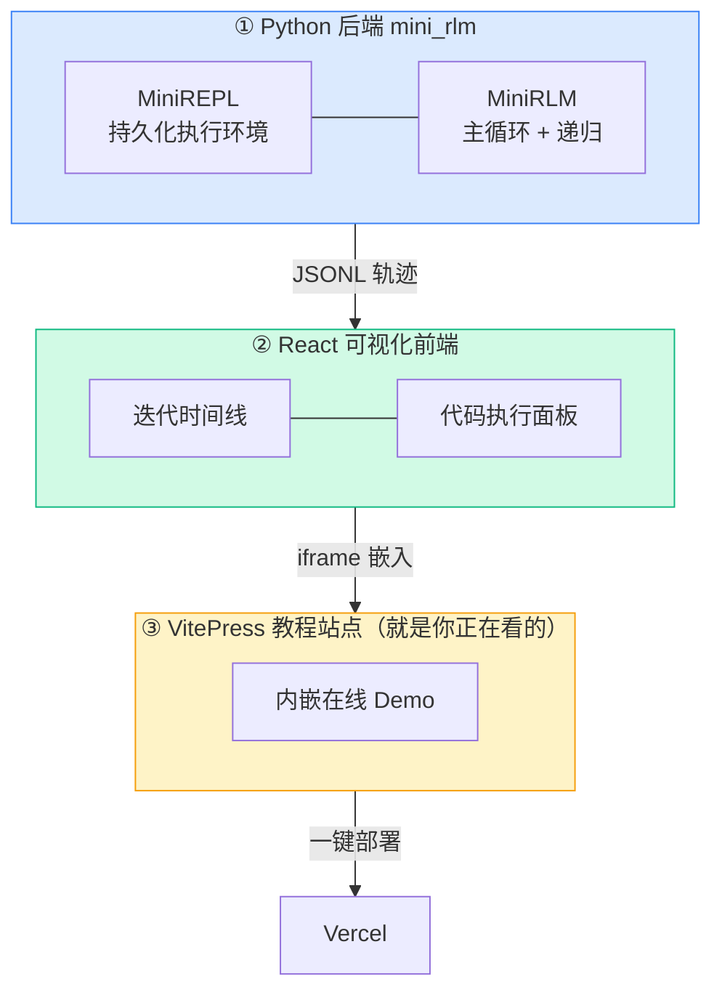
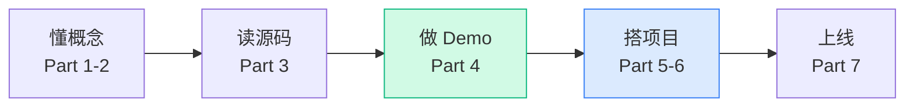

# 你将做出什么

在动手之前，先花三分钟看清终点在哪里。一个清晰的"成品长什么样"，能让后面每一步都有方向感。

## 一句话版本

你会从零写出一个**递归语言模型（Recursive Language Model, RLM）**：它对外用起来就像一个普通的"输入字符串、输出字符串"的模型，但内部能处理**远超模型上下文窗口**的超长输入——靠的不是更大的窗口，而是让模型**写代码去翻看输入、把任务切碎、再递归地调用自己**。

## 这个想法为什么值得学

先看一组论文里的真实数字（GPT-5 为底座）：

| 任务 | 普通 GPT-5 | RLM（深度=1） | 说明 |
|---|---|---|---|
| OOLONG（信息聚合，131K tokens） | 44.0 | **56.0** | 答案依赖几乎每一行 |
| OOLONG-Pairs（成对推理，32K） | 0.1 | **58.0** | 普通模型几乎全错 |
| BrowseComp+（深度检索，6–11M tokens） | 0.0* | **91.3** | 输入超窗口，普通模型直接跑不了 |

> `*` 表示输入超过了模型上下文窗口，普通调用根本无法完成。

最后一行是关键：**6–11M tokens 远超 GPT-5 的 272K 窗口**，普通模型连"读完"都做不到，而 RLM 不仅能跑，还拿到 91 分。这不是把窗口调大，而是换了一种"模型与长文本相处"的范式。

## 你最终的项目

你会得到三样东西，它们一起构成一个能跑、能看、能部署的教学版 RLM：



**① 后端 `mini_rlm`**：一个约 7 个文件的 Python 包，保留 RLM 的核心闭环（REPL 卸载 + 代码块解析 + `llm_query` + `answer` 终止 + 迭代循环）和符号递归（`rlm_query`）。它内置一个 `MockLM`，**不需要任何 API key 就能跑通整个循环**。

**② 前端可视化器**：一个 React 应用，把后端吐出的"轨迹"画成看得见的东西——每一轮迭代是什么、模型写了什么代码、代码 print 了什么、什么时候递归地调用了子模型。

**③ 教程站点**：你正在看的这个 VitePress 站点本身，它把②嵌进来，部署到 Vercel 后，任何人打开网页就能看到一个真实的 RLM 执行轨迹在动。

## 一个你马上能跑的例子

后端写完后，下面这段代码就能跑——**不用 API key**：

```python
from mini_rlm import MiniRLM, RLMConfig, MockLM

# MockLM 用脚本扮演一个"懂 RLM 协议"的模型：先 peek，再交卷
mock = MockLM(responses=[
    "我先看看 context 多长\n```repl\nprint(len(context))\n```",
    "```repl\nanswer['content'] = f'一共 {len(context)} 字符'\nanswer['ready'] = True\n```",
])

rlm = MiniRLM(config=RLMConfig(max_iterations=4), client=mock)
result = rlm.completion(context="hello world " * 1000, task="统计字符数")
print(result.response)   # -> 一共 12000 字符
```

注意这里发生了什么：那段 12000 字符的 `context` **从没进入模型的对话历史**，模型全程只通过写 `print(len(context))` 这样的代码去"隔着玻璃看"它。这就是 RLM 的核心动作，你会在 [Demo 1](/40-demos/demo1-persistent-repl) 亲手实现它。

## 学习路线与你需要的基础



**前置知识**（够用即可，不要求精通）：

| 你需要会 | 用在哪里 | 不会也行吗 |
|---|---|---|
| Python 基础（函数、类、`exec`/正则的概念） | 后端 mini_rlm | 必须会 Python |
| 调用过任意一种 LLM API | 理解 `llm_query` | 我们有 MockLM，可零成本 |
| React/TypeScript 基础 | 前端可视化 | 可跳过前端，只读不写 |
| 命令行 / git | 运行与部署 | 必须会基础命令行 |

> 💡 **怎么读最高效**：第一遍别纠结每个细节。先顺着 Part 1 建立"为什么"的直觉，到 Part 4 动手把 5 个 Demo 跑一遍，机制自然就懂了。Part 3 的源码精读可以在做完 Demo 后回头看，会更有体感。

## 小练习（热身）

不用写代码，先想清楚两个问题，它们是整套教程的"题眼"：

1. 如果一篇文档有 1000 万字符，而模型窗口只有 27 万 token，你能想到几种"硬塞不进去就压缩/截断"之外的办法？
2. 上面那个 MockLM 例子里，假如把 `context` 换成 1000 万字符，这段代码会变慢或报错吗？为什么不会？

> 带着这两个问题进入下一章 [长上下文的根本困境](/10-concepts/long-context-problem)，你会发现 RLM 的答案既简单又出人意料。
