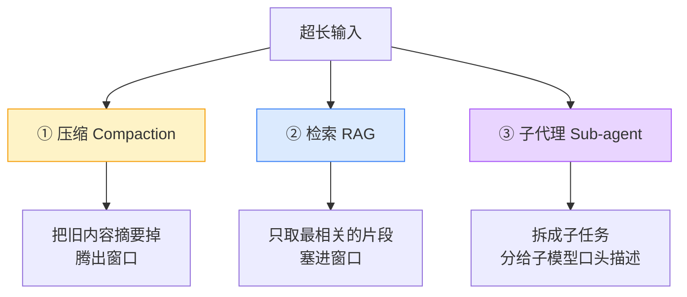

# 现有方案的天花板

RLM 不是凭空冒出来的。在它之前，工程界已经有好几套对付长上下文的成熟办法。理解它们各自卡在哪，你才能体会 RLM 那个"把 prompt 当环境"的洞察到底新在哪里。

## 三类主流方案

### ① 压缩（Compaction）：最流行，但会丢信息

做法：内容多到快撑满窗口时，就把前面的内容**摘要**成一小段，腾地方给新内容。Claude Code、各种 agent 框架都在用。

**它的天花板**：压缩**假设"早期细节可以安全遗忘"**。这对很多任务是致命的——

> 想象任务是"统计这份名单里每个姓氏出现了几次"。当你读到第 900 个名字时，前面 800 个的细节早被摘要成"一些常见姓氏"了。这时你根本没法给出准确计数。

压缩是**有损**的。对那些"答案依赖几乎每一处细节"的密集任务（还记得上一章的 O(n)、O(n²) 吗），它会丢掉恰恰需要的东西。

### ② 检索（RAG / 工具检索）：受限于"塞回窗口"

做法：把文档切块、建索引（如 BM25 或向量检索），每次只把**最相关的几块**取出来塞进模型窗口。

**它的天花板**：检索回来的片段，**最终还是要进模型窗口**——于是又回到了窗口限制和 context rot。而且它**只对"能被检索命中"的任务有效**：如果答案需要综合成百上千个片段（而不是少数几个），检索就抓瞎了。论文里 CodeAct+BM25 这类基线在密集任务上的表现就印证了这点。

### ③ 子代理 / 自委派（Sub-agent）：被"口头转述"卡住

做法：让主模型把任务拆成子任务，**派给子模型**去做，再收集结果。听起来已经很接近 RLM 了？关键差别在下面。

**它的天花板**：这些方法让模型**用自然语言"说出"要委派什么**（autoregressively verbalize），而不是**用代码"程序化地"生成委派**。这有两个硬伤：

1. **数量受限**：你没法靠"一句句说"派出 100 万个子任务。但有些任务就是需要遍历 100 万个片段。
2. **输出受限**：子任务的结果要拼回主模型的输出里，又撞上输出长度上限。

## 一张对比表，看清各自的"破绽"

| 方案 | 输入能超窗口吗？ | 信息无损吗？ | 能处理 O(n²) 密集任务吗？ | 输出能超窗口吗？ |
|---|:---:|:---:|:---:|:---:|
| 直接调用 | ❌ | ✅ | ❌ | ❌ |
| 压缩 Compaction | ✅ | ❌ 有损 | ❌ | ❌ |
| 检索 RAG | ✅ | ⚠️ 取决于检索 | ❌ | ❌ |
| 子代理（口头委派） | ⚠️ 有限 | ✅ | ❌ 数量受限 | ❌ |
| **RLM** | ✅ | ✅ | ✅ | ✅ |

最后一行先别急着信，那是我们整套教程要亲手验证的。但请记住这张表，因为 RLM 的三个设计决策，正好就是为了把这四列**全部打勾**。

## 它们共同的"原罪"

退一步看，前三类方案有一个共同的隐含假设：

> **"要处理一段内容，就得先把它（或它的某种压缩/片段）放进模型的上下文窗口。"**

压缩是"放进去之前先缩小"，检索是"只放进去一部分"，子代理是"放进去之前先口头拆分"。它们都在和那个窗口**讨价还价**，但谁也没质疑这个前提本身。

RLM 的洞察恰恰是质疑这个前提：

> **凭什么内容一定要进窗口？放在窗口外面，让模型写代码隔空操作它，不行吗？**

下一章，我们就来看这个"放在窗口外面"的具体长相。

## 小练习

1. 对"把这份 500 页合同里所有提到『违约金』的条款逐条列出并比较金额"这个任务，压缩、检索、子代理分别会在哪一步出问题？
2. 子代理方法里说"用代码生成委派"比"口头描述委派"强。你能想到一个具体例子，说明只有"用代码"才能做到的委派吗？

::: details 参考思路
1. 压缩：读到后面的条款时，前面条款的金额细节可能已被摘要丢失，没法精确比较。检索："违约金"可能命中几十处，但如果有些条款用了同义词或需要跨条款推理，检索会漏。子代理：如果有 50 处需要逐一处理，口头一条条派既慢又容易超输出。
2. 比如 `for clause in split_into_clauses(contract): results.append(llm_query(f"提取金额：{clause}"))`——一个 for 循环就能程序化地派出任意多个子调用，这是"口头说"做不到的。这正是 [Demo 3](/40-demos/demo3-llm-query) 要演示的。
:::
