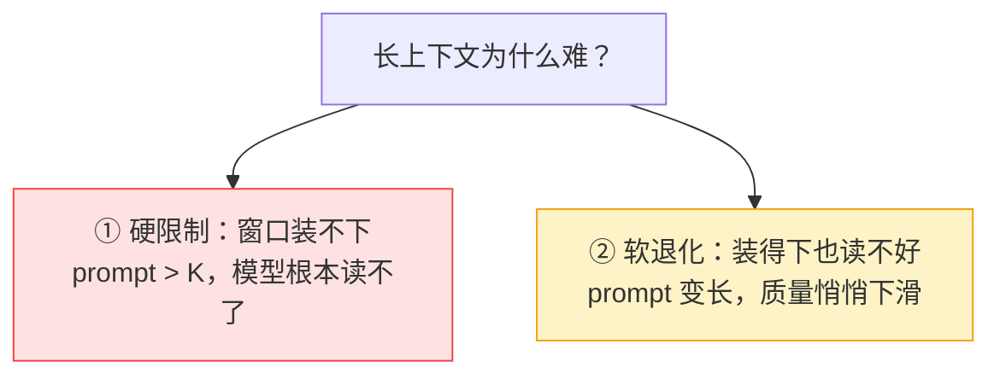
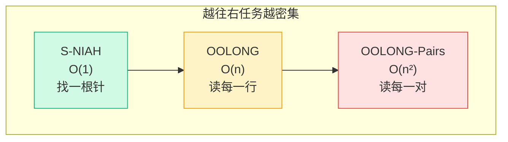
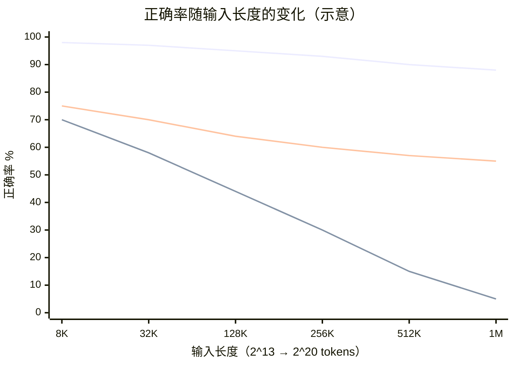

# 长上下文的根本困境

要理解 RLM 为什么这么设计，得先真切感受到它在对抗什么。这一章不讲解决方案，只把"敌人"看清楚。

## 两个独立的限制，别混为一谈

人们一说"长上下文问题"，常常把两件事搅在一起。把它们拆开，是理解 RLM 的第一步。

**① 硬限制（上下文窗口 K）**：每个模型有一个最大 token 数。GPT-5 是 272K。超过这个数，多出来的内容**进不去**，模型连看都看不到。一篇 1000 万 token 的文档，差了将近 40 倍。

**② 软退化（context rot）**：就算你的输入塞得进窗口，**越接近上限、质量越差**。模型会"读着读着就忘了开头""被中间的噪声带偏"。研究界把这个现象叫 *context rot*（上下文腐烂）。

第二个限制更隐蔽，也更致命——因为它在你以为"还没超限、应该没事"的时候就已经在伤害你了。

## 关键洞察：难度不只取决于长度，还取决于任务

论文里有一个特别重要的观点：**一个模型的"有效上下文窗口"，不能脱离具体任务来谈**。同样长的输入，任务越"密集"，模型崩得越早。

用三个任务来体会这件事，它们的"处理复杂度随长度增长的方式"完全不同：

| 任务 | 复杂度 | 直觉 | 长度增长时 |
|---|---|---|---|
| **S-NIAH**（大海捞针） | O(1) | 在一堆废话里找一句话 | "针"大小不变，相对越来越好找 |
| **OOLONG**（信息聚合） | O(n) | 给每一行打标签再汇总 | 几乎每一行都要用到 |
| **OOLONG-Pairs**（成对推理） | O(n²) | 要考虑所有两两组合 | 工作量随长度平方爆炸 |

这解释了一个反直觉的现象：现在的前沿模型在 100 万 token 的"大海捞针"上几乎满分，让人以为"长上下文已经解决了"；但同样这些模型，在**短得多**的 OOLONG 上就开始明显退化。**不是长度的问题，是密度的问题。**

## 一张图看懂退化

把横轴设成输入长度、纵轴设成任务正确率，普通模型大致是这样的（示意，趋势源自论文 Figure 1）：

注意三条线：

- 简单任务（最上面）即使到 1M 也还行——所以"长上下文好像解决了"是个幻觉。
- 密集任务（中间）**断崖式下跌**，而且在还没到窗口上限时就开始跌。
- RLM（最下面那条更平的线）下跌得慢得多，到长输入时反而反超。

## 为什么"把窗口做大"治不了本

你可能会想：那等模型窗口做到 1000 万 token 不就好了？两个问题：

1. **context rot 不会因为窗口变大而消失**。窗口能装下 ≠ 模型能读好。密集任务的退化是个长期存在的、随长度增长的现象。
2. **成本随长度线性甚至更糟地涨**。把 1000 万 token 一次性喂进注意力机制，又慢又贵。论文里给过一个对比：让 GPT-5-mini 直接吞 6–11M token，线性外推成本约 \$1.50–\$2.75 一次；而 RLM 平均只要 \$0.99，还更准。

> RLM 的赌注是：**与其把所有内容塞进模型的"眼睛"（注意力窗口），不如把内容放在模型"手边"（一个环境），让它用代码按需去拿。** 下一章我们先看看，在 RLM 之前，人们试过哪些办法，又各自卡在哪。

## 小练习

1. 你正在做一个"总结整本书"的任务。按本章的框架，它更接近 O(1)、O(n) 还是 O(n²)？如果改成"找出书里所有自相矛盾的论点对"呢？
2. 假设有个模型号称支持 200 万 token 窗口。基于本章内容，你会用什么任务去检验它是"真能用 200 万"还是"只是装得下"？

::: details 参考思路
1. "总结全书"至少是 O(n)——你得读到几乎每一段。"找所有矛盾论点对"是 O(n²)，因为要两两比对。
2. 别用大海捞针（那是 O(1)，容易满分骗人）。用一个 O(n) 或 O(n²) 的密集任务，比如"统计全书每个角色出现的章节并交叉验证"，在 200 万 token 长度上看正确率是否崩。
:::
