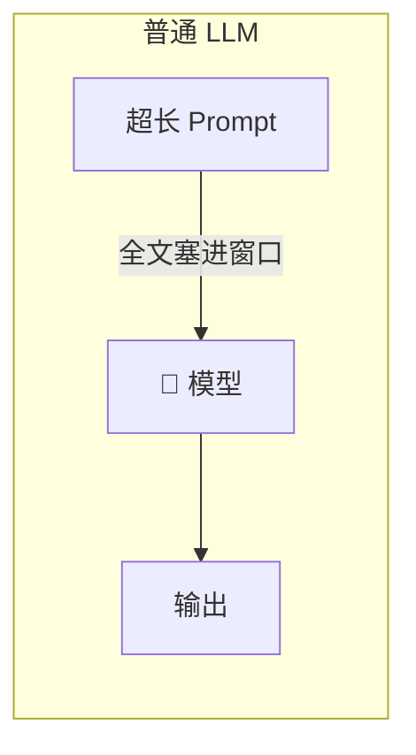
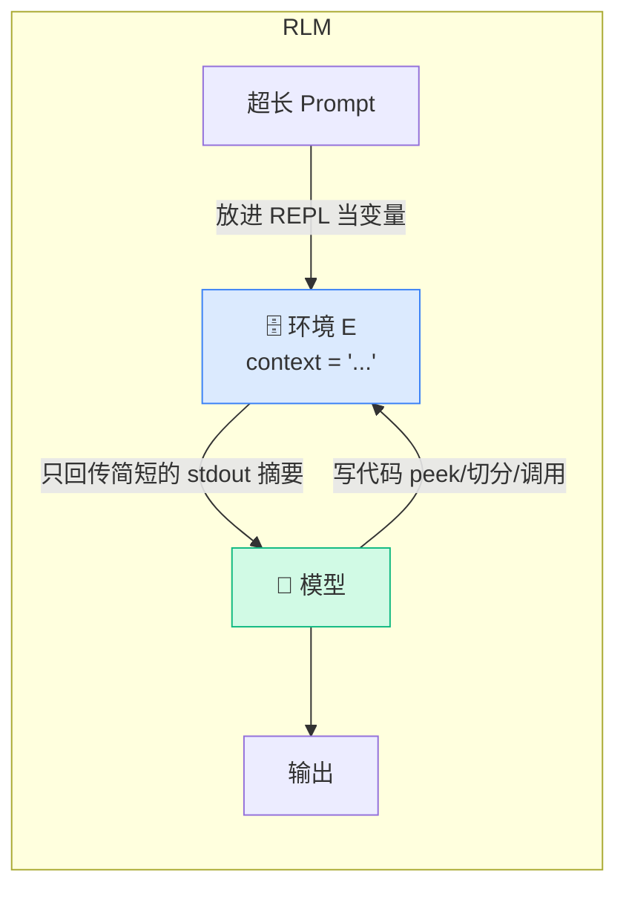
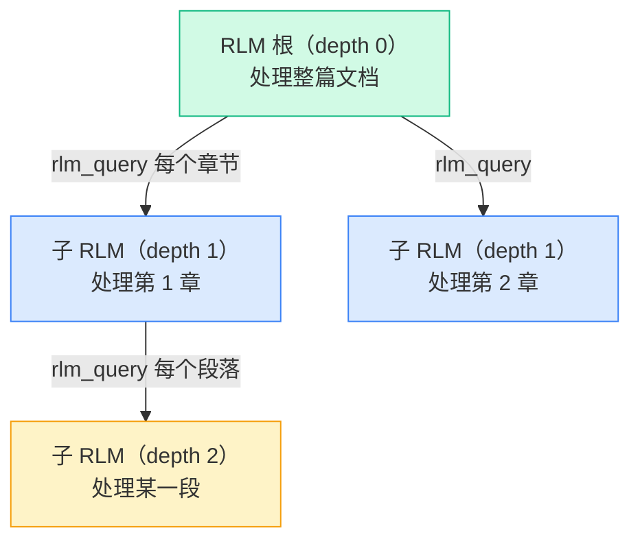

# RLM 的核心洞察

上一章结尾我们提了个问题：凭什么内容一定要进模型窗口？这一章就是这个问题的答案，也是整套教程的"题眼"。读懂这一章，后面所有代码你都会觉得"理所当然"。

## 一句话洞察

> **不要把超长 prompt 喂给神经网络，而要把它当作"环境"的一部分，让模型用代码去符号化地、递归地操作它。**

把这句话里的两个关键词记牢：**环境（environment）** 和 **递归（recursion）**。

## "prompt 即环境"是什么意思

普通 LLM 的工作方式是：prompt 全文 → 进入注意力窗口 → 模型一次性"看到"全部 → 输出。

RLM 把这个画面整个换掉：





看出区别了吗？在 RLM 里，**模型和超长内容之间隔着一层环境**。那段内容存在一个 Python 变量 `context` 里，模型**永远不会自动看到它的全文**。模型能做的，是写代码去"隔着玻璃"操作它：

```python
print(len(context))          # 问问它多长
print(context[:200])         # 瞄一眼开头
chunks = context.split("\n") # 把它切碎
```

每次执行后，只有**很短的 stdout**（比如 `12000`）回到模型的上下文里。于是无论 `context` 是 1 万字符还是 1000 万字符，**模型自己的窗口占用几乎不变**。

这就是为什么 [上一章的小练习](/00-intro/what-you-will-build#小练习-热身) 里，把 context 换成 1000 万字符也不会让那段代码变慢或爆窗口——因为那 1000 万字符压根没进模型，只是个变量。

## REPL：让"环境"具体起来

"环境"听着抽象，论文给了它一个非常具体的形态：**一个 Python REPL（Read-Eval-Print Loop）**。

REPL 就是那种"你敲一行代码、它执行、打印结果、记住状态、等你敲下一行"的交互式环境（Python 命令行就是）。它有两个对 RLM 至关重要的性质：

1. **持久化**：这一轮建的变量，下一轮还在。模型可以分多步、迭代地搭建中间结果。
2. **可编程**：模型不是在"自然语言里思考"，而是在"代码里思考"——切片、循环、正则、调用函数，精确而可组合。

RLM 把超长 prompt 作为这个 REPL 里的 `context` 变量，再给 REPL 装上几个特殊函数（下一节就讲），然后让模型**一轮一轮地写代码与之交互，直到给出答案**。

## 递归：环境里能调用模型自己

如果只到上面这步，RLM 还只是个"会写代码读文件的 agent"。真正让它质变的，是 REPL 里那几个特殊函数——**模型能在代码里调用语言模型，甚至调用一个完整的 RLM**：

```python
# 在 REPL 代码里，模型可以这样写：
labels = []
for chunk in chunks:                      # chunks 可能有 100 万个
    label = llm_query(f"给这段打标签：{chunk}")   # 对每一片调用一个子模型
    labels.append(label)
```

这一个 `for` 循环，就**程序化地派出了任意多个子调用**——这正是上一章说的、子代理方法靠"口头转述"做不到的事。

而 `rlm_query` 更进一步：它派出的子调用**本身又是一个完整的 RLM**（有自己的 REPL、自己的循环、还能再 `rlm_query`）。于是"递归"二字名副其实：



每一层都把"自己窗口装不下的活儿"往下分包，没有任何一层需要把全部内容塞进自己的窗口。这就是 RLM 能处理超窗口 10 倍以上输入、还能输出超长结果的根本原因。

## 对外，它还是一个"语言模型"

最妙的是，尽管内部这么复杂，RLM **对外的接口和普通模型一模一样**：输入一个字符串，输出一个字符串。

```python
result = rlm.completion(context=超长文档, task="...")
print(result.response)   # 就是一个字符串
```

所以论文说 RLM 是"一个没有上下文限制的、抽象的语言模型"。你可以把一个 RLM 当成更大模型的子调用，层层嵌套——这也是为什么它叫"递归语言模型"。

## 把洞察拆成可实现的三件事

到这里，"为什么"已经讲透了。但"prompt 即环境 + 递归"要变成能跑的代码，得落实成三个具体的设计决策。它们看似简单，却是 RLM 区别于一堆"长得很像但差很多"的方案的关键。下一章 [三个关键设计决策](/10-concepts/three-design-choices) 逐一拆解。

## 小练习

1. 用你自己的话，向一个完全没听过 RLM 的同学解释："为什么 context 有 1000 万字符，模型窗口只有 27 万，RLM 却不会爆窗口？"
2. `llm_query` 和 `rlm_query` 都能在代码里调用模型。你觉得它俩最大的区别是什么？什么样的子任务该用 `rlm_query` 而不是 `llm_query`？

::: details 参考思路
1. 因为那 1000 万字符存在 REPL 的 `context` 变量里，从没进入模型的对话历史。模型只通过写代码（如 `context[:200]`）去看它的一小部分，每次只有很短的 stdout 回到模型窗口，所以模型窗口占用与 context 总长几乎无关。
2. `llm_query` 开的子模型没有 REPL、没有记忆，适合"一小段、一步到位"的语义处理（如给一句话打标签）。`rlm_query` 开的子调用是完整 RLM，适合"子任务本身又长又复杂、需要它自己再去切分/递归"的情况（如总结一整章）。这正是 [Demo 5](/40-demos/demo5-recursion) 的主题。
:::
