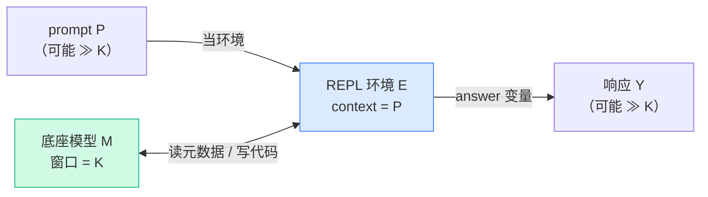
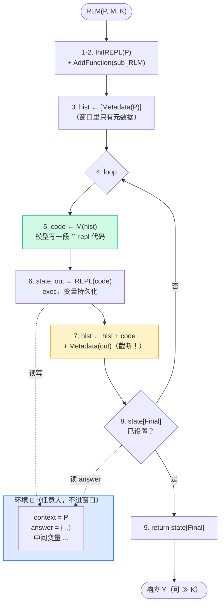

# 形式化定义与 Algorithm 1

[概念篇](/10-concepts/rlm-insight) 我们用大白话把"prompt 即环境 + 递归"讲透了。这一章换个视角：把同一件事**形式化**地写清楚，并逐行读论文里的 Algorithm 1。读完你会发现，论文的伪代码和你在 Part 5 要写的 `mini_rlm` 几乎是一一对应的——形式化定义不是为了唬人，而是为了让"无界"这件事有据可依。

## 先把 RLM 形式化地定义清楚

论文给 RLM 下了一个很克制的定义。我们逐个符号拆开：

> 给定一个**底座模型 M**（context 窗口为 K）和一段 **prompt P**，**RLM 是一个围绕 M 的推理时脚手架（inference-time scaffold）**。它把 P 当作一个**环境**，最终返回一个响应 Y。

注意几个词的分量：

- **底座模型 M**：就是一个普通的、有固定窗口 K 的语言模型（GPT-5、Qwen3-8B……）。RLM **不改 M 的权重**，不微调、不重训。
- **推理时脚手架**：RLM 是套在 M 外面的一层调度逻辑，只在推理时起作用。换句话说，RLM 是一个**算法**，不是一个新模型。
- **把 P 当环境**：这是题眼。P 不进 M 的窗口，而是进一个 REPL，成为环境里的一个变量。
- **返回响应 Y**：对外，RLM 的签名和 M 一模一样：`(P) -> Y`，输入字符串、输出字符串。

把它写成一个函数签名，就是：

```python
def RLM(P: str, M: Model, K: int) -> str:
    ...  # 内部跑一个 REPL 循环，最终 return Y
```

### "无界"到底指哪三个视野

RLM 追求的目标，论文概括为三个"无界（unbounded）"。这三条是后面所有设计的出发点，务必记牢：

| 视野 | 普通 M 的上限 | RLM 的目标 | 靠什么解锁 |
|---|---|---|---|
| **输入视野** | P 必须 ≤ K | P 可以 ≫ K | P 进环境当变量，不进窗口 |
| **输出视野** | Y 必须 ≤ K | Y 可以 ≫ K | Y 在环境变量里逐步攒出来 |
| **语义视野** | 一次只能"看见"窗口内的内容 | 能对 P 的**每一片**都动手 | 代码里程序化地循环调用子模型 |

这三条分别对应 [三个关键设计决策](/10-concepts/three-design-choices) 里的决策①②③。形式化定义和那三个决策说的是同一件事，只是这里把"目标"说清楚，那里把"手段"说清楚。



## 逐行读 Algorithm 1

下面是论文 Algorithm 1 的结构（我们用中文把每步意思标注出来）。它就是 RLM 的完整控制流——一个会写代码的循环。

```text
算法 1：RLM(P, M, K)
─────────────────────────────────────────────
1   state ← InitREPL(prompt = P)        # 起一个 REPL，把 P 放进去当 context
2   state ← AddFunction(state, sub_RLM) # 给 REPL 注入 sub_RLM（递归子调用）
3   hist  ← [Metadata(state)]           # 窗口里只放 P 的"元数据"，不放全文
4   loop:                               # 主循环（最多 K/c 轮，见下一章）
5       code        ← M(hist)           # 让模型基于历史写一段代码
6       state, out  ← REPL(state, code) # 在环境里执行，拿到 stdout
7       hist        ← hist + code + Metadata(out)   # 只追加 out 的元数据
8       if state[Final] is set:         # 模型把答案写进了环境变量？
9           return state[Final]         # 取出来返回，结束
─────────────────────────────────────────────
```

我们一行一行讲"为什么这么写"。

**第 1 行 `InitREPL(prompt=P)`**——起一个 Python REPL，并把超长的 P 塞进环境里成为一个变量（我们实现里叫 `context`）。**关键**：从这一刻起，P 就和模型的窗口"物理隔离"了。模型想看 P，必须写代码（`print(context[:200])`），主动取、按需取。在 `mini_rlm` 里这对应 `MiniREPL.load_context()`，它只做一件事：`self.ns['context'] = P`。

**第 2 行 `AddFunction(sub_RLM)`**——往 REPL 的命名空间里注入特殊函数。论文写的是 `sub_RLM`，实际还包括 `llm_query` 和 `answer`。**为什么要在这一步注入**？因为递归的"调用入口"必须是环境里的一个可调用对象，模型才能在代码里 `for` 循环批量调用它。这就是 [决策三：符号递归](/10-concepts/three-design-choices#决策三-符号递归-能在代码里程序化地调用模型) 的落地点。

**第 3 行 `hist ← [Metadata(state)]`**——初始化对话历史。注意它放的是 `Metadata(state)`，即"P 有多长、开头几个字、怎么访问它"这类**常数大小的元信息**，而**不是 P 本身**。这一行决定了输入视野能否无界：放元数据，窗口占用与 |P| 无关；放全文，立刻继承 K 的限制（这正是 Algorithm 2 的破绽①）。

**第 4 行 `loop`**——主循环。论文实现里是 `for i in range(max_iterations)`（官方默认 30，`mini_rlm` 默认 12）。循环为什么能"任意发起子调用却不爆窗口"，留到 [下一章](/20-paper/repl-loop) 用时序图讲。

**第 5 行 `code ← M(hist)`**——把当前历史喂给模型，让它**写一段代码**（包在 ` ```repl ` 围栏里）。模型在这里"思考"的产物不是自然语言答案，而是可执行代码。`mini_rlm` 里对应 `MiniRLM._run_one_turn` 调 `client.completion(messages)`。

**第 6 行 `state, out ← REPL(state, code)`**——在 REPL 里执行这段代码。`state` 被更新（变量持久化，下一轮还在），`out` 是这段代码的 stdout。`mini_rlm` 里是 `MiniREPL.execute_code()`，底层一句 `exec(code, self.ns, self.ns)`。

**第 7 行 `hist ← hist + code + Metadata(out)`**——把刚才的代码和 **stdout 的元数据/截断**追加回历史。**最关键的一个字是 `Metadata`**：回喂的是 out 被截断/摘要后的常数大小片段，**绝不是 out 的全文**。这是整个 RLM 不爆窗口的命门。

**第 8–9 行 `if state[Final]: return`**——检测模型有没有把答案写进环境的"交卷变量"。在 `mini_rlm` 里这是 `_AnswerDict`：模型写 `answer["content"] = ...; answer["ready"] = True`，`on_ready` 回调触发，循环就此返回。**答案是从环境变量里取的，不是模型在历史里"说"出来的**——这就是输出视野能无界的原因（决策②）。

::: tip 一个值得记住的对应关系
Algorithm 1 的 9 行伪代码，几乎逐行对应 `mini_rlm` 里的真实函数。Part 5 写代码时，你可以拿这张表当"施工图"：第 1 行 → `load_context`，第 2 行 → `_make_repl` 注入工具，第 3/7 行 → `build_system_messages` / `format_iteration_feedback`，第 5 行 → `client.completion`，第 6 行 → `execute_code`，第 8 行 → `_AnswerDict.on_ready`。
:::

## 它和 Algorithm 2 差在哪：三个破绽

论文用 Algorithm 2 刻画一个"看起来很像 RLM、其实弱一个量级"的普通 agent。把两者并排，三个破绽一目了然。

::: code-group

```text [Algorithm 1：RLM（强）]
RLM(P, M, K):
  state ← InitREPL(prompt=P)        # ✅ P 进环境
  state ← AddFunction(sub_RLM)      # ✅ 能程序化递归
  hist  ← [Metadata(state)]         # ✅ 窗口里只有元数据
  loop:
    code       ← M(hist)
    state, out ← REPL(state, code)
    hist       ← hist + code + Metadata(out)
    if state[Final]: return state[Final]   # ✅ 答案从环境变量取
```

```text [Algorithm 2：普通 agent（弱）]
Agent(P, M, K):
  actions ← {Finish, Exec, Search, sub_LLM}
  hist ← [Metadata(actions), P]     # ⚠️破绽①：P 直接进了窗口
  loop:
    action, val ← M(hist)
    if action == Finish: return val # ⚠️破绽②：输出=模型直接生成
    out ← Execute(action, val)      # ⚠️破绽③：只能口头委派，不能 for 循环递归
    hist ← hist + (action, val, out)
    if tokens(hist) > K: hist ← Compress(hist)   # 撑爆了只能有损压缩
```

:::

三个破绽，逐个对照 Algorithm 1：

- **破绽①（P 进窗口）**：Algorithm 2 第 2 行把 `P` 直接拼进 `hist`。于是输入视野立刻被 K 锁死，长了只能压缩——有损。Algorithm 1 第 3 行只放 `Metadata`，P 在环境里，输入视野无界。
- **破绽②（Finish 直接生成输出）**：Algorithm 2 靠 `Finish` 动作让模型一口气生成答案，输出长度天然 ≤ K。Algorithm 1 让答案在 `state[Final]` 变量里慢慢攒，输出视野无界。
- **破绽③（口头委派 vs 程序化递归）**：Algorithm 2 的 `sub_LLM` 只能由模型一次次"口头说出"要派什么，发不出 `for chunk in 一百万片` 这种批量子调用。Algorithm 1 把 `sub_RLM` 注入成环境里的可调用对象，能被任意循环包裹——这是语义视野无界的关键。

这三条和 [三个关键设计决策那张总表](/10-concepts/three-design-choices#三个决策-一张总表) 是镜像关系：破绽是"少了某个决策会怎样"，决策是"补上它能解锁什么"。

## Algorithm 1 的数据流全景

把上面 9 行画成一张数据流图，你会更直观地看到"两条管道"——一条是**窗口里流动的常数大小元数据**，一条是**环境里流动的任意大对象**。两条管道始终分离，这正是 RLM 不爆窗口的几何直觉。



图里的虚线（环境读写）流动的是任意大对象，实线（hist 更新）流动的是常数大小元数据。**只要这两条线不交叉——即第 7 行回喂的永远是 `Metadata(out)` 而非 `out`——窗口就永远不爆**。下一章我们就用时序图把"为什么只回喂元数据"这件事彻底讲清。

::: warning 常见错误
读 Algorithm 1 时最容易误解第 6、7 行：以为"执行代码的 stdout 会原样回到模型"。**不会**。第 7 行白纸黑字写的是 `Metadata(out)`——stdout 先被截断（官方 20000 字符，`mini_rlm` 默认 4000）再回喂。如果你实现时图省事直接把整个 `out` 拼进 hist，那么模型一旦 `print(context)`，整段 P 就回流进窗口，RLM 当场退化成普通长上下文模型，第一条"输入无界"直接失效。
:::

## 小练习

1. 论文定义里说"RLM 是围绕 M 的推理时脚手架"。请据此判断：RLM 需要重新训练或微调底座模型 M 吗？为什么这个性质对"任何现成模型都能套上 RLM"很重要？
2. 把 Algorithm 1 的第 3 行从 `hist ← [Metadata(state)]` 改成 `hist ← [state, P]`（即把 P 全文放进历史），其余不变。三个"无界"里哪一个会立刻失效？这正好对应 Algorithm 2 的哪个破绽？

::: details 参考思路
1. 不需要。"推理时脚手架"意味着 RLM 只在推理时套一层调度逻辑，**不碰 M 的权重**。这很重要：因为它意味着任何现成模型（闭源 API 也行）都能直接当 M 用，无需训练数据、无需算力微调，换个更强的 M 整套 RLM 立即受益。（注：论文另有 RLM-Qwen3-8B 是**可选**地用轨迹微调 M 来进一步提升，但 RLM 本身不依赖它。）
2. "输入视野无界"立刻失效——P 全文进了窗口，就继承了 M 的窗口上限 K，超过就得压缩。这正对应 Algorithm 2 的**破绽①**。
:::
