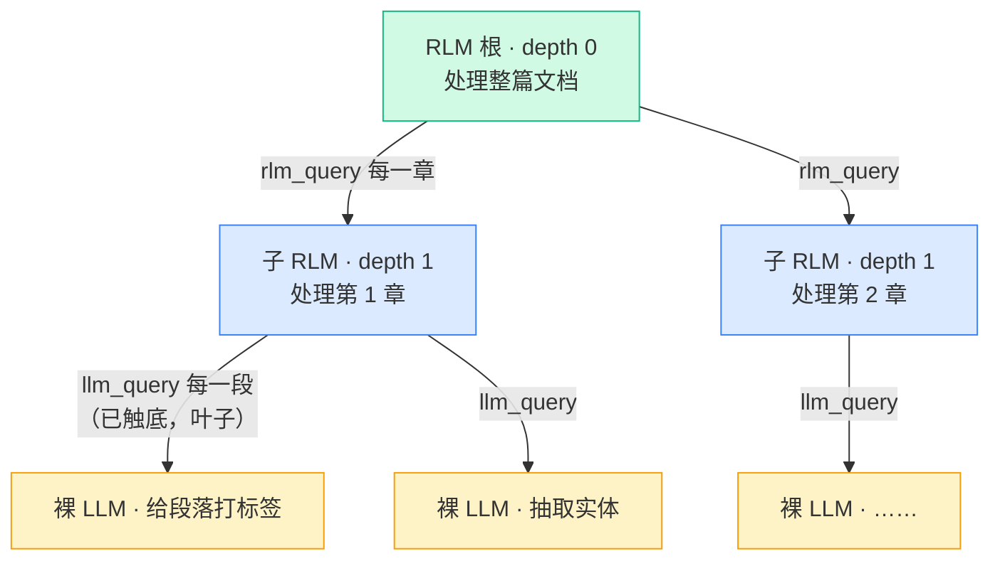
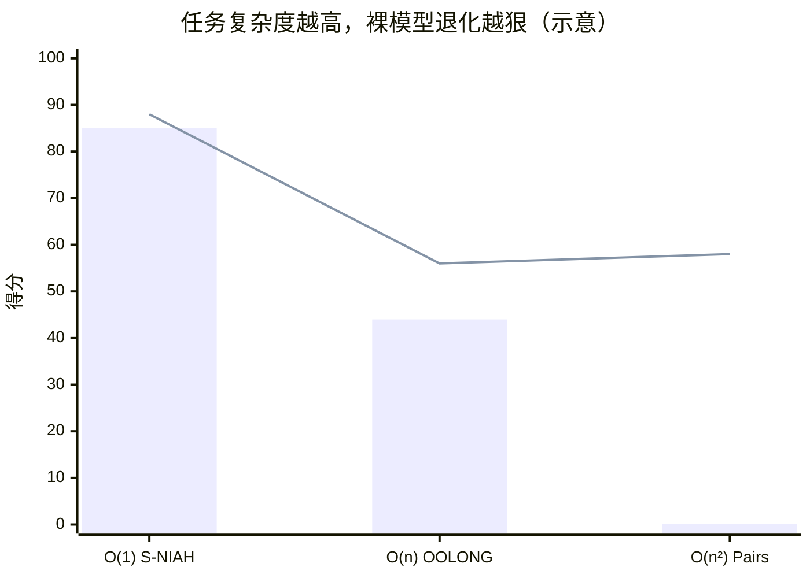

# 递归深度与实验结论

[上一章](/20-paper/repl-loop) 末尾我们留了个钩子：当根循环的 K/c 轮预算不够用时，可以用 `rlm_query` 把子任务**下分一层**。这一章就把"层"讲清楚——RLM 的 **depth（递归深度）** 到底是什么语义、它怎么换来更大的计算预算，然后用论文的主结果表验证一句话：**任务越密集，深度越值钱**。这是 Part 2 的收尾，读完你就有了去 [Part 3 读官方源码](/30-source/architecture-overview) 的全部地图。

## depth 的三档语义

RLM 的递归不是无限制地往下钻，而是用一个 `depth` 计数器明确管控"还能不能再往下递归"。论文给了三档语义，干净利落：

| depth | 能力 | 子调用是什么 | 直觉 |
|---|---|---|---|
| **depth = 0** | 无子调用能力 | —— | 就是一个会写代码读 context 的 agent，只能自己干 |
| **depth = 1** | 可子调用 LLM | `llm_query` → 一个**裸 LLM**（无 REPL、无记忆） | 能"分包"，但分包对象只会一步到位地处理一小段 |
| **depth > 1** | 可子调用 RLM | `rlm_query` → 一个**完整子 RLM**（有自己的 REPL/循环/再递归） | 能把"又长又复杂的子任务"整个下放，让它自己再切分 |

关键分界在 **depth=1 和 depth>1** 之间：depth=1 的子调用是"叶子"（`llm_query`，处理完就回），depth>1 的子调用是"枝"（`rlm_query`，可以再长出子调用）。在 `mini_rlm` 里这个分界由一行逻辑控制——`MiniRLM._make_repl` 里 **只有 `depth+1 < max_depth` 时才给 REPL 装 `subcall_fn`**，否则 `rlm_query` 自动退化成 `llm_query`。这就是"深度耗尽就触底为叶子"的实现。

::: tip 为什么深度能换来更大的计算预算
回忆 [上一章那个 K/c 上界](/20-paper/repl-loop#核心-为什么-只回喂常数大小元数据-是命门)：单层 RLM 的根循环最多 K/c 轮。每往下递归一层，子 RLM 就拥有**自己独立的 K/c 轮预算和自己的窗口**。于是总的有效计算量从"一个 K/c"变成"层层相乘"。增加 depth，本质上是用递归把"无界"从输入/输出扩展到**计算深度**。这也是为什么密集任务吃深度——它们需要的总计算量，单层装不下。
:::

## 实验结论速读：四张主结果

论文在一组刻意设计的长上下文基准上测了 RLM。配置是 **底座 M = GPT-5，子调用用更便宜的 GPT-5-mini**。下表把最有代表性的四个结果列出来（"基线"指同一个 GPT-5 直接做、不套 RLM）：

| 基准 | 任务性质 | 基线（裸 GPT-5） | RLM | 提升 |
|---|---|---|---|---|
| **CodeQA** | 代码库问答 | 24 | **62**（depth 1） | +38 |
| **OOLONG** | 长文档逐项处理 | 44 | **56** | +12 |
| **OOLONG-Pairs** | 所有"对"两两处理 | 0.1 | **58** | +57.9 |
| **BrowseComp+**（1K 文档，6–11M tokens） | 海量检索式问答 | 0 | **91.3** | +91.3 |

几个数字值得停下来品：

- **OOLONG-Pairs 从 0.1 到 58**。基线几乎是 0——因为这个任务要求遍历所有"对"，输出本身就长到放不进窗口，裸模型连"说完答案"都做不到（这正是 [决策②输出无界](/20-paper/algorithm#无界-到底指哪三个视野) 的杀手锏）。RLM 把答案在变量里逐对攒出来，于是有了 58。
- **BrowseComp+ 从 0 到 91.3**。输入是 6–11M tokens、1000 篇文档，**远超任何模型的窗口**。裸模型根本喂不进去（0 分），RLM 把文档当环境、程序化检索，直接拿到 91.3。这是"输入无界"最极端的演示。
- **CodeQA depth 1 就能 24→62**。说明很多任务并不需要深递归，单层"程序化子调用"已经够用——深度是按需投入的资源，不是越深越好。

## 为什么深度越高密集任务越好，Qwen 却可能变差

这是本章最需要"讲为什么"的一点。论文观察到两个看似矛盾的现象，其实根因一致。

**现象 A：密集任务里，depth 越高越好。** 像 OOLONG-Pairs 这种"必须对海量子单元逐一处理"的密集任务，单层 RLM 的一个根循环里塞不下那么多协调工作；往下递归一层，把"处理某个章节内的所有对"整个下放给子 RLM，每层各自从容。任务越密集（需要的总计算量越大），多出来的递归预算就越值钱。

**现象 B：换成较弱的底座（如 Qwen），depth 越高反而可能变差。** 根因是——**递归是用代码实现的，而每加一层，就多一次"模型必须写出语法正确、逻辑正确的 `rlm_query` 调用代码"的机会**。GPT-5 这类强模型写代码稳，深度的收益盖过出错的代价；但较弱的模型（如未微调的 Qwen3-8B）更容易写出**语法错误或调用错误的代码**，一层错就拖垮整条递归链。于是对弱模型，深度带来的"出错面积"增长，可能盖过"计算预算"的增益，净效果变差。

> 一句话：**深度是把"算力"换成"对模型代码能力的要求"**。模型代码写得越稳，越能享受深度红利；写不稳，深度反而是放大器——把错误也放大了。

::: warning 常见错误
不要把"RLM 总是 depth 越大越好"当成定律去调参。深度的收益**强依赖两个条件**：(1) 任务足够密集（单层预算不够）；(2) 底座模型代码能力足够稳。任务很简单时加深度纯属浪费成本；模型代码能力弱时加深度可能倒退。`mini_rlm` 默认 `max_depth=2` 就是个克制的、对教学/弱模型友好的选择——先把 depth=1 跑顺，确认子调用代码稳定，再考虑放开到更深。
:::

## 成本：和普通模型一个量级

工程师最关心的问题：套了这么一层递归，是不是贵得离谱？论文的答案出人意料——**RLM 的成本与基线（裸跑 GPT-5）相当，某些设置下甚至更低**。原因有二：

1. **子调用用更便宜的模型**。根用 GPT-5，海量子调用用 GPT-5-mini。便宜模型干粗活，贵模型只做协调。
2. **根模型窗口占用是常数级**（K/c 上界）。裸跑超长输入要把几百万 token 全喂进贵模型，token 计费爆炸；RLM 的根模型每轮只看常数大小的元数据，贵 token 反而省了。

所以 RLM 不是"花更多钱买更强"，而更接近"用同样的钱，换来本来根本做不到的任务"。

## 任务复杂度 O(1)/O(n)/O(n²) 与退化

论文用一组复杂度递增的合成任务，把"什么时候 RLM 优势最大"量化了出来。复杂度指的是**"要正确作答，必须对输入做多少次有效处理"**：

| 任务 | 复杂度 | 含义 | 裸模型表现 |
|---|---|---|---|
| **S-NIAH**（大海捞针） | O(1) | 只需定位一处针 | 还行——找到那一处就够 |
| **OOLONG** | O(n) | 需逐项扫一遍输入 | 开始退化——n 大了扫不全 |
| **OOLONG-Pairs** | O(n²) | 需处理所有两两配对 | 崩溃——n² 远超任何窗口能承载的注意力 |

规律很清楚：**任务复杂度越高，裸模型退化越严重，RLM 的相对优势越大**。这背后正是 [概念篇说的 context rot](/10-concepts/long-context-problem)——随着输入变长、需要的有效处理次数变多，裸模型的注意力被稀释、信息被"腐蚀"，性能断崖式下跌。而 RLM 把 O(n)、O(n²) 的处理量**程序化地摊到任意多子调用上**，每个子调用只面对一小段、注意力不被稀释，于是复杂度越高、差距越夸张（O(n²) 的 OOLONG-Pairs 从 0.1 飙到 58 就是铁证）。这条"复杂度 ↔ 退化"的因果，建议回头对照 [长上下文的根本困境](/10-concepts/long-context-problem) 一起看。

（柱=裸模型，线=RLM；数值取自 OOLONG/Pairs 主结果，S-NIAH 为示意。）

## 每个基准在压测"哪一种无界"

四张主结果不是随便挑的——它们各自把 [三个无界视野](/20-paper/algorithm#无界-到底指哪三个视野) 里的某一条压到极限。看懂这层对应，你就知道每个数字在证明什么：

| 基准 | 主要压测 | 裸模型为什么不行 | RLM 靠哪个决策赢 |
|---|---|---|---|
| BrowseComp+ | **输入无界** | 6–11M tokens 根本喂不进窗口 | 决策①：P 进环境当变量 |
| OOLONG-Pairs | **输出无界** + 语义无界 | 答案太长，模型一口气说不完 | 决策②：答案在变量里攒 |
| CodeQA / OOLONG | **语义无界** | 需对全部内容逐项处理，注意力被稀释 | 决策③：程序化批量子调用 |

所以这四个数字合起来，恰好是对"三个无界"的一次完整实证：输入、输出、语义，各有一个基准把它顶到天花板，而 RLM 在每一个上都把裸模型甩开一个量级。

## 顺带一提：训练一个 RLM-Qwen3-8B

[前一章](/20-paper/algorithm#小练习) 我们强调过，RLM 本身**不需要训练**——任何现成模型都能直接当 M。但论文做了个**可选**的加分实验：用 RLM 自己跑出来的轨迹去微调底座，看能不能让模型更"会当 RLM 的根/子"。

做法很简单：收集 **1000 条 RLM 运行轨迹**（每条就是 Algorithm 1 跑一遍产生的 `hist`——一串"写代码 / 看 stdout 元数据"的交互），拿它们去微调 Qwen3-8B。结果：**比未微调的 base 版本，中位数提升约 +28%**。

为什么有效？回到上一节的"现象 B"：弱模型的瓶颈是**写不稳 `rlm_query`/`llm_query` 的调用代码**。用真实轨迹微调，恰好是教模型"在 RLM 这个范式里该怎么写代码、怎么切分、何时交卷"——把出错率压下去，深度红利就吃得到了。这也解释了为什么仅 1000 条轨迹、+28% 的提升就很可观：它补的正是弱模型最缺的那块短板。在 `mini_rlm` 里，这些轨迹就是 `TrajectoryLogger` 落的 JSONL（第一行 metadata、之后每行一个 iteration）——你在 [Part 5 日志与测试](/50-build-backend/logging-and-tests) 写的那个 logger，产出的正是这种可用于微调的数据。

## Part 2 收尾

到这里，论文原理的三块拼图齐了：[Algorithm 1 的形式化](/20-paper/algorithm)（是什么）、[REPL 循环时序与 K/c 上界](/20-paper/repl-loop)（为什么不爆窗口）、递归深度与实验（深了会怎样、值不值）。下一站 [Part 3](/30-source/architecture-overview) 我们打开官方代码仓，看这套原理在真实工程里是怎么落成三层架构的。

## 小练习

1. 你手上有一个长文档分类任务：把 50 万段文字各打一个标签，互相之间没有依赖。你会用 depth=1（`llm_query`）还是 depth>1（`rlm_query`）来做？为什么？（提示：每段处理是不是"又长又复杂、需要子任务自己再切分"？）
2. 论文里 RLM 在 O(n²) 的 OOLONG-Pairs 上相对优势最大、在 O(1) 的 S-NIAH 上优势最小。请用"裸模型退化"和"RLM 把处理量摊给子调用"两个机制，解释这个"复杂度越高、差距越大"的规律。

::: details 参考思路
1. 用 **depth=1（`llm_query`）** 就够了。每段是独立的、一步到位的小处理（打个标签），子任务本身既不长也不需要再切分——正是裸 LLM 叶子调用的理想场景。根 RLM 写一个 `for` 循环对 50 万段各发一次 `llm_query` 即可。上 `rlm_query` 反而徒增每个子调用的开销和"多一层写错代码"的风险，得不偿失。这呼应了 [概念篇小练习](/10-concepts/rlm-insight#小练习) 里 `llm_query` vs `rlm_query` 的取舍。
2. 复杂度越高，"要正确作答必须做的有效处理次数"越多。**裸模型**：处理量越大，越多信息要挤进同一个固定窗口、注意力被稀释得越狠（context rot），所以从 O(1) 到 O(n²) 退化越来越严重，O(n²) 直接崩到接近 0。**RLM**：它把这 O(n)/O(n²) 的处理量**程序化地拆成任意多个子调用**，每个子调用只面对一小段、注意力不被稀释，总处理量再大也只是多发几个子调用而已。于是任务越复杂，裸模型掉得越狠、RLM 稳得越住，两者差距就越夸张。
:::
