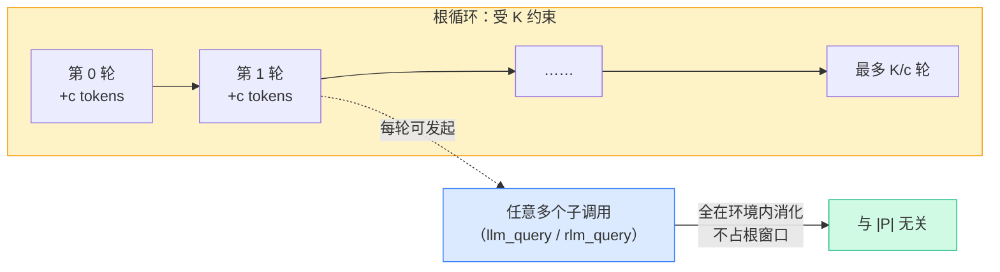

# REPL 循环时序图

[上一章](/20-paper/algorithm) 我们逐行读了 Algorithm 1，并在数据流图里埋了一个伏笔："只要第 7 行回喂的永远是 stdout 的**元数据**而非全文，窗口就永远不爆。"这一章我们把这件事彻底讲清——用一张时序图还原一次完整 RLM 运行的来龙去脉，并算清楚那个让所有工程师安心的数字：**为什么每轮只追加常数大小的元数据，窗口就有了硬上界**。

## 四个参与者

一次 RLM 运行里有四个角色在来回传话。先认清它们各自管什么：

| 参与者 | 职责 | 对应 `mini_rlm` |
|---|---|---|
| **User** | 发起请求，给出超长 context 和任务 task | 调 `rlm.completion(context, task)` |
| **RLM 循环** | 调度中枢：建历史、调模型、把代码丢给 REPL、检测交卷 | `MiniRLM.completion` 的 `for` 循环 |
| **LLM 模型** | 底座模型 M：每轮基于历史写一段 ` ```repl ` 代码 | `client.completion(messages)` |
| **REPL 环境** | 持久化命名空间：执行代码、存变量、注入 `llm_query`/`answer` | `MiniREPL.execute_code` |

注意 **RLM 循环** 和 **LLM 模型** 是两个角色。新手最容易把它俩混为一谈，以为"模型自己在循环"。不是——**循环是脚手架在跑，模型只负责被调用时写一段代码**。这个分工是理解 RLM 的关键。

## 一次完整运行的时序图

下面这张图还原从用户发请求到拿到答案的全过程。看的时候重点盯**每条返回箭头上的标注**——哪些是"任意大对象"，哪些是"常数大小元数据"。

```mermaid
sequenceDiagram
    autonumber
    participant U as User
    participant L as RLM 循环
    participant M as LLM 模型
    participant R as REPL 环境

    U->>L: completion(context=超长P, task)
    Note over L,R: 初始化阶段
    L->>R: load_context(P)
    R-->>L: context 变量就位（P 留在环境，不回传）
    L->>L: hist ← [系统提示 + P 的元数据]

    rect rgb(235, 245, 255)
    Note over L,R: 主循环 · 第 0 轮
    L->>M: completion(hist)
    M-->>L: ```repl print(len(context)); print(context[:200]) ```
    L->>R: execute_code(code)
    R-->>L: stdout="12000\n第一章 ……"（已截断到 c 字符）
    L->>L: hist ← hist + code + Metadata(stdout)
    end

    rect rgb(235, 245, 255)
    Note over L,R: 主循环 · 第 1 轮（变量持久化，context 还在）
    L->>M: completion(hist)
    M-->>L: ```repl labels=[llm_query(x) for x in chunks] ```
    L->>R: execute_code(code)
    Note over R: 环境内部对每个 chunk 调子模型<br/>（成百上千次 llm_query 都发生在这里）
    R-->>L: stdout="处理了 800 个分片"（仍是常数大小）
    L->>L: hist ← hist + code + Metadata(stdout)
    end

    rect rgb(235, 255, 235)
    Note over L,R: 主循环 · 第 n 轮 · 交卷
    L->>M: completion(hist)
    M-->>L: ```repl answer["content"]=final; answer["ready"]=True ```
    L->>R: execute_code(code)
    R-->>L: on_ready 触发，final_answer 就绪
    L->>L: 检测到 Final，跳出循环
    end

    L-->>U: response = answer["content"]（可 ≫ K）
```

## 顺着箭头读：四个阶段

**初始化（第 1–4 步）**。User 把超长 P 交给 RLM 循环，循环立刻调 `load_context` 把 P 塞进 REPL 当 `context` 变量。**注意第 3 步的返回箭头**：REPL 只回一句"就位"，**P 没有跟着回传**——它从此留在环境里。然后第 4 步建 `hist`，里面只有系统提示和 P 的元数据（长度、开头几个字、怎么访问）。窗口干净。

**第 0 轮：探路（第 5–8 步）**。循环把 `hist` 喂给模型，模型写出第一段代码——通常是 `print(len(context))` 这种"先摸清家底"的探查（系统提示会引导它第 0 轮先 peek，对应 `mini_rlm` 的 `build_turn_prompt` safeguard）。REPL 执行后，stdout 被截断到 c 字符再回喂。**这一轮没有任何全文进窗口**。

**第 1 轮：批量子调用（第 9–12 步）**。模型看懂了 context 结构，写出 `[llm_query(x) for x in chunks]` 这种程序化递归。**最关键的一幕在第 11 步的 Note 里**：成百上千次 `llm_query` 全都发生在 **REPL 环境内部**，根本不经过 RLM 循环的历史。环境忙活半天，回给循环的仍然只是一句"处理了 800 个分片"——常数大小。

**交卷（第 13–16 步）**。模型把答案写进 `answer` 变量并设 `ready=True`，`on_ready` 回调触发，循环检测到 Final 就跳出，把 `answer["content"]` 返回给 User。**答案是从环境变量取的**，所以它的长度不受模型窗口约束（这就是 [输出无界](/20-paper/algorithm#无界-到底指哪三个视野)）。

::: tip 时序图里藏着的三道"防火墙"
回看三条关键返回箭头：(a) `load_context` 不回传 P；(b) `execute_code` 只回传截断后的 stdout；(c) 子调用全在环境内部消化。这三道防火墙拦住的，正是三类"任意大对象"流回窗口的路径。少任何一道，窗口都会被某条路径灌爆。
:::

## 核心：为什么"只回喂常数大小元数据"是命门

现在回答埋了两章的伏笔。RLM 凭什么敢让模型在环境里发起**任意多**子调用，却保证自己的窗口不爆？答案藏在一个简单的算术里。

论文的论证是这样的：**每一轮，回喂给历史的内容都被 trim（截断）到至多 c 个 token**（c 是个常数，比如官方截断到 20000 字符、`mini_rlm` 截断到 4000）。那么：

- 每轮 `hist` 的增量 ≤ c（一段代码 + 一段截断后的 stdout，都是常数量级）；
- 模型窗口 K 是固定的；
- 于是根循环最多能跑 **K / c 轮**——超过这个轮数，`hist` 就会逼近 K。



这张图是 RLM 复杂度直觉的全部：

- **根循环的轮数有硬上界 K/c**——这是个**常数**（K 和 c 都固定），与 P 多长完全无关。所以无论 P 是 1 万字符还是 1000 万字符，根模型最多看 K/c 屏"元数据"。
- **每一轮内部，可以发起任意多子调用**——因为子调用在环境里跑，它们的输入输出都是环境变量，不占根窗口一个 token。想对 P 的一百万个分片各来一刀？写一个 `for` 循环就行，根窗口纹丝不动。

把两点合起来：**根模型的工作量是 O(K/c)=O(1)（相对 |P|），而实际处理 P 的算力被推到了"环境内的任意多子调用"上。** 输入无界、语义无界，就是这么挣来的。

::: warning 常见错误
最常见的实现 bug，是为了"让模型看清结果"而把整个 stdout 原样回喂（去掉截断）。后果是连锁的：模型一旦写出 `print(context)` 或 `print(big_list)`，整个大对象瞬间灌进 `hist`，**单这一轮就可能超过 K**——RLM 直接退化成普通长上下文模型，K/c 的上界荡然无存。截断（trim 到 c）不是"为了省钱的优化"，而是**保证窗口有界的算法前提**。`mini_rlm` 里这道防线是 `parsing._truncate` + `RLMConfig.stdout_truncate_chars=4000`，请务必保留。
:::

::: details 旁注：截断会不会丢信息？会，但这正是设计意图
有人会担心："截断 stdout 不就丢信息了吗？" 会丢，但这是**刻意**的。回喂的本就该是"元数据/摘要"，不是数据本身。模型真要某段完整内容，应该写代码**精确地取**那一段（`context[1000:1200]`），而不是指望把全部 stdout 倒进窗口。这恰好逼出 RLM 想要的行为：模型学会"用代码按需取用"，而不是"把一切都背进脑子"。这与 [概念篇"句柄 vs 实体"](/10-concepts/three-design-choices#决策一-给模型一个-prompt-的-符号句柄-而不是-prompt-本身) 是同一个道理。
:::

## 把"谁占窗口"拆成一张账单

口说无凭，我们把一次运行里的"窗口占用账单"列清楚。假设 P=1000 万字符、模型窗口 K=128k tokens、每轮截断 c=4k tokens、第 1 轮在环境里发起了 80 万次 `llm_query`：

| 数据流 | 体量 | 进根窗口吗 | 在哪里消化 |
|---|---|---|---|
| P 全文 | 1000 万字符 | ❌ 不进 | 留在 REPL 的 `context` 变量 |
| 每轮模型写的代码 | 几百 token | ✅ 进 | 根 `hist` |
| 每轮 stdout | 截断到 c=4k | ✅ 进（截断后） | 根 `hist` |
| 80 万次子调用的输入/输出 | 海量 | ❌ 不进 | REPL 环境内部 |
| 最终答案 Y | 可能很长 | ❌ 不进 | `answer` 变量，结束时直接返回给 User |

一眼可见：**真正进根窗口的，只有"代码 + 截断后的 stdout"两项，且每轮都是常数量级**。其余三项（P、子调用、Y）全在环境里流转，一个 token 都不占根模型的窗口。这张账单就是 K/c 上界的"现金流量表"版本。

## 和官方实现的一点差异

时序图里"RLM 循环 ↔ REPL 环境"这条线，在 `mini_rlm` 里是**进程内的闭包直接调用**——简单、零依赖，适合学习。官方实现这条线走的是一个**多线程 TCP socket 服务器**（`core/lm_handler.py` 的 `LMHandler`）：当 REPL 跑在隔离沙箱（docker / e2b / modal）里时，沙箱内的 `llm_query` 需要通过 socket 回调主进程才能发 LM 请求。两者**时序逻辑完全一样**，只是把"函数调用"换成了"网络往返"以支持远程沙箱。这层差异我们在 [Part 3 三层架构鸟瞰](/30-source/architecture-overview) 里细讲。

## 小练习

1. 把这张时序图里"第 1 轮"的 800 次 `llm_query` 改成 80 万次。RLM 循环（根历史 `hist`）会因此变长吗？为什么？这说明根窗口占用和什么有关、和什么无关？
2. 论文说"trim 每轮到 c tokens，则最多 K/c 轮根迭代"。假设底座模型窗口 K=128k tokens、每轮截断 c=4k tokens。根循环最多约多少轮？如果某个任务真的需要超过这个轮数才能做完，你会怎么改造（提示：想想 `rlm_query` 和递归深度）？

::: details 参考思路
1. **不会变长**。那 80 万次 `llm_query` 全发生在 REPL 环境内部，它们的输入输出都是环境变量；回给根循环的只是一句常数大小的 stdout 摘要（如"处理了 80 万个分片"）。所以根 `hist` 的增量仍是 ≤ c。这说明：**根窗口占用只和"根循环跑了几轮"有关，和"环境里发起了多少子调用 / P 有多长"无关**。
2. 约 K/c = 128k / 4k = **32 轮**。如果任务需要更多轮，正确做法不是硬把根循环拉长（那会逼近 K），而是用 `rlm_query` 把子任务**下分一层**：每个子 RLM 有自己独立的 K/c 轮预算和自己的窗口。这样总的"有效轮数"变成 (K/c) 的乘法叠加而非加法——这正是 [下一章递归深度](/20-paper/depth-and-results) 要讲的：增加 depth，本质是用递归换取更大的有效计算预算。
:::
