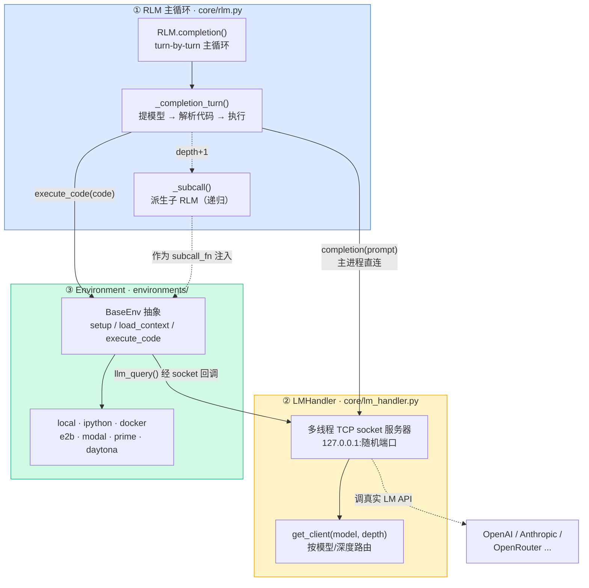
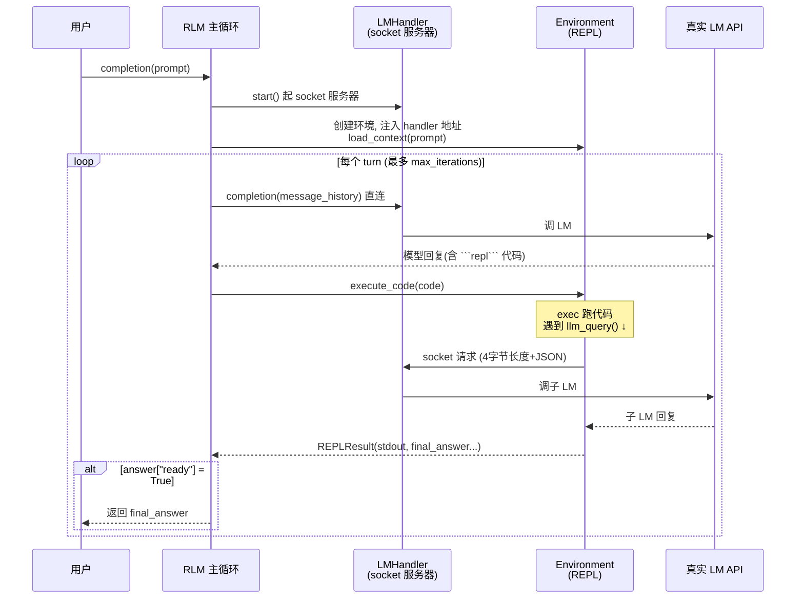
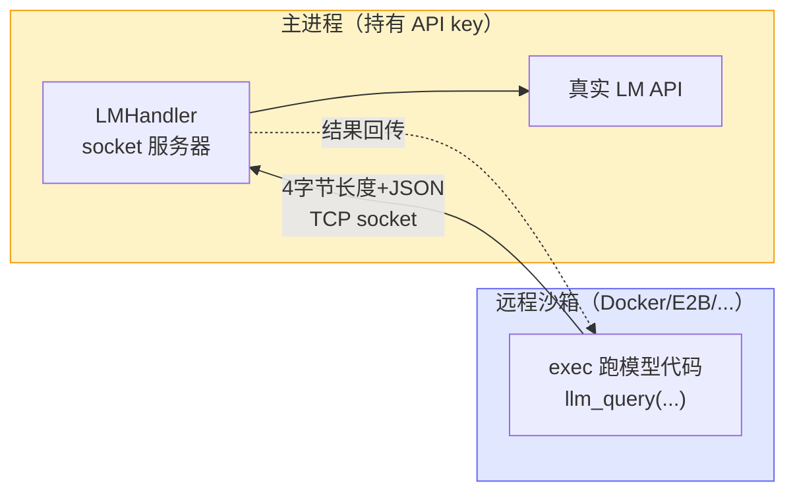

# 三层架构鸟瞰

到这里你已经懂了 RLM 的**思想**（[prompt 即环境 + 递归](/10-concepts/three-design-choices)）。Part 3 我们换个视角：打开[官方代码库](https://github.com/alexzhang13/rlm)，看真正能跑在 GPT-5 上、能把上下文塞进 Docker/E2B/Modal 远程沙箱的工程实现长什么样。

这一章先画一张"鸟瞰图"——三层各自管什么、数据怎么流。把这张图记牢，后面两章（[核心循环](/30-source/core-loop)、[REPL 与提示词](/30-source/repl-and-prompts)）就是在这三层里逐层放大。

::: tip 这是"精读"不是"翻译"
我们的目标不是逐行复述源码，而是讲清**官方每个设计选择背后的权衡**。每讲到一处，都会回头对照我们将在 [Part 5](/40-demos/) 写的简化版 `mini_rlm`：哪里被简化了、为什么教学版可以这么简化而不丢失本质。
:::

## 一张图看懂三层

官方实现可以干净地切成三层。它们的职责边界非常清晰，这正是这套代码值得精读的原因。



三层各自一句话：

| 层 | 文件 | 一句话职责 |
|---|---|---|
| ① RLM 主循环 | `core/rlm.py` | 驱动 turn-by-turn 循环：提模型、解析 ```` ```repl ````、调环境执行、检测交卷、护栏兜底 |
| ② LMHandler | `core/lm_handler.py` | 一个 TCP socket 服务器，**统一所有 LM 请求的出口**——无论请求来自主进程还是沙箱里的 `llm_query` |
| ③ Environment | `environments/` | 真正跑代码的地方：持久化 Python 命名空间、捕获 stdout、注入 `llm_query`/`rlm_query`、捕获 `answer` |

## 一次 completion 的数据流

把上图的箭头按时间顺序走一遍，你就理解了整个系统：



注意这里有**两条**通往 LM 的路径，它们都汇聚到 LMHandler：

1. **主进程直连**：主循环要让根模型写下一步代码，直接调 `lm_handler.completion(message_history)`（`core/rlm.py:655`）。这条路不走 socket，是普通的进程内方法调用。
2. **环境回调**：沙箱里模型写的代码执行到 `llm_query(...)` 时，环境通过 socket 把请求发回 LMHandler（`local_repl.py:272` 的 `send_lm_request`）。这条路**必须走 socket**。

为什么同一个 Handler 要支持两条路径、其中一条还非得用 socket？这就是理解官方架构的关键，也是理解"为什么我们 `mini_rlm` 能去掉 socket"的关键。

## 为什么官方要用 socket 服务器？

先看 `LMHandler` 的定位（`core/lm_handler.py:127-133`）：

```python
class LMHandler:
    """
    Handles all LM calls from the RLM main process and environment subprocesses.

    Uses a multi-threaded socket server for concurrent requests.
    Protocol: 4-byte big-endian length prefix + JSON payload.
    """
```

关键词是 **"environment subprocesses"**——环境可能跑在另一个进程，甚至另一台机器上。

回忆官方支持的 7 种环境：`local / ipython / docker / e2b / modal / prime / daytona`。后五种是**隔离沙箱**：你的 100M 字符上下文和模型写的代码，跑在一个 Docker 容器、E2B 微虚拟机、或 Modal 云函数里。问题来了——

> 沙箱里那段代码执行到 `llm_query("总结这个 chunk")` 时，它**怎么调到 LM**？

沙箱出于安全通常没有你的 API key，也不在你的 Python 进程里。它唯一能做的，是通过网络把"我要发一个 LM 请求"这件事**回传给主进程**。于是官方的设计是：

- 主进程起一个 TCP socket 服务器（`LMHandler.start()`，`core/lm_handler.py:187-198`），监听 `127.0.0.1` 的一个随机端口（`port=0` 让 OS 自动分配，`:139`）。
- 创建环境时，把 `(host, port)` 作为 `lm_handler_address` 注入进去（`core/rlm.py:272`）。
- 沙箱里的 `llm_query` 把请求打包成 `4 字节长度前缀 + JSON`，通过 socket 发回主进程（`local_repl.py:271-272`）。
- 主进程的 socket handler 收到后，用**自己持有的 API key** 真正调 LM，再把结果发回沙箱（`core/lm_handler.py:61-80`）。



再加两个理由，socket 就更显得必要：

- **多线程并发**：`rlm_query_batched` 会用线程池同时发起几十个子调用（`local_repl.py:381`），每个线程独立向 socket 发请求。`ThreadingTCPServer`（`core/lm_handler.py:120-124`）天然每连接一线程，正好接住这种并发。
- **统一计费出口**：所有 LM 调用都过这一个 Handler，于是 token/成本能在一个地方汇总（`get_usage_summary()`，`:219-233`），护栏（预算、token 上限）才有统一的数据来源。

::: warning 常见误解
socket 服务器**不是**为了"调用远程的 LM API"——调 OpenAI 本来就是网络请求。它是为了让**远程沙箱里的代码**能反向回调**本地主进程**来发 LM 请求。方向是"沙箱 → 主进程"，不是"主进程 → 云端 LM"。把方向搞反，就理解不了为什么 `local` 环境其实也用了同一套 socket。
:::

## 对照：为什么 mini_rlm 可以去掉 socket

这是官方与我们教学版 `mini_rlm` 的**最大差异**，值得讲透。

`mini_rlm` 只实现 `local` 一种环境——代码就在你的 Python 进程里 `exec`，**和主循环共享同一个进程、同一个内存空间**。既然 REPL 和主循环在一个进程里，REPL 想发 LM 请求时，根本不需要"跨进程通信"，直接调一个 Python 函数就行。

于是 `mini_rlm` 用**闭包注入**替代了整个 socket 层：

| 维度 | 官方 | mini_rlm |
|---|---|---|
| 环境位置 | 可能在远程沙箱（另一进程/机器） | 一定在本进程 |
| LM 请求通路 | TCP socket（4 字节长度 + JSON） | 直接调 Python 函数 |
| 谁持有"发请求"的能力 | `LMHandler` socket 地址 | 一个 `client` 对象 / `subcall_fn` 闭包 |
| 并发子调用 | `ThreadingTCPServer` 多线程 | （教学版可串行，足够说明问题） |
| 代码量 | `lm_handler.py` + `comms_utils.py` ≈ 数百行 | **0 行**（不存在这一层） |

具体到代码：`mini_rlm` 的 `MiniREPL` 直接持有一个 `client`（在 `_llm_query` 里调 `client.completion`），并接收一个 `subcall_fn` 闭包（在 `_rlm_query` 里调它来递归）。整个"LMHandler + socket 协议"被一个函数引用取代了。

> 一句话权衡：**官方为了支持远程隔离沙箱，付出了一整层 socket 服务器的复杂度；教学版只跑本地、只求讲清原理，于是把这层折叠成了一个函数闭包。** 原理（"环境里的代码能回调发 LM 请求"）完全保留，工程复杂度归零。

这也提示你：如果哪天你想给 `mini_rlm` 加一个 Docker 环境，**socket 层就是你绕不开的第一道工程门槛**——这正是官方代码值得保留它的原因。

## 官方目录树

最后给一张官方 `rlm/` 包的目录树，标注我们 Part 3 会精读的文件（★）。后面两章会反复回到这棵树：

```text
rlm/
├── core/
│   ├── rlm.py            ★ RLM 主循环：completion / _completion_turn / _subcall
│   ├── lm_handler.py     ★ LMHandler：多线程 TCP socket 服务器
│   ├── comms_utils.py      socket 协议：LMRequest/LMResponse，4字节长度+JSON
│   └── types.py            REPLResult / RLMIteration / RLMChatCompletion 等
├── environments/
│   ├── base_env.py         BaseEnv 抽象；NonIsolatedEnv vs IsolatedEnv
│   ├── local_repl.py     ★ 本地 REPL：exec + 命名空间持久化 + answer 捕获
│   ├── ipython_repl.py     基于 IPython 内核的本地环境
│   ├── docker_repl.py      隔离沙箱：Docker 容器
│   ├── e2b_repl.py         隔离沙箱：E2B 微虚拟机
│   ├── modal_repl.py       隔离沙箱：Modal 云函数
│   ├── prime_repl.py       隔离沙箱：Prime Intellect
│   └── daytona_repl.py     隔离沙箱：Daytona
├── utils/
│   ├── prompts.py        ★ RLM_SYSTEM_PROMPT / ORCHESTRATOR_ADDENDUM
│   ├── parsing.py        ★ find_code_blocks / format_iteration（20000 字符截断）
│   ├── token_utils.py      token 计数、上下文上限（compaction 用）
│   └── exceptions.py       预算/超时/token/错误阈值等护栏异常
├── clients/                各家 LM 客户端：openai / anthropic / gemini / ...
└── logger/                 RLMLogger + 终端 verbose 输出
```

::: details 为什么本地环境也走 socket？
你可能注意到：`local` 明明在同一进程，却也通过 `lm_handler_address` 发 socket 请求（`local_repl.py:267-272`）。官方这么做是为了**让七种环境共用同一套接口**——`LocalREPL` 和 `DockerREPL` 对外行为一致，主循环不必关心环境是本地还是远程。这是"为统一抽象付出局部冗余"的典型工程取舍。`mini_rlm` 不追求多环境，所以直接砍掉这层冗余。
:::

## 小练习

1. 有人提议给 RLM 加一个"在 AWS Lambda 里跑代码"的新环境。基于本章的三层划分，他至少要实现/改动哪些东西？哪一层完全不用动？
2. `mini_rlm` 把 socket 层换成了函数闭包。如果某天你要让 `mini_rlm` 支持"代码跑在子进程里"（而不是同进程 `exec`），这个闭包方案会在哪一步失效？你会怎么补救？

::: details 参考思路
1. 要新写一个继承 `BaseEnv`（具体是 `IsolatedEnv`）的环境类，实现 `setup / load_context / execute_code`，并让沙箱里的代码能通过 socket 回连 `LMHandler`（把 `lm_handler_address` 注入沙箱、在沙箱内实现 `llm_query` 的 socket 客户端）。**RLM 主循环（`core/rlm.py`）几乎不用动**——它只调 `environment.execute_code(...)`，不关心代码在哪跑。LMHandler 也不用动，它本来就是为"沙箱回调"设计的。这正是三层解耦的价值。
2. 函数闭包靠"同进程共享内存"才能直接调用。一旦代码跑到子进程，子进程拿不到父进程内存里的那个 `subcall_fn` 对象，闭包调用就失效了。补救方式恰恰就是官方的方案：在两个进程间架一条通信通道（socket / pipe / 共享队列），把"调用闭包"变成"发一条消息回主进程，由主进程代为执行"。换句话说，你会被迫重新发明 LMHandler。
:::
