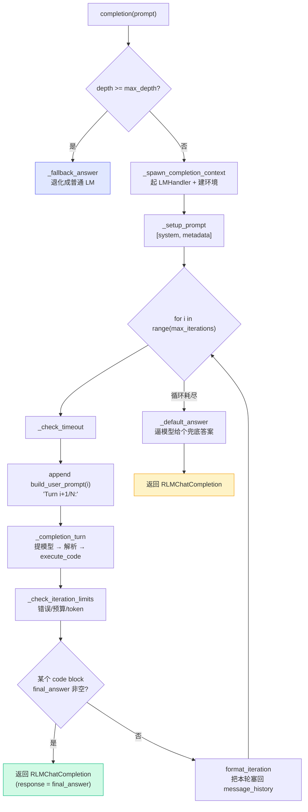

# 核心循环 core/rlm.py

上一章我们俯瞰了三层架构。这一章把放大镜对准最核心的一层——`core/rlm.py` 里的 `RLM` 类（定义于 `:41`）。它就是那个 turn-by-turn 的"心跳"：提模型、跑代码、看交卷没有，循环往复。

读完你会发现：**RLM 的主循环骨架其实非常短**。复杂度全在护栏（超时、预算、token、错误、compaction）和递归（`_subcall`）上。我们先抓骨架，再逐个看护栏，最后对照 `mini_rlm` 看哪些护栏在教学版里被砍掉了、为什么砍得起。

## 一次 completion 的控制流

先上全景图，后面逐段拆。这是 `completion()`（`core/rlm.py:324-488`）一次调用的控制流：



注意三个出口：①深度到顶直接退化成 LM（`_fallback_answer`）；②循环内某轮交卷（`final_answer`）；③循环耗尽走兜底（`_default_answer`）。下面逐个看。

## 入口的第一道闸：depth >= max_depth 就退化

`completion()` 一进门，重置完计数器，先做一个判断（`core/rlm.py:347-349`）：

```python
# If we're at max depth, the RLM is an LM, so we fallback to the regular LM.
if self.depth >= self.max_depth:
    return self._fallback_answer(prompt)
```

这一行落地了[论文里的 depth 语义](/20-paper/)：递归不能无限深，到顶了，这个"RLM"就退化成一个普通 LM——`_fallback_answer`（`:696-702`）直接拿 client 做一次 `completion`，不再起环境、不再循环。

> 为什么这道闸放在最前面？因为子调用 `_subcall` 会一路 `depth+1` 地往下递归（见本章末尾）。没有这道闸，递归就停不下来。它是递归的**终止条件**。

`mini_rlm` 完全保留了这个语义：它的 `MiniRLM.completion` 同样在深度到顶时退化。这是三个核心设计之一（程序化递归）的边界，不能简化。

## 启动：起 socket、建环境、装系统提示

通过深度闸后，进入一个 `with` 上下文（`core/rlm.py:354-355`）：

```python
with self._spawn_completion_context(prompt) as (lm_handler, environment):
    message_history = self._setup_prompt(prompt, root_prompt=root_prompt)
```

`_spawn_completion_context`（`:225-296`）干三件事，正好对应[上一章三层架构](/30-source/architecture-overview)：

1. 建 client，包进 `LMHandler` 并 `start()` 起 socket 服务器（`:234-256`）。
2. 建环境，把 socket 地址、上下文、深度注入进去（`:270-286`）。**关键一行**：当 `max_depth > 1` 且环境是 local/ipython 时，把 `self._subcall` 作为 `subcall_fn` 注入（`:276-277`）——这就是递归能力的来源。
3. 用 `try/finally` 保证退出时 `lm_handler.stop()`、非持久化环境 `cleanup()`（`:291-296`）。

`_setup_prompt`（`:298-322`）则建起初始消息历史，只有两条：`[system, metadata]`。注意**这里不放 prompt 全文**——只放它的元数据（类型、长度）。这正是[设计决策一"句柄而非实体"](/10-concepts/three-design-choices#决策一-给模型一个-prompt-的-符号句柄-而不是-prompt-本身)在代码里的落点。

## 主循环骨架：for i in range(max_iterations)

这是整个文件的心脏（`core/rlm.py:359` 起，默认 `max_iterations=30`，见 `:57`）。剥掉护栏后，骨架只有五步：

```python
for i in range(self.max_iterations):
    self._check_timeout(i, time_start)                  # 护栏：超时
    # ... compaction 检查（可选）...
    message_history.append(                              # ① 追加本轮 user 提示
        build_user_prompt(root_prompt, i, context_count, history_count,
                          max_iterations=self.max_iterations)
    )
    iteration = self._completion_turn(                  # ② 提模型 + 跑代码
        prompt=message_history, lm_handler=lm_handler, environment=environment,
    )
    self._check_iteration_limits(iteration, i, lm_handler)   # 护栏：错误/预算/token

    final_answer = None                                 # ③ 检测交卷
    for block in iteration.code_blocks:
        if getattr(block.result, "final_answer", None) is not None:
            final_answer = block.result.final_answer
            break
    iteration.final_answer = final_answer

    if final_answer is not None:                        # ④ 交卷则返回
        return RLMChatCompletion(...)

    new_messages = format_iteration(iteration)          # ⑤ 把本轮塞回历史
    message_history.extend(new_messages)
```

逐步解读：

**① 每轮追加一条 user 提示**（`:392-400`）。`build_user_prompt` 生成的就是那条朴素的 `"Turn 3/30:"`（[prompts.py:248](/30-source/repl-and-prompts)）。第 0 轮还会带一句 safeguard，提醒模型"先看 context，别急着交卷"。注意官方是**全前缀**地把每轮 user 提示**持久化**进 `message_history`，让模型看到一条连续的 `[system, metadata, user_0, assistant_0, repl_0, user_1, ...]` 链（见 `:388-391` 的注释）。

**② `_completion_turn`** 是单轮的执行单元，下一节细讲。

**③ final_answer 检测**（`:414-419`）是循环的退出判据，**值得专门看**。

**④/⑤** 交卷就返回，没交卷就 `format_iteration` 把"模型回复 + REPL 输出"两条消息塞回历史，进入下一轮。

## final_answer 是怎么检测出来的

很多人初读会以为"模型说一句 final answer 就结束了"。不是。看 `:414-419`：

```python
final_answer = None
for block in iteration.code_blocks:
    if getattr(block.result, "final_answer", None) is not None:
        final_answer = block.result.final_answer
        break
```

终止信号**不来自模型的自然语言**，而来自**环境的执行结果**——具体说，是某个 ```` ```repl ```` 代码块执行后，`REPLResult.final_answer` 非空。而 `final_answer` 非空，当且仅当模型在代码里写了 `answer["ready"] = True`（这条链路下一章[REPL 与提示词](/30-source/repl-and-prompts#answerdict-如何捕获最终答案)讲透）。

这正是[设计决策二"答案从环境里取，而不是让模型说"](/10-concepts/three-design-choices#决策二-最终答案从环境里-取-而不是让模型-说)的代码落点：

> 答案是一个**变量里攒出来的值**，可以任意长、可以跨多轮拼接，输出长度不受模型窗口限制。主循环只是去环境里"取"这个值。

`mini_rlm` 一模一样地复刻了这个机制：它的 `MiniRLM._run_one_turn` 同样遍历 `REPLResult`，看 `final_answer` 是否被 `_AnswerDict` 的 `on_ready` 回调填上。这是核心三决策之一，**不能简化**。

## 没交卷怎么办：两道兜底

主循环正常 `for` 结束（30 轮跑完还没交卷），不会抛错，而是走兜底（`core/rlm.py:468-470`）：

```python
# Default behavior: we run out of iterations, provide one final answer
time_end = time.perf_counter()
final_answer = self._default_answer(message_history, lm_handler)
```

`_default_answer`（`:671-694`）追加一句 `"Please provide a final answer ..."`，逼模型基于已有信息给个答案。**这是工程上的"防空手而归"**——宁可给个不完美的答案，也不要抛异常让调用方拿到 `None`。

此外循环里还埋了一路 `KeyboardInterrupt` 捕获（`:461-466`），用户 Ctrl+C 时抛 `CancellationError` 并**带上 `_best_partial_answer`**——尽量把已经攒到的半成品答案交出去。

`mini_rlm` 保留了"循环耗尽走兜底"这一条（max_iterations 兜底），但**不实现** Ctrl+C 的 partial-answer 回传——教学场景下用不上，砍掉让循环更易读。

## 护栏：官方的五道保险，教学版砍了几道

官方主循环被五种护栏包裹，全是为"真金白银调 GPT-5、可能跑几分钟、可能花几美元"的生产场景准备的：

| 护栏 | 触发点 | 实现位置 | 抛出的异常 |
|---|---|---|---|
| 超时 | 每轮开头 | `_check_timeout` `:490-508` | `TimeoutExceededError` |
| 错误阈值 | 每轮结束 | `_check_iteration_limits` `:518-547` | `ErrorThresholdExceededError` |
| 预算（USD） | 每轮结束 | `:549-564` | `BudgetExceededError` |
| token 上限 | 每轮结束 | `:566-583` | `TokenLimitExceededError` |
| compaction | 每轮开头 | `:363-376` | （不抛错，触发历史压缩） |

几个值得注意的设计：

- **连续错误才计数**（`:526-529`）：`_consecutive_errors` 在成功一轮后归零。偶发一次代码报错不会终止，连续 N 次才停——区分"偶然出错"和"卡死循环"。
- **护栏异常都带 `partial_answer`**（如 `:503`）：撞墙时不空手而归，把 `_best_partial_answer` 一并抛出。`_best_partial_answer` 在每轮更新（`:421-423`）。
- **compaction 是另一类**（`:363-376`、`_compact_history` `:600-642`）：它不是"停止"，而是当根模型历史逼近上下文上限的 `compaction_threshold_pct`（默认 0.85）时，让模型**自我总结**进而压缩历史。注意这和[设计决策一](/10-concepts/three-design-choices)的精神略有张力——RLM 本该靠"上下文在环境里"避免压缩，但**根模型自己的逐轮历史**仍可能涨太长，所以官方留了这道可选的口子。

::: tip 护栏 vs 核心，要分清
上面这五道护栏，**没有一道是 RLM 跑起来的必要条件**。它们是"生产健壮性"，不是"算法本质"。这正是 `mini_rlm` 敢于大刀阔斧简化的地方。
:::

**`mini_rlm` 对照**：教学版只保留**两道最本质的边界**——`max_iterations`（循环上限，否则会死循环）和 `max_depth`（递归上限，否则递归停不下来）。超时、预算、token、错误阈值、compaction **全部砍掉**。理由很简单：`mini_rlm` 默认用 `MockLM`（零成本、瞬时返回、不会真出错），这些为"真钱真时间"准备的护栏在教学场景下毫无用武之地，留着只会模糊主循环的骨架。

> 一句话权衡：**官方主循环 ≈ 5 步骨架 + 5 道护栏；教学版只留骨架 + 2 道硬边界。** 你读 `mini_rlm/rlm.py` 时会惊讶它多短——短就对了，因为它把"算法"和"生产健壮性"分开了，只留前者。

## 单轮：_completion_turn

最后看单轮执行单元（`core/rlm.py:644-669`），它短得可以全文贴出：

```python
def _completion_turn(self, prompt, lm_handler, environment) -> RLMIteration:
    iter_start = time.perf_counter()
    response = lm_handler.completion(prompt)              # ① 提模型（主进程直连）
    code_block_strs = find_code_blocks(response)          # ② 解析 ```repl``` 块
    code_blocks = []
    for code_block_str in code_block_strs:
        code_result = environment.execute_code(code_block_str)   # ③ 逐块执行
        code_blocks.append(CodeBlock(code=code_block_str, result=code_result))
    iteration_time = time.perf_counter() - iter_start
    return RLMIteration(prompt=prompt, response=response,
                        code_blocks=code_blocks, iteration_time=iteration_time)
```

三步，干净利落：

1. **提模型**（`:655`）：`lm_handler.completion(prompt)`，这是[上一章](/30-source/architecture-overview#为什么官方要用-socket-服务器)说的"主进程直连"路径——不走 socket，直接进程内调用。
2. **解析代码**（`:656`）：`find_code_blocks` 用正则把模型回复里所有 ```` ```repl ```` 块抠出来（正则细节见下一章）。
3. **逐块执行**（`:659-661`）：每个块丢给 `environment.execute_code`，拿回 `REPLResult`，包成 `CodeBlock`。

一轮可以有**多个** ```` ```repl ```` 块，它们按顺序在**同一个持久化命名空间**里执行——前一块定义的变量，后一块能用。

`mini_rlm` 的单轮逻辑（`_run_one_turn`）和这里几乎逐行对应：提模型 → `find_code_blocks` → 逐块 `execute_code`。唯一差别是 `mini_rlm` 直接调 `client.completion`，没有"经 LMHandler 直连"这一层包装——因为它根本没有 LMHandler。

## 递归：_subcall 一瞥

主循环之外还有一个方法撑起了"程序化递归"——`_subcall`（`core/rlm.py:704-869`）。它被作为 `subcall_fn` 注入环境，当沙箱里模型写的代码调 `rlm_query(...)` 时被触发。核心就两步（`:806-834`）：

```python
child = RLM(                          # 新建一个 depth+1 的子 RLM
    backend=self.backend,
    depth=next_depth,
    max_depth=self.max_depth,
    custom_tools=self.custom_sub_tools,
    # ... 把 budget/timeout 的"剩余额度"传给孩子 ...
)
result = child.completion(prompt, root_prompt=None)   # 子 RLM 跑自己的完整循环
```

精妙之处：

- **剩余额度下传**（`:762-790`）：父 RLM 把"还剩多少预算、还剩多少超时"算好传给子 RLM，护栏跨递归层累计——子调用花的钱也算进父的总账（`:835-837`）。
- **到顶退化**（`:732-760`）：如果 `next_depth >= max_depth`，不建子 RLM，直接做一次普通 LM 调用——又是那道深度闸，在递归侧的体现。
- **错误吞掉而非抛出**（`:850-858`）：子调用失败时返回一个 `response` 是错误信息的 completion，**不让一个子调用的失败炸掉整个父循环**。这对 `rlm_query_batched` 几十个并发子调用尤其重要。

`mini_rlm` 的 `_spawn_subcall` 保留了最核心的"新建 `depth+1` 的子 `MiniRLM`、调它的 `completion`"，但**砍掉**了剩余预算/超时下传、错误吞掉的精细处理——教学版不追求生产级容错，递归"能跑通、能讲清原理"即可。`_subcall` 与递归的完整精读，我们留到 [Part 5 的递归 Demo](/40-demos/) 里结合 `mini_rlm` 源码再展开。

## 小练习

1. 官方主循环里，"模型说了一句 'The answer is 42'"会让 `completion()` 返回吗？为什么？要让它返回，模型必须在代码里做什么？
2. 你把 `max_iterations` 设成 3，但任务很难，模型 3 轮都没交卷。`completion()` 会抛异常吗？它最终返回什么？这个设计对调用方有什么好处？

::: details 参考思路
1. **不会**。终止信号来自 `REPLResult.final_answer` 非空（`core/rlm.py:414-419`），而它非空当且仅当模型在 ```` ```repl ```` 块里执行了 `answer["content"] = ...; answer["ready"] = True`。纯自然语言里说"答案是 42"不触发任何东西，循环会继续。模型必须把答案**写进环境变量并 flip ready**——这就是"答案从环境取而非模型说"的设计。
2. **不抛异常**。`for` 循环正常结束后走 `_default_answer`（`:468-470`），追加一句"请基于现有信息给最终答案"逼模型兜底，返回一个 `RLMChatCompletion`。好处：调用方**永远拿到一个字符串答案**，不必处理"循环跑满但没结果"的 `None`/异常分支——把"可能不完美"的责任留在 RLM 内部，对外接口保持简单稳定。
:::
