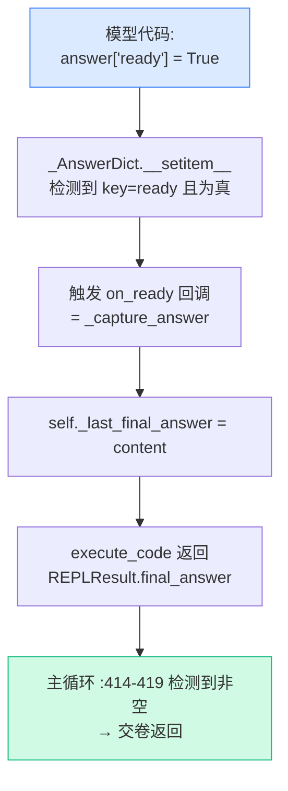

# REPL 环境与提示词

前两章讲了三层架构和主循环。但有两个问题一直没回答清楚：

- 模型写的代码到底**在哪、怎么跑**，变量为什么能跨轮保持？答案是 `final_answer` 又是怎么从代码里"冒"出来的？
- 模型怎么**知道**自己是个 RLM、该用 ```` ```repl ````、该往 `answer` 里写东西？

这一章把这两件事讲透。分三部分：(a) `local_repl.py` 的执行机制；(b) `prompts.py` 怎么"调教"模型当 RLM；(c) `parsing.py` 的正则与截断。每部分都对照 `mini_rlm` 的简化。

## (a) REPL 执行机制：exec + 命名空间

### 持久化：一个命名空间 exec 到底

核心只有一行（`environments/local_repl.py:557`）：

```python
combined = {**self.globals, **self.locals}
exec(code, combined, combined)
```

`exec(code, globals, locals)` 是 Python 内置：把 `code` 当作一段程序，在给定的全局/局部命名空间里跑。官方把 `globals` 和 `locals` 合并成同一个 `combined` 字典传进去——**globals 和 locals 是同一个对象**，于是函数定义、推导式作用域不会出幺蛾子。

执行完，把新产生的变量回收进 `self.locals`（`:560-562`）：

```python
for key, value in combined.items():
    if key not in self.globals and not key.startswith("_"):
        self.locals[key] = value
```

**持久化的本质就在这里**：`self.locals` 是实例属性，活过单次 `execute_code`。这一轮往 `self.locals` 写的变量，下一轮 `combined = {**self.globals, **self.locals}` 时又被带回来。所以模型第 1 轮写 `chunks = ...`，第 5 轮还能 `print(chunks[0])`。

```mermaid
flowchart LR
    subgraph turn1["第 1 轮 execute_code"]
        E1["exec: chunks = split(context)"] --> S1["回收进 self.locals"]
    end
    subgraph turn2["第 5 轮 execute_code"]
        C2["combined = globals + self.locals<br/>(chunks 在这里)"] --> E2["exec: print(chunks[0]) ✓"]
    end
    S1 -.self.locals 跨轮存活.-> C2
    style S1 fill:#d1fae5,stroke:#10b981
```

::: warning 常见错误：exec 不是安全沙箱
官方在 `_SAFE_BUILTINS`（`local_repl.py:55-144`）里挑了一份白名单 builtins，并把 `eval`/`exec`/`compile`/`globals`/`locals`/`input` 显式设为 `None`（`:138-144`）来"封"掉最危险的几个。但**这远不是真正的隔离**——`open`、`__import__` 还在白名单里，模型完全能读写文件、import 任意库。官方真正的隔离靠的是 docker/e2b/modal 那些**独立沙箱环境**，`local` 只是"轻量本地、自担风险"。`mini_rlm` 更直接：它用裸 `exec`，**完全不是安全沙箱**，文档里反复强调"只在可信输入下用"。教学版不该用来跑不可信代码。
:::

### _AnswerDict 如何捕获最终答案

上一章说"final_answer 来自环境"，机关就是 `_AnswerDict`（`local_repl.py:26-47`）。它是一个**伪装成普通 dict 的 dict 子类**，重写了 `__setitem__`：

```python
class _AnswerDict(dict):
    def __init__(self, on_ready=None):
        super().__init__()
        super().__setitem__("content", "")
        super().__setitem__("ready", False)
        self._on_ready = on_ready

    def __setitem__(self, key, value):
        super().__setitem__(key, value)
        if key == "ready" and value and self._on_ready is not None:
            try:
                self._on_ready(self.get("content", ""))
            except Exception:
                pass
```

对模型来说，`answer` 就是个普通字典——它写 `answer["content"] = "42"`、`answer["ready"] = True` 毫无异样。但**当它把 `ready` 设成真值的瞬间**，`__setitem__` 触发 `on_ready` 回调。回调是 `_capture_answer`（`:244-245`），把 content 存进 `self._last_final_answer`。然后 `execute_code` 末尾（`:573-583`）把它放进 `REPLResult.final_answer` 交给主循环。



为什么要搞这么个"会回调的 dict"，而不是每轮执行完去命名空间里翻一下 `answer["ready"]`？因为**事件驱动比轮询干净**：答案一旦就绪立刻被捕获，且能精确捕获"flip 那一刻"的 content。官方还在 `_restore_scaffold`（`:527-539`）里加了道保险——万一模型把 `answer` 整个重新赋成一个**普通** dict（callback 就丢了），重新包回 `_AnswerDict` 并补捕获一次。

**`mini_rlm` 对照**：完全保留了 `_AnswerDict(on_ready)` 这个机制——这是[设计决策二](/10-concepts/three-design-choices#决策二-最终答案从环境里-取-而不是让模型-说)的命脉，砍不得。但 `mini_rlm` 省掉了 `_restore_scaffold` 那套"模型把 answer 重新赋值"的防御性恢复——教学版假设模型守规矩。

### _capture_output 如何截 stdout

模型只能通过 `print(...)` 看到 REPL 的输出（这是系统提示里反复强调的，见下文）。官方用一个上下文管理器临时换掉 `sys.stdout`/`sys.stderr`（`local_repl.py:492-502`）：

```python
@contextmanager
def _capture_output(self):
    with self._lock:                                  # 线程锁：批量子调用时并发安全
        old_stdout, old_stderr = sys.stdout, sys.stderr
        stdout_buf, stderr_buf = io.StringIO(), io.StringIO()
        try:
            sys.stdout, sys.stderr = stdout_buf, stderr_buf
            yield stdout_buf, stderr_buf
        finally:
            sys.stdout, sys.stderr = old_stdout, old_stderr   # 必复原
```

`exec` 跑在这个 `with` 里（`:554`），于是 `print` 全进了 `StringIO` 缓冲，`execute_code` 末尾把 `getvalue()` 取出来放进 `REPLResult.stdout`。`finally` 保证无论代码报不报错，真正的 stdout 一定被复原——否则会污染整个进程的输出。那个 `self._lock`（`:178`）很关键：`rlm_query_batched` 会多线程并发执行代码，没有锁，几个线程同时换 `sys.stdout` 就乱套了。

**`mini_rlm` 对照**：用 `contextlib.redirect_stdout`/`redirect_stderr` 实现同样的捕获，但**不加线程锁**——因为教学版的子调用是串行的（没有 `ThreadPoolExecutor`），不存在并发改 `sys.stdout` 的竞争。少一把锁，少一份心智负担。

### _rlm_query / subcall_fn 如何注入递归

`setup()` 往 `self.globals` 里塞了一组函数（`local_repl.py:223-227`），这就是模型在代码里能直接调的"魔法函数"：

```python
self.globals["SHOW_VARS"] = self._show_vars
self.globals["llm_query"] = self._llm_query
self.globals["llm_query_batched"] = self._llm_query_batched
self.globals["rlm_query"] = self._rlm_query
self.globals["rlm_query_batched"] = self._rlm_query_batched
```

`llm_query`（`:258-280`）走 socket 发请求给 LMHandler（[上一章](/30-source/architecture-overview)讲过），拿回一个**叶子级**的普通 LM 回复。

`rlm_query`（`:313-333`）才是递归的入口，逻辑很优雅：

```python
def _rlm_query(self, prompt: str, model: str | None = None) -> str:
    if self.subcall_fn is not None:
        try:
            completion = self.subcall_fn(prompt, model)
            self._pending_llm_calls.append(completion)
            return completion.response
        except Exception as e:
            return f"Error: RLM query failed - {e}"
    # Fall back to plain LM call if no recursive capability
    return self._llm_query(prompt, model)
```

**有 `subcall_fn` 就递归，没有就退化成 `llm_query`**。而 `subcall_fn` 正是上一章主循环在 `max_depth > 1` 时注入的 `RLM._subcall`（`core/rlm.py:276-277`）。一条链就此闭合：

> 模型写 `rlm_query(chunk)` → `_rlm_query` 调 `subcall_fn` → `RLM._subcall` 新建 `depth+1` 子 RLM → 子 RLM 跑自己的完整 `completion` 循环 → 返回。

这就是[设计决策三"程序化递归"](/10-concepts/three-design-choices#决策三-符号递归-能在代码里程序化地调用模型)：模型能在**任意 `for` 循环里**调 `llm_query`/`rlm_query`，把 LM 调用当一等公民来组合。

**`mini_rlm` 对照**：`MiniREPL` 接收一个 `subcall_fn` 闭包（不是 socket 地址），`_rlm_query` 同样是"有 `subcall_fn` 则递归、否则退化为 `_llm_query`"。叶子调用记一条 `RLMResult(stopped_reason='leaf_llm')`。机制一模一样，只是通路从 socket 换成了直接函数调用。

## (b) prompts.py：怎么把模型"调教"成 RLM

模型默认不知道自己该当 RLM。是系统提示告诉它的。官方的系统提示由两块拼成（`utils/prompts.py`，拼接逻辑在 `build_rlm_system_prompt:211-245`）：`RLM_SYSTEM_PROMPT` + `ORCHESTRATOR_ADDENDUM`。

### RLM_SYSTEM_PROMPT：你是谁、有什么工具

`RLM_SYSTEM_PROMPT`（`utils/prompts.py:125-143`）开门见山定义身份：

> You are a Recursive Language Model (RLM): a language model with a prompt, and a very important context stored in a Python REPL related to that prompt.

然后列出 REPL 里有什么：`context`、`llm_query`、`llm_query_batched`、`rlm_query`/`rlm_query_batched`、`SHOW_VARS()`、`answer` dict。两段最该划重点：

**第一，怎么交卷**（`:135`）。它直接告诉模型 `answer` 的协议——往 `content` 写答案、把 `ready` 设 `True`。这就是 (a) 里 `_AnswerDict` 在提示侧的"使用说明"。

**第二，REPL 的两条铁律**（`:138`），这两句解决了真实的踩坑：

> REPL outputs over ~20K characters are truncated... The REPL is NOT a Jupyter cell — only `print(...)` output (stdout) is shown back to you between turns; a bare expression on the last line is silently discarded. Always wrap inspections in `print(...)`.

- **超 20K 截断**：所以别 `print` 整个 context，要切片后丢给 `llm_query`。这对应 (c) 里 `format_iteration` 的截断。
- **不是 Jupyter**：最后一行裸表达式**不会**显示，必须 `print(...)`。这是 LLM 写 REPL 代码最常犯的错——以为像 notebook 一样末行自动回显。官方直接在提示里堵死。

末尾还有一句行为约束（`:142`）：`Do not flip answer["ready"] = True on turn 1 without first inspecting context.` 这和[主循环里第 0 轮的 safeguard](/30-source/core-loop#主循环骨架-for-i-in-range-max-iterations)（`build_user_prompt:260-265`）双重保险，防止模型不看上下文就瞎交卷。

### ORCHESTRATOR_ADDENDUM：你是指挥，不是亲自下场的人

`ORCHESTRATOR_ADDENDUM`（`utils/prompts.py:147-205`）是更精妙的一段，由 `orchestrator=True`（默认）拼上。一句话总纲（`:149`）：

> As an RLM, you should act as an orchestrator, not a solver.

它在反复纠正模型的一个本能倾向——**亲自读、亲自想**。但 RLM 的整个价值在于"自己的窗口很小，把重活外包"。所以这段提示密集地灌输几条工程纪律：

- **把长上下文操作推给 `llm_query`**（`:162-173`）："Your own context window is small. Push every long-context operation ... into `llm_query` calls instead of pulling that text into your own message stream." 连"回顾自己的进度"都要让 `llm_query` 帮你总结成 1-2 句再 `print`，别让长 stdout 污染历史。
- **但也别过度委派**（`:166-170`）：如果一个 Python 关键词/正则搜索就能定位答案，或答案就在某段可见文本里，**直接读**——sub-LM 是给"塞不下"或"要语义理解"的场景用的。
- **子调用预算的两个独立轴**（`:180-199`）：① 单条 prompt 容量约 ~100K 字符；② 单批 fan-out 约 ~20 条。反模式是"几百上千条单条目的 mega-batch"，正解是"~20 条胖 prompt 的小批量"。这段把[决策三](/10-concepts/three-design-choices#决策三-符号递归-能在代码里程序化地调用模型)从"能递归"提升到了"怎么高效地递归"。

`build_rlm_system_prompt`（`:211-245`）最后还拼上一条 **metadata** user 消息（`:232-236`）——告诉模型 context 的**类型和总字符数**，但**不给全文**：

> Your context is a {context_type} of {context_total_length} total characters.

这就是[决策一"句柄而非实体"](/10-concepts/three-design-choices#决策一-给模型一个-prompt-的-符号句柄-而不是-prompt-本身)在提示侧的落点——模型只知道"有多长"，想要内容自己写代码取。

**`mini_rlm` 对照**：`prompts.py` 里有个 `SYSTEM_PROMPT`，**保留了三件本质**——告诉模型 context 在 REPL、用 ```` ```repl ```` 写代码、用 `llm_query`/`rlm_query`/`answer`。但它**大幅精简**了 `ORCHESTRATOR_ADDENDUM` 那套"~100K/~20 条预算、胖 prompt 小批量、何时该自己读"的精细调教——那些是为了在真实大上下文任务上榨性能，教学版用 `MockLM` 不需要。`mini_rlm` 的 `build_turn_prompt` 也保留了"第 0 轮提醒先 peek"的 safeguard。

> 一句话权衡：**官方提示词是被真实任务反复打磨过的"作战手册"，每句话背后都是一个踩过的坑；教学版只留"让模型最低限度懂规则"的核心，省去性能调优部分。**

## (c) parsing.py：正则与截断

### find_code_blocks：把代码从回复里抠出来

主循环靠它把模型回复里的 ```` ```repl ```` 块解析出来（`utils/parsing.py:10-22`）：

```python
def find_code_blocks(text: str) -> list[str]:
    pattern = r"```repl\s*\n(.*?)\n```"
    results = []
    for match in re.finditer(pattern, text, re.DOTALL):
        code_content = match.group(1).strip()
        results.append(code_content)
    return results
```

拆解这个正则：

| 片段 | 含义 |
|---|---|
| `` ```repl `` | 必须以 ```` ```repl ```` 围栏开头（普通 ```` ``` ```` 或 ```` ```python ```` 不匹配） |
| `\s*\n` | `repl` 后允许空白，然后必须换行 |
| `(.*?)` | 非贪婪捕获代码体 |
| `\n` ` ``` ` | 必须以换行 + ```` ``` ```` 收尾 |
| `re.DOTALL` | 让 `.` 匹配换行——代码是多行的，这个 flag 必不可少 |
| `re.finditer` | 找**所有**块，所以一轮可有多个 ```` ```repl ```` 块 |

::: tip 为什么专挑 repl 这个语言标识
模型回复里常夹带普通 ```` ```python ```` 代码（讲解、伪代码）。只匹配 ```` ```repl ```` 能精确区分"这块要真跑"和"这块只是展示"。这是个朴素但有效的约定。
:::

**`mini_rlm` 对照**：它的 `find_code_blocks` 正则是 `r"```repl\s*\n(.*?)```"`（同样 `re.DOTALL`）。和官方几乎一致，只是收尾少了 `\n`（官方要求结尾 ```` ``` ```` 前有换行，`mini_rlm` 略松）。功能等价。

### format_iteration：20000 字符截断

一轮执行完，要把"模型回复 + REPL 输出"塞回历史给下一轮。`format_iteration`（`utils/parsing.py:25-69`）干这事，关键是**截断**（`:59-63`）：

```python
result = format_execution_result(code_block.result)
if len(result) > max_character_length:                       # 默认 20000
    result = (
        result[:max_character_length]
        + f"... + [{len(result) - max_character_length} chars...]"
    )
```

`max_character_length` 默认 20000——和系统提示里那句"REPL outputs over ~20K characters are truncated"**严格对应**。这不是巧合，是同一个工程约束的两次表达：提示侧告诉模型"会被截"，解析侧真的截。

为什么必须截？因为 REPL 输出会进 `message_history`，而历史每轮都喂给根模型。要是模型手滑 `print(context)` 把 100M 字符全打出来，不截断的话**一轮就把根模型窗口撑爆**——这恰恰是 RLM 想避免的事。截断是"保护根模型窗口"的最后一道闸。

`format_iteration` 还有个细节（`:53-68`）：每轮**恰好产出两条消息**——一条 assistant（模型回复，含代码）+ 一条 user（所有代码块输出拼一起）。即使一轮跑了好几个块，也合并成一条 user 回复，保持 `assistant→user` 的整齐交替，且不把代码重复回喂（代码已在 assistant 消息里）。

**`mini_rlm` 对照**：`parsing.py` 有 `format_iteration_feedback` 和 `_truncate`，截断阈值由 `RLMConfig.stdout_truncate_chars` 配置（默认 4000，比官方的 20000 小）。为什么教学版调小？因为 `MockLM` 的输出本就短，4000 足够；调小还能让你在 demo 里更容易**观察到截断行为**本身。这是个"为教学可见性而调参"的小设计。

## 三部分一张总表

| 机制 | 官方位置 | mini_rlm 简化 |
|---|---|---|
| 命名空间持久化 | `exec(code, combined, combined)` `local_repl.py:557` | 同款 `exec`，裸 exec 非沙箱 |
| 答案捕获 | `_AnswerDict` + `on_ready` `:26-47` | 完整保留，省 `_restore_scaffold` 恢复 |
| stdout 捕获 | `_capture_output` + 线程锁 `:492-502` | `redirect_stdout`，无锁（串行） |
| 递归注入 | `_rlm_query` → `subcall_fn`(=`_subcall`) `:313-333` | 同款，subcall_fn 是闭包非 socket |
| 身份/工具提示 | `RLM_SYSTEM_PROMPT` `prompts.py:125-143` | 保留三本质，精简措辞 |
| 编排纪律 | `ORCHESTRATOR_ADDENDUM` `:147-205` | 大幅精简（去掉性能调优部分） |
| 代码解析 | `find_code_blocks` 正则 `parsing.py:10-22` | 几乎同款正则 |
| 输出截断 | `format_iteration` 20000 字符 `:25-69` | `stdout_truncate_chars` 默认 4000 |

读到这里，官方源码的主链路你已经走通了一遍。Part 3 到此为止——你现在有了对照官方的全部参照系，[Part 5 动手写 `mini_rlm`](/40-demos/) 时，每写一个文件都能回来问一句"官方对应的是哪段、我为什么能简化"。

## 小练习

1. 模型在某一轮写了 `result = context[:50000]` 然后 `print(result)`。下一轮它在 `message_history` 里会看到这 5 万字符的全部吗？是哪个机制、在哪个文件挡住了？这对"保护根模型窗口"有什么意义？
2. `_AnswerDict` 重写 `__setitem__` 来捕获 `ready=True`。假如官方改用"每轮执行完去命名空间翻一下 `answer['ready']`"的轮询方案，功能上能不能等价？官方为什么仍偏好回调式？（提示：想想 `_restore_scaffold` 在防什么、"flip 那一刻的 content"是否重要）

::: details 参考思路
1. **看不到全部**。`format_iteration`（`parsing.py:25-69`）把 REPL 输出截到 `max_character_length=20000` 字符，超出部分换成 `... + [N chars...]`。意义：REPL 输出会进 `message_history` 并每轮喂给根模型，不截断的话一次 `print` 就能撑爆根模型窗口——而"不撑爆根模型窗口"正是 RLM 的立身之本。系统提示里"~20K truncated"和这里的 20000 是同一约束的两次表达。
2. 大体能等价，但有两处微妙差别让回调更优。其一，回调能精确捕获**flip ready 那一刻**的 `content`——若模型先 `ready=True` 再改 `content`，轮询可能拿到改后的值，回调拿到的是触发瞬间的快照。其二，回调是事件驱动、与执行解耦，不必每轮无条件扫一遍命名空间。官方还用 `_restore_scaffold`（`local_repl.py:527-539`）兜住"模型把 answer 整个重新赋成普通 dict、callback 丢失"的边角情况，再补一次轮询式捕获——相当于"回调为主、轮询兜底"的混合，比纯轮询更稳。
:::
