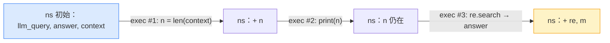

# Demo 1 · 一个会记住变量的 REPL

> 源码：`final-project/backend/demos/demo1_persistent_repl.py` · 依赖 `mini_rlm/repl.py`

RLM 的第一块基石是 [核心洞察](/10-concepts/rlm-insight) 里反复强调的"**环境 E**"——一个能跨多次执行记住状态的 Python REPL。这个 demo 刻意**不碰任何 LLM**，就为了让你把注意力全放在环境本身上，亲眼看清它的四个能力。

## 本 demo 要握住的机制

| 机制 | 一句话 | 在 `MiniREPL` 里的体现 |
| --- | --- | --- |
| **持久化** | 这一次执行建的变量，下一次还在 | 所有代码都在同一个命名空间字典 `self.ns` 里 `exec` |
| **stdout 捕获** | `print` 的东西被收集起来（将来回喂给模型） | `redirect_stdout` 捕获到 `io.StringIO` |
| **context 卸载** | 超长输入作为 `context` 变量存在，只能用代码 peek | `load_context` 把它放进 `self.ns["context"]` |
| **answer 终止** | 设 `answer["ready"]=True` 就"交卷" | 特制的 `_AnswerDict` 触发回调 |

把这四个握住，你就理解了"prompt 即环境"在代码层面到底是什么样子。

## 运行命令与预期输出

````bash
cd final-project/backend
python demos/demo1_persistent_repl.py
````

输出（已实测）：

```text
============================================================
第 1 次执行：建一个变量 + peek context 的长度
============================================================
stdout >>> context 共 317 个字符
开头 20 字: 噪声 噪声 噪声 噪声 噪声 噪声 噪声

============================================================
第 2 次执行：复用上一次建的变量 n（这就是 REPL 的持久化）
============================================================
stdout >>> 上次算出的 n 还在: 317

============================================================
第 3 次执行：用代码在 context 里定位 PASSWORD，然后交卷
============================================================
捕获到最终答案 final_answer = hunter2

小结：我们没有把 100+ 行 context 喂给任何模型，全程只用代码去 peek/定位。
这正是 RLM 的起点：把 prompt 当环境，而不是塞进上下文窗口。
```

看第 2 次执行那一行：`n` 是第 1 次执行建的变量，第 2 次执行还能用——**这就是"REPL 而不是一次性 eval"的本质**。再看第 3 次：我们从来没把那 317 个字符整体打印出来，只用一行正则 `re.search` 就把藏在噪声里的密码 `hunter2` 挖了出来。

## 关键代码逐段讲解

### 1. 创建 REPL，把超长输入"卸载"进去

````python
from mini_rlm import MiniREPL, MockLM

# MiniREPL 需要一个 client 给 llm_query 用，这个 demo 用不到，随便给个 mock
repl = MiniREPL(client=MockLM(responses=["unused"]))

# 把一段"超长输入"卸载进 REPL —— 注意它没有进入任何模型上下文，只是个变量
repl.load_context("噪声 " * 50 + "PASSWORD=hunter2 " + "噪声 " * 50)
````

`MiniREPL.__init__` 必须收一个 `client`（给 `llm_query` 用），但本 demo 不调模型，所以塞一个 `MockLM` 占位。

`load_context` 的实现简单到只有一行（`repl.py:92`）：

````python
def load_context(self, context: Any) -> None:
    """把超长输入放进 REPL，作为 `context` 变量。模型只能写代码去看它。"""
    self.ns["context"] = context
````

它只是往命名空间字典里塞了个键 `context`。**这就是"卸载"的全部魔法**——内容进的是一个变量，而不是模型的对话历史。哪怕你把这里换成 1000 万字符，这一行也是 O(1) 的引用赋值。

### 2. 持久化的秘密：同一个命名空间反复 `exec`

执行代码走的是 `execute_code`（`repl.py:132`），核心就一句：

````python
with redirect_stdout(stdout_buf), redirect_stderr(stderr_buf):
    exec(code, self.ns, self.ns)  # 教学用途，非安全沙箱
````

注意 `exec` 的第二、第三个参数都是 **同一个** `self.ns`。这意味着：

- 代码里读到的全局变量来自 `self.ns`（所以能看见上次建的 `n`、看见 `context`、看见注入的 `llm_query`）；
- 代码里新建的变量也写回 `self.ns`（所以这次建的 `n` 下次还在）。

把这三次执行画成时间线，命名空间 `self.ns` 像一条贯穿始终的传送带：



### 3. stdout 捕获：为下一步回喂做准备

`execute_code` 用 `redirect_stdout` 把 `print` 的输出引到一个 `io.StringIO` 缓冲里，最后打包进返回值 `REPLResult.stdout`：

````python
return REPLResult(
    stdout=stdout_buf.getvalue(),
    stderr=stderr,
    ...
    final_answer=self._final_answer,
)
````

本 demo 只是把 `stdout` 打出来看；但在完整 RLM 里，这段 stdout 正是 [Demo 2](/40-demos/demo2-parse-and-run) 要"格式化回喂给模型"的东西。模型靠它知道自己写的代码跑出了什么结果。

::: tip 一个容易忽略的设计：报错不崩溃
`execute_code` 用 `try/except Exception` 把模型代码里的任何报错接住，**塞进 `stderr` 而不是抛出**。为什么？因为 RLM 的精髓之一是"模型能从执行报错里恢复"——下一轮它看到 traceback，就会自己改代码。这个 demo 还体会不到，到 [Demo 4](/40-demos/demo4-full-loop) 你就会感激这个设计。
:::

### 4. answer 终止：怎么"交卷"

第 3 次执行里有这么两行模型代码：

````python
answer['content'] = m.group(1)
answer['ready'] = True
````

`answer` 不是普通字典，而是 `MiniREPL` 注入的特制 `_AnswerDict`（`repl.py:28`）：

````python
class _AnswerDict(dict):
    def __setitem__(self, key: str, value: Any) -> None:
        super().__setitem__(key, value)
        if key == "ready" and value:
            self._on_ready(str(self.get("content", "")))
````

它重写了 `__setitem__`：一旦检测到 `answer["ready"] = True`，立刻触发 `on_ready` 回调，把 `content` 记成 `self._final_answer`。于是上层 RLM 循环**不需要轮询**——模型一交卷，`REPLResult.final_answer` 就有值了，主循环看到它就 `break`。这是个很优雅的"事件驱动终止"。

## 动手改改看

把第 3 次执行那段改成"故意写错"，亲眼看看 REPL 怎么把报错收进 `stderr` 而不崩溃：

````python
r3 = repl.execute_code(
    "import re\n"
    "m = re.search(r'NOPE=(\\w+)', context)\n"   # 改成匹配不到的模式
    "answer['content'] = m.group(1)\n"            # m 是 None，这里会 AttributeError
    "answer['ready'] = True"
)
print("final_answer =", r3.final_answer)   # 会是 None（没交卷成功）
print("stderr >>>", r3.stderr.strip()[-120:])  # 末尾能看到 traceback
````

你会发现脚本**没有崩**，`final_answer` 是 `None`，而 `stderr` 里躺着一段 `AttributeError: 'NoneType' object has no attribute 'group'`。在真正的 RLM 里，这段 traceback 会被回喂给模型，模型下一轮就会修正正则。

## 常见错误

::: warning 误以为 `exec` 是安全沙箱
`MiniREPL` 用 `exec` 直接在**当前进程**里执行代码。教学场景没问题，但它**不是安全沙箱**——模型生成的代码能 `import os` 删你的文件。官方实现用 Docker / E2B / Modal 等隔离环境跑不可信代码（见 [Part 3](/30-source/repl-and-prompts)）。生产环境务必隔离，别把真模型生成的代码直接 `exec`。
:::

::: warning `context` 没加载就执行代码
如果忘了调 `load_context` 就执行引用了 `context` 的代码，会得到 `NameError: name 'context' is not defined`（被收进 `stderr`）。`context` 不是凭空存在的，它是 `load_context` 往 `self.ns` 里塞的键。
:::

## 小练习

1. 把第 1 次执行的 context 换成 `"X" * 10_000_000`（一千万字符），再加一行 `print(context[:5])`。脚本会变慢吗？为什么 `len(context)` 和 `context[:5]` 几乎瞬间完成？
2. `_AnswerDict` 只在 `key == "ready" and value` 为真时触发回调。如果模型先写 `answer['content'] = '42'` 但**忘了**写 `answer['ready'] = True`，`execute_code` 返回的 `final_answer` 是什么？这对主循环意味着什么？

::: details 参考思路
1. 不会明显变慢。`load_context` 只是把这个大字符串的**引用**放进 `self.ns["context"]`，是 O(1) 的；`len()` 读的是字符串预存的长度，`context[:5]` 只复制 5 个字符。这两步都与字符串总长无关——这正是"context 卸载"省窗口又省时间的根本原因。真正会变慢的是 `print(context)` 这种把全文拉出来的操作，而 RLM 的训练目标恰恰就是让模型**别那么干**。
2. `final_answer` 会是 `None`。因为 `on_ready` 回调只在 `ready` 被设为真时才触发，没设 `ready` 就等于"没交卷"。对主循环而言，这一轮 `iteration.final_answer is None`，循环不会 `break`，会把 REPL 反馈接回历史进入下一轮——直到模型补上 `answer['ready'] = True` 或耗尽 `max_iterations` 走兜底。
:::

下一站：模型不会"直接调函数"，它只会吐文本。[Demo 2](/40-demos/demo2-parse-and-run) 教你怎么从那坨文本里把 ` ```repl ` 代码块抠出来执行。
