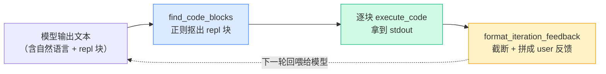

# Demo 2 · 从模型输出里抠出代码并执行

> 源码：`final-project/backend/demos/demo2_parse_and_run.py` · 依赖 `mini_rlm/parsing.py`、`mini_rlm/repl.py`

[Demo 1](/40-demos/demo1-persistent-repl) 造好了"环境"，但有个绕不开的现实：**模型不会"直接调用函数"，它只会输出一段文本。** 那模型怎么驱动 REPL？RLM 的约定是——模型把想执行的动作写在 ` ```repl ` 代码块里，我们负责把它抠出来执行。这个 demo 就把"解析 → 执行 → 格式化反馈"这一环跑通，它是 RLM 主循环里最核心的一次心跳。

## 本 demo 要握住的机制



三个要点：
1. **只认 ` ```repl `**：普通 ` ```python ` 块不是"动作"，会被正则忽略。
2. **一轮可以有多块**：模型一次输出里写几个 ` ```repl `，就按顺序执行几块。
3. **回喂必须截断**：stdout 可能是几十万字符的 context 切片，原样塞回去会把窗口撑爆。

## 运行命令与预期输出

````bash
cd final-project/backend
python demos/demo2_parse_and_run.py
````

输出（已实测）：

```text
============================================================
第 1 步：从模型输出里抠 ```repl 代码块
============================================================
抠到 2 个代码块（注意 ```python 块被正确忽略了）:
  [1] 'print("长度:", len(context))'
  [2] 'errors = context.count("ERROR")\nprint("ERROR 出现次数:", errors)'

============================================================
第 2 步：逐块执行，收集结果
============================================================
执行 'print("长度:", len(context))' -> stdout: '长度: 50'
执行 'errors = context.count("ERROR")\nprint("ERROR 出现次数:", errors)' -> stdout: 'ERROR 出现次数: 2'

============================================================
第 3 步：格式化成回喂给模型的反馈（下一轮 user 消息）
============================================================
REPL 输出（第 1 块）：
stdout:
长度: 50


REPL 输出（第 2 块）：
stdout:
ERROR 出现次数: 2
```

注意第 1 步：模型那段输出里其实有 **3 个** 代码块，但只抠出了 **2 个**——那个 ` ```python ` 块被正确地忽略了。这是 RLM 协议刻意的设计：只有 ` ```repl ` 才是"我要执行的动作"，` ```python ` 只是模型在写示例或解释，不该被执行。

## 关键代码逐段讲解

### 1. 那段"假装是模型输出"的文本

demo 手写了一段文本，模拟模型某一轮的真实输出——有自然语言思考，夹着两个 ` ```repl ` 块，还故意放了一个 ` ```python ` 块当干扰：

````text
我先看看 context 有多长，再统计里面 "ERROR" 出现了几次。

```repl
print("长度:", len(context))
```

顺便统计一下错误行数：

```repl
errors = context.count("ERROR")
print("ERROR 出现次数:", errors)
```

普通的 ```python 块不算动作，不会被执行：

```python
print("我不该被执行")
```
````

这正是真实模型会产出的样子：**思考和动作混在一起**。我们的工作就是从中只挑出"动作"。

### 2. `find_code_blocks`：一个正则解决战斗

解析的全部逻辑在 `parsing.py:18`：

````python
# 匹配 ```repl\n ... \n``` ，re.DOTALL 让 . 能匹配换行
_CODE_BLOCK_PATTERN = re.compile(r"```repl\s*\n(.*?)```", re.DOTALL)

def find_code_blocks(text: str) -> list[str]:
    blocks: list[str] = []
    for match in _CODE_BLOCK_PATTERN.finditer(text):
        code = match.group(1).strip()
        if code:
            blocks.append(code)
    return blocks
````

逐个拆开这个正则：

- ` ```repl ` 是字面量——**只匹配 `repl` 标签**，所以 ` ```python ` 天然匹配不上，这就是它被忽略的原因。
- `\s*\n` 吃掉 `repl` 后面到换行之间的空白。
- `(.*?)` 是**非贪婪**捕获组：尽量少匹配，配合 `re.DOTALL`（让 `.` 也能匹配换行），保证多个代码块各自独立、不会一口气吞到最后一个 ` ``` `。
- `.strip()` + `if code` 去掉空块。

::: tip 和官方正则的一处小差异
官方的正则是 `r"```repl\s*\n(.*?)\n```"`（结尾多了个 `\n`），我们这版是 `r"```repl\s*\n(.*?)```"`。差别只在对"代码块最后一行是否带换行"的容忍度上，对实际解析结果几乎没有影响。事实清单里两边都列了，知道这点即可，不必纠结。
:::

### 3. 逐块执行，包成 `CodeBlock`

抠出代码后，demo 把每块丢进 [Demo 1](/40-demos/demo1-persistent-repl) 那个持久化 REPL：

````python
code_blocks: list[CodeBlock] = []
for b in blocks:
    result = repl.execute_code(b)
    code_blocks.append(CodeBlock(code=b, result=result))
````

`CodeBlock(code=..., result=...)` 把"模型写的代码"和"它跑出的 `REPLResult`"绑在一起。这个配对结构后面会一路传到轨迹日志和 [可视化前端](/60-build-frontend/visualizer)——前端就是靠它把"代码"和"输出"并排画出来的。

因为用的是**同一个** `repl` 实例，第 2 块里的 `errors` 和第 1 块共享命名空间（虽然这里没用上跨块变量，但持久化随时待命）。

### 4. `format_iteration_feedback`：把结果拼成回喂消息

执行完总得告诉模型"你跑出了啥"。这一步在 `parsing.py:62`：

````python
def format_iteration_feedback(code_blocks, truncate_chars=4000) -> str:
    if not code_blocks:
        return "你这一轮没有写任何 ```repl 代码块。请记住：..."
    multi = len(code_blocks) > 1
    chunks = []
    for i, block in enumerate(code_blocks):
        header = f"REPL 输出（第 {i + 1} 块）：" if multi else "REPL 输出："
        chunks.append(header + "\n" + format_repl_output(block.result, truncate_chars))
    return "\n\n".join(chunks)
````

两个细节值得留意：

- **多块会编号**：本 demo 有两块，所以输出里是"第 1 块 / 第 2 块"；只有一块时就是干净的"REPL 输出："。
- **没写任何块会被点名**：如果模型这一轮光说话不写 ` ```repl `，反馈会变成一句提醒"你这一轮没写代码块"。这是个防呆护栏，避免模型空转。

而真正负责"截断"的是 `format_repl_output` 里调的 `_truncate`（`parsing.py:80`）：超过 `truncate_chars` 就截断并标注 `[已省略 N 个字符]`。本 demo 故意把上限设成 `truncate_chars=200` 让你看清截断行为；完整 RLM 默认是 4000（来自 `RLMConfig.stdout_truncate_chars`）。

> **为什么必须截断？** 如果模型写了 `print(context)`，stdout 就是整段超长 context。原样回喂等于把 prompt 又塞回了窗口——[核心洞察](/10-concepts/rlm-insight) 里 RLM 拼命想避免的事，就这么前功尽弃了。截断是这层"环境隔玻璃"的最后一道防线。

## 动手改改看

往 `FAKE_MODEL_OUTPUT` 里加一个**会让 stdout 超长**的代码块，亲眼看截断生效。把这段拼到末尾：

````python
FAKE_MODEL_OUTPUT += '''
现在我手贱把整段 context 打出来：

```repl
print(context * 20)
```
'''
````

再跑（`truncate_chars=200` 已经够触发了），你会在第 3 步反馈里看到那一块的输出被砍断，结尾出现 `... [已省略 N 个字符]`。这就是模型"打印过量"时，环境替我们兜住窗口的样子。

## 常见错误

::: warning 用 ` ```python ` 而不是 ` ```repl `
如果你（或真模型）把动作写成 ` ```python ` 块，`find_code_blocks` 一个都抠不到，`format_iteration_feedback` 会返回"你这一轮没写代码块"的提醒。RLM 的系统提示词（[Part 3](/30-source/repl-and-prompts)）会明确告诉模型"必须用 ` ```repl `"，正是为了避免这个。调试时若发现模型代码"没被执行"，第一反应就是检查标签是不是写成 `repl`。
:::

::: warning 在三反引号代码块里再写三反引号
这是**写文档**时的坑，不是代码的坑：本章正文里展示含 ` ```repl ` 的文本，外层一律用**四个反引号**围栏，否则 Markdown 会在内层 ` ``` ` 处提前闭合，把后面的内容全弄乱。本文的代码示例都遵守了这条。
:::

## 小练习

1. 把 `FAKE_MODEL_OUTPUT` 里的两个 ` ```repl ` 改成各写一个变量、再让第二块读第一块的变量（比如第一块 `x = 10`，第二块 `print(x * 2)`）。它能跑通吗？这验证了 Demo 几的什么机制？
2. `format_iteration_feedback` 在 `code_blocks` 为空时返回一句提醒。结合 [Demo 4](/40-demos/demo4-full-loop) 的主循环想一想：什么情况下模型这一轮会"一个代码块都没写"？这个提醒消息回喂给模型后，期望它下一轮做什么？

::: details 参考思路
1. 能跑通，第二块会打印 `20`。因为两块用的是**同一个** `MiniREPL` 实例，命名空间 `self.ns` 持久化——第一块建的 `x` 第二块还在。这验证的正是 [Demo 1](/40-demos/demo1-persistent-repl) 的"持久化"机制，只不过这次是跨"两个代码块"而非跨"两次 `execute_code` 调用"（本质一样）。
2. 当模型这一轮只输出自然语言思考、没写任何 ` ```repl `（比如它在"想"但还没决定动作，或写成了 ` ```python `）时就会发生。提醒消息回喂后，期望模型下一轮意识到"我必须写 ` ```repl ` 才能推进"，于是补上一个真正的代码块，避免主循环空转浪费迭代次数。
:::

下一站：到现在 REPL 只会"纯计算"。[Demo 3](/40-demos/demo3-llm-query) 给它装上 `llm_query`，让它能在代码里调用另一个模型做语义处理。
