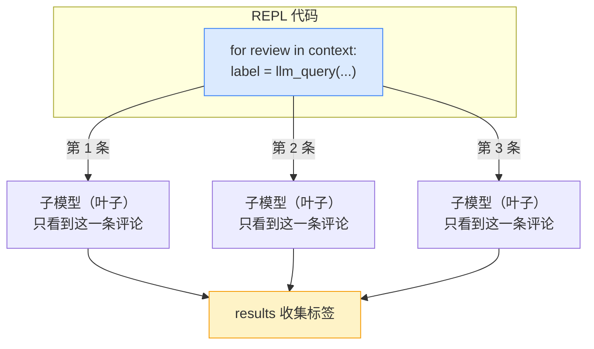

# Demo 3 · 让 REPL 能调用 LLM（llm_query）

> 源码：`final-project/backend/demos/demo3_llm_query.py` · 依赖 `mini_rlm/repl.py`、`mini_rlm/clients.py`

到 [Demo 2](/40-demos/demo2-parse-and-run) 为止，REPL 只会做"纯计算"——切片、正则、计数。但很多任务需要**语义理解**：这条评论是正面还是负面？这段话讲了什么？纯 Python 算不出来。RLM 的杀手锏就在这里：**让模型能在代码里调用另一个模型**，对 context 的某个切片做语义处理。这就是 `llm_query`。

## 本 demo 要握住的机制

`llm_query(prompt) -> str`：开一个**全新的、无 REPL、无记忆**的子模型，回答你传给它的 prompt。它最强大的用法不是调一次，而是——**在循环里对很多切片分别调用它**：

````python
for review in context:                      # context 可能有 100 万条
    label = llm_query(f"判断情感：{review}")  # 对每一条调一次子模型
````



关键认知：**每个子模型只看到你传的那一条切片**，看不到 REPL、看不到 context 全文、也记不住上一条。100 万条评论就循环 100 万次——这就是 RLM 突破上下文窗口的根本姿势。

## 运行命令与预期输出

零成本（默认 MockLM）：

````bash
cd final-project/backend
python demos/demo3_llm_query.py
````

输出（已实测）：

```text
============================================================
在 REPL 代码里 for 循环，对 context 的每一条切片调用 llm_query
============================================================
  评论 1: 正面
  评论 2: 负面
  评论 3: 中性
分类完成，共 3 条

============================================================
这一段代码里一共触发了 3 次子 LLM 调用
每次调用都是一个全新的、看不到 REPL 的子模型——它只看到你传的那一条评论。
============================================================
```

想看真模型（需要 API key）：

````bash
export OPENAI_API_KEY="sk-..."
python demos/demo3_llm_query.py --real
````

## 关键代码逐段讲解

### 1. MockLM 的"函数模式"：扮演一个情感分类器

前两个 demo 的 MockLM 都用"脚本模式"（`responses=[...]` 按顺序吐）。这个 demo 第一次用**函数模式** `response_fn`：

````python
def make_client(use_real: bool):
    if use_real:
        return OpenAICompatClient(model_name="gpt-4o-mini")

    # Mock 情感分类器：根据 prompt 里的关键词决定返回"正面/负面"
    def classify(messages) -> str:
        text = messages[-1].content
        if any(w in text for w in ["好", "棒", "喜欢", "amazing", "great"]):
            return "正面"
        if any(w in text for w in ["差", "烂", "讨厌", "terrible", "bad"]):
            return "负面"
        return "中性"

    return MockLM(response_fn=classify)
````

对照 `clients.py:114` 的 `MockLM.completion`：当 `response_fn` 不为 `None` 时，它直接 `text = self._response_fn(messages)`，把整个消息列表交给你的函数。

**为什么这里必须用函数模式而不是脚本模式？** 因为 `llm_query` 每次传进来的评论不一样，回复必须**依赖输入内容**动态决定。脚本模式是"与输入无关、按固定顺序吐"，没法做到"看见'棒'就回正面"。这就是 [总览](/40-demos/overview) 那道练习题的答案落地。

::: tip MockLM 三种模式速记
- **脚本模式** `responses=[...]`：固定顺序，行为完全确定。Demo 1/2/4/5 都用它编排"懂协议的模型"。
- **函数模式** `response_fn=fn`：`fn(messages) -> str`，依输入动态生成。本 demo 的分类器、需要"看 context 内容回应"的场景用它。
- **默认模式**：都不传时回显最后一条消息，仅供快速冒烟。
:::

### 2. 把 context 设成一批切片，在代码里循环调用

````python
reviews = [
    "这个产品太棒了，我很喜欢！",
    "质量很差，非常讨厌。",
    "还行吧，没什么特别的。",
]
repl.load_context(reviews)
````

注意 `context` 这次不是字符串，而是一个 **list**——`load_context` 来者不拒，往 `self.ns["context"]` 一塞就行。然后模型（这里是我们手写的代码）这样处理它：

````python
code = """
results = []
for i, review in enumerate(context):
    label = llm_query(f"判断这条评论的情感，只回答'正面'/'负面'/'中性'：{review}")
    results.append((review[:12], label))
    print(f"  评论 {i+1}: {label}")
print("分类完成，共", len(results), "条")
"""
result = repl.execute_code(code)
````

这段代码在 REPL 里 `exec`，`for` 循环每转一圈就调一次 `llm_query`——**程序化地、循环地**把语义处理下放给子模型。

### 3. `llm_query` 内部：调子模型 + 记一笔"叶子"账

`llm_query` 注入的是 `MiniREPL._llm_query`（`repl.py:98`）：

````python
def _llm_query(self, prompt: str) -> str:
    text, in_tok, out_tok = self._client.completion(
        [Message(role="user", content=prompt)]
    )
    self.usage.add(in_tok, out_tok)
    # 记成一个"叶子"子调用，供前端展示
    self._pending_calls.append(
        RLMResult(
            response=text,
            root_model=self._client.model_name,
            depth=self._depth + 1,
            usage=UsageSummary(total_calls=1, input_tokens=in_tok, output_tokens=out_tok),
            stopped_reason="leaf_llm",
        )
    )
    return text
````

三件事：
1. **只用一条 user 消息**调底层 client——子模型没有系统提示、没有历史、没有 REPL，纯粹"一问一答"。
2. 累加 token 用量到 `self.usage`。
3. 把这次调用记成一个 `RLMResult`，`stopped_reason="leaf_llm"`，`depth = self._depth + 1`，追加进 `self._pending_calls`。

这第 3 点是个伏笔：每次 `llm_query` 都在结果里留下一条"叶子"记录。`execute_code` 收尾时会把 `self._pending_calls` 打包进 `REPLResult.rlm_calls`，所以 demo 末尾才能数出：

````python
print(f"这一段代码里一共触发了 {len(result.rlm_calls)} 次子 LLM 调用")  # -> 3
````

这个 `rlm_calls` 列表，到 [Demo 5](/40-demos/demo5-recursion) 会装进真正的子 RLM，成为"递归"在数据结构上的体现。`leaf_llm` 这个标记，正是用来区分"叶子 LLM 调用"和"子 RLM 调用"的。

### 4. `--real` 用法：切到真模型

````python
if use_real:
    return OpenAICompatClient(model_name="gpt-4o-mini")
````

`OpenAICompatClient`（`clients.py:50`）底层就是 `openai` SDK。它读环境变量 `OPENAI_API_KEY` 和 `OPENAI_BASE_URL`——后者让你指向**任何** OpenAI 兼容服务（官方、国内代理、本地 vLLM 都行）。换句话说，上层 `_llm_query` 那段代码**一个字都不用改**，就能从"假分类器"切到"真 GPT 分类器"，因为两者都实现同一个 `BaseLM.completion` 接口。这就是 [总览](/40-demos/overview) 说的"对底层无感知"。

## 动手改改看

把单条 `llm_query` 升级成"批量"调用，体会接口一致性。`MiniREPL` 其实还注入了 `llm_query_batched`（`repl.py:116`，教学版串行实现）。把循环改成一次性批量：

````python
code = """
prompts = [f"判断情感，只回答'正面'/'负面'/'中性'：{r}" for r in context]
labels = llm_query_batched(prompts)
for r, l in zip(context, labels):
    print(f"  {r[:12]} -> {l}")
print("批量分类完成，共", len(labels), "条")
"""
result = repl.execute_code(code)
print(result.stdout)
print("子调用次数:", len(result.rlm_calls))   # 仍是 3：批量内部还是逐条调
````

跑完你会发现 `rlm_calls` 还是 3——因为教学版 `_llm_query_batched` 内部就是 `[self._llm_query(p) for p in prompts]`，串行调三次。真要并发，就是把它换成 `ThreadPoolExecutor`（官方就是这么做的，事实清单里有提）。这正是源码注释里写的"并发留作练习"。

## 常见错误

::: warning 在 `llm_query` 的 prompt 里塞整段 context
新手常写成 `llm_query(f"在这段里找答案：{context}")`，把**整个** context 当 prompt 传给子模型。这一下就把超长内容塞回了模型窗口——RLM 千辛万苦避免的事又发生了。正确姿势是先用代码把 context **切成小片**，再对**每一片**调 `llm_query`。`llm_query` 的入参应该是"一小段"，不是"一大坨"。
:::

::: warning `--real` 忘配 API key
不设 `OPENAI_API_KEY` 就加 `--real`，`OpenAICompatClient` 会在真正发请求时报认证错误。`OpenAICompatClient` 还做了延迟导入：没装 `openai` 包时会提示 `pip install openai`，但只有走 `--real` 才会触发——所以纯 MockLM 路径连 `openai` 都不用装。
:::

## 小练习

1. `llm_query` 内部记的那条 `RLMResult` 里 `stopped_reason="leaf_llm"`。结合 [Demo 5](/40-demos/demo5-recursion) 猜一猜：`rlm_query`（递归子调用）记的那条 `stopped_reason` 会是什么？为什么要用不同的标记区分它俩？
2. 假设 context 有 100 万条评论，你用 `for` 循环逐条 `llm_query`。这 100 万次调用里，**父模型自己的上下文窗口**增长了多少？（提示：父模型看到的只是这段代码的 stdout，不是 100 万次子调用的全部内容。）

::: details 参考思路
1. `rlm_query` 起的是一个完整子 RLM，它跑完后 `stopped_reason` 会是 `"final_answer"`（正常交卷）或 `"max_iterations"`（轮次耗尽），**不会**是 `"leaf_llm"`。用不同标记区分，是为了让 [可视化前端](/60-build-frontend/visualizer) 知道：这是个"一问一答的叶子"还是"有自己迭代轨迹的子 RLM"——前者画成一个点，后者要能展开成一棵子树。
2. 几乎不增长。父模型看到的只是这段循环代码的 **stdout**（比如"分类完成，共 1000000 条"加上若干打印行），而不是 100 万次子调用各自的 prompt 和回复。子调用的内容存在 REPL 的 `results` 变量里，要用才 peek。所以无论多少条，父窗口占用基本恒定——这就是 [核心洞察](/10-concepts/rlm-insight) 里"窗口占用与 context 总长无关"的精确兑现。
:::

下一站：前三个零件齐了。[Demo 4](/40-demos/demo4-full-loop) 把它们接上**真模型决策**，跑通完整的 Algorithm 1 循环。
