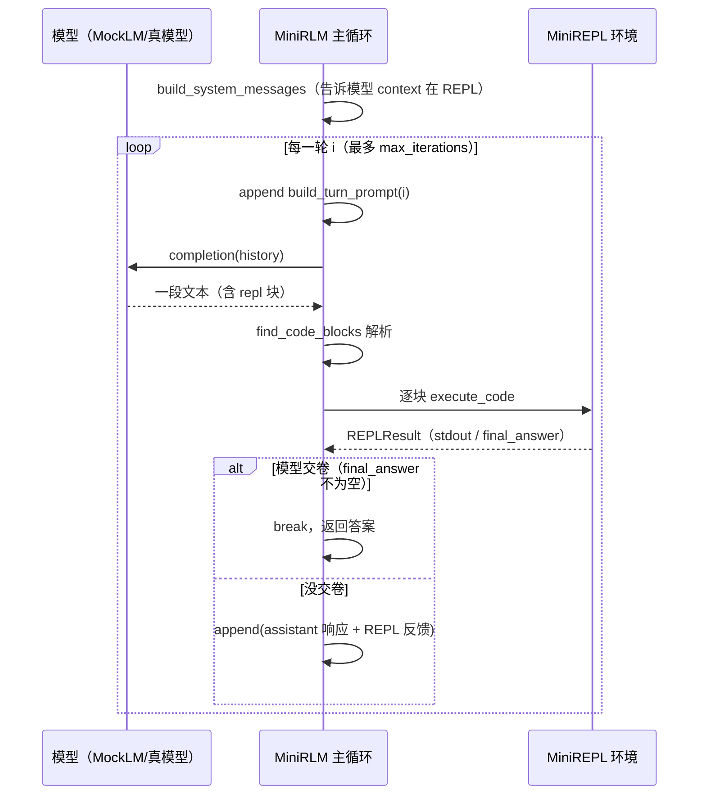

# Demo 4 · 完整的 RLM 循环

> 源码：`final-project/backend/demos/demo4_full_loop.py` · 依赖 `mini_rlm/rlm.py`、`mini_rlm/repl.py`、`mini_rlm/parsing.py`、`mini_rlm/logger.py`

前三个 demo 分别造好了零件：[持久化 REPL](/40-demos/demo1-persistent-repl)、[代码块解析](/40-demos/demo2-parse-and-run)、[llm_query](/40-demos/demo3-llm-query)。现在把它们和**真正的模型决策**接起来——不再是我们手写代码，而是让模型自己一轮一轮地决定写什么。这就是 [Algorithm 1](/20-paper/algorithm) 的完整循环，也是 `MiniRLM` 的全部。

## 本 demo 要握住的机制

`MiniRLM.completion(context, task)` 内部就是这个循环（`rlm.py:96`）：



把它和前三个 demo 对应起来：**模型决策**是新接进来的灵魂，**解析执行**来自 Demo 2，**REPL 环境**来自 Demo 1，而每一轮的 `llm_query` 能力来自 Demo 3。四块齐活，循环转起来，RLM 就活了。

## 运行命令与预期输出

零成本（强烈建议先跑这个看清每一轮）：

````bash
cd final-project/backend
python demos/demo4_full_loop.py
````

输出（已实测）：

```text
任务: 这段日志里有多少行 ERROR？第一条 ERROR 的完整内容是什么？
context 规模: 29904 字符 / 1000 行
（注意：这段 context 从未整体进入模型上下文，模型全靠写代码 peek）

--- 第 1 轮 ---
模型说: 我先看看日志有多大。
  执行代码: print('总行数:', context.count(chr(10)) + 1) print('前 80 字:', context[:80
  得到输出: 总行数: 1000 | 前 80 字: [0] INFO request handled ok | [1] INFO request handled ok |
--- 第 2 轮 ---
模型说: 现在统计 ERROR 并找第一条。
  执行代码: lines = context.split(chr(10)) errors = [l for l in lines if 'ERROR' i
  得到输出: ERROR 行数: 6 | 第一条: [50] ERROR timeout on request
--- 第 3 轮 ---
模型说: (直接写代码)
  执行代码: answer['content'] = f'共 {len(errors)} 行 ERROR；第一条是: {errors[0]}' answe

============================================================
最终答案: 共 6 行 ERROR；第一条是: [50] ERROR timeout on request
停止原因: final_answer | 总迭代: 3
轨迹已写入 ./logs/，可用 Part 6 的可视化前端打开
```

三轮就解决了：**第 1 轮 peek 规模 → 第 2 轮统计 + 定位 → 第 3 轮组织答案交卷**。注意那段 29904 字符的日志**从没整体进过模型**——模型全靠 `context.split` / 列表推导这些代码去操作它。

接真模型：

````bash
export OPENAI_API_KEY="sk-..."
python demos/demo4_full_loop.py --real
````

## 关键代码逐段讲解

### 1. MockLM 脚本如何"扮演懂协议的模型"

这是本 demo 最值得玩味的地方。我们用脚本模式的 MockLM 写了一个**假装懂 RLM 协议**的模型——它的三条 `responses` 恰好就是一个聪明模型解决这个任务的三步：

````python
def scripted_mock() -> MockLM:
    return MockLM(responses=[
        # 第 1 轮：先探查 context 规模
        "我先看看日志有多大。\n"
        "```repl\n"
        "print('总行数:', context.count(chr(10)) + 1)\n"
        "print('前 80 字:', context[:80])\n"
        "```",
        # 第 2 轮：统计 ERROR 行数并定位第一条
        "现在统计 ERROR 并找第一条。\n"
        "```repl\n"
        "lines = context.split(chr(10))\n"
        "errors = [l for l in lines if 'ERROR' in l]\n"
        "print('ERROR 行数:', len(errors))\n"
        "print('第一条:', errors[0])\n"
        "```",
        # 第 3 轮：组织答案并交卷
        "```repl\n"
        "answer['content'] = f'共 {len(errors)} 行 ERROR；第一条是: {errors[0]}'\n"
        "answer['ready'] = True\n"
        "```",
    ])
````

每条 `responses` 都长得**和真模型输出一模一样**：自然语言 + ` ```repl ` 块。主循环不知道也不在乎背后是脚本——它只管解析执行。这就是 MockLM 的教学价值：**行为完全确定、可复现，又完整走通了真模型会走的每一步**。

::: tip 为什么用 `chr(10)` 而不是直接写换行？
脚本里的换行符 `chr(10)` 是为了避免在 Python 字符串里嵌入真换行打乱排版——它就是 `"\n"`。模型真要数行数，`context.count("\n") + 1` 和 `context.count(chr(10)) + 1` 等价。
:::

注意第 2 轮用到了第 1 轮没建的 `errors`？不，第 2 轮**自己建了** `errors`；而第 3 轮用的 `errors` 来自第 2 轮——**这就是 [Demo 1](/40-demos/demo1-persistent-repl) 持久化在主循环里的真实价值**：跨轮共享中间结果，模型不必每轮重算。

### 2. 主循环：`completion` 的骨架

`rlm.py:96` 的循环体，对照上面的时序图看：

````python
for i in range(self.config.max_iterations):
    history.append(build_turn_prompt(i, self.config.max_iterations))
    iteration = self._run_one_turn(i, history, repl)
    result.iterations.append(iteration)

    if iteration.final_answer is not None:
        result.response = iteration.final_answer
        result.stopped_reason = "final_answer"
        break

    # 把"模型这一轮说了什么 + REPL 反馈"接回历史，进入下一轮
    history.append(Message(role="assistant", content=iteration.response))
    history.append(Message(role="user", content=format_iteration_feedback(
        iteration.code_blocks, self.config.stdout_truncate_chars)))
else:
    # 轮次用尽还没交卷：兜底取最后一次非空响应
    result.response = self._fallback_answer(result)
    result.stopped_reason = "max_iterations"
````

逐行对应前面所有机制：
- `build_turn_prompt(i, ...)`：每轮给模型的提示（第 0 轮还带"先 peek 别盲答"的 safeguard）。
- `_run_one_turn`：调模型 → `find_code_blocks` 解析 → 逐块 `execute_code`（这里面就用到 Demo 2、Demo 3）。
- `final_answer is not None` → `break`：这就是 [Demo 1](/40-demos/demo1-persistent-repl) 那个 `_AnswerDict` 回调结出的果——模型一交卷，主循环立刻停。
- `format_iteration_feedback`：[Demo 2](/40-demos/demo2-parse-and-run) 的回喂，把 stdout 截断后接回历史。
- `for...else`：Python 的冷门语法——循环**正常跑完没 break**（即耗尽 `max_iterations` 还没交卷）才走 `else`，用 `_fallback_answer` 兜底取最后一次非空响应。

### 3. `_run_one_turn`：一轮的内部

````python
response, in_tok, out_tok = self._client.completion(history)
...
for code in find_code_blocks(response):
    repl_result = repl.execute_code(code)
    code_blocks.append(CodeBlock(code=code, result=repl_result))
    if repl_result.final_answer is not None:
        final_answer = repl_result.final_answer
        break  # 交卷了，本轮剩余代码块不再执行
````

一个细节：一旦某块代码触发了交卷，**本轮剩下的代码块就不再执行**。这是合理的——模型都交卷了，再跑后面的代码没意义。

### 4. 轨迹写入 `./logs`，供 Part 6 可视化

demo 给 `MiniRLM` 传了一个 `TrajectoryLogger`：

````python
logger = TrajectoryLogger(log_dir="./logs")
rlm = MiniRLM(config=config, client=client, trajectory_logger=logger)
````

`completion` 在 `depth == 0`（即根 RLM）跑完后会落盘（`rlm.py:124`）：

````python
if self.trajectory_logger is not None and self.depth == 0:
    self.trajectory_logger.write(result, self.config)
````

`TrajectoryLogger.write` 把结果序列化成 **JSONL**：第一行是 `metadata`，之后每行一个 iteration。这个文件就是 [Part 6 可视化前端](/60-build-frontend/visualizer) 的输入——它能把这三轮迭代画成时间线，把每轮的代码、stdout、子调用都展开给你看。跑完这个 demo，`./logs/` 下就多了一份轨迹，正好拿去喂前端。

::: tip 为什么只有 `depth == 0` 才落盘？
子 RLM（[Demo 5](/40-demos/demo5-recursion)）的轨迹已经**嵌在父结果的 `rlm_calls` 里**了，单独落盘会重复。所以只有根 RLM 写文件，整棵递归树自然都在那一份里。这条 `depth == 0` 判断是为 Demo 5 的递归埋的伏笔。
:::

## 动手改改看

把 `max_iterations` 调到 **2**，看模型"还没来得及交卷就被掐断"会发生什么：

````python
config = RLMConfig(model_name="mock-model", max_iterations=2)
````

再跑。脚本有三步、但只给 2 轮，第 3 步"交卷"那条 response 永远轮不到执行。你会看到：

- 总迭代数变成 2；
- `停止原因` 从 `final_answer` 变成 `max_iterations`；
- 最终答案不再是干净的统计结果，而是 `_fallback_answer` 兜底取的**第 2 轮那段 response 原文**。

这直观演示了 `max_iterations` 是条硬性安全阀：再聪明的模型，轮次耗尽也得停，靠兜底交一个"尽力而为"的答案。

## 常见错误

::: warning MockLM 脚本步数和任务对不上
脚本模式的 MockLM 按顺序吐 `responses`，**它不会看 REPL 反馈临场应变**。如果你把任务改难了、但脚本还是老三步，模型就会"答非所问"。脚本用尽后还被调用，MockLM 会兜底吐一个"交卷空答案"的块（`clients.py:117`）避免死循环。要让假模型真的随机应变，得换 [Demo 3](/40-demos/demo3-llm-query) 的函数模式或上 `--real`。
:::

::: warning 把 `./logs` 当成可直接阅读的日志
`./logs` 下是 **JSONL** 轨迹文件，给 [可视化前端](/60-build-frontend/visualizer) 吃的，不是给人读的纯文本日志。想看人类可读的每轮过程，看 demo 脚本自己打印的那些 `--- 第 N 轮 ---`。两者目的不同：前者结构化喂前端，后者给你单步对照。
:::

## 小练习

1. 主循环里 `for...else` 的 `else` 在什么条件下执行？如果模型在第 2 轮就交卷了，`else` 会执行吗？`stopped_reason` 分别是什么？
2. demo 把每轮 `it.response.split("```")[0]` 取出来当"模型说的话"打印。为什么要 `split("```")[0]`？如果模型这一轮**直接以 ` ```repl ` 开头**（没有前导自然语言），这个表达式会得到什么，demo 又是怎么兜的？

::: details 参考思路
1. `else` 只在 `for` 循环**正常跑完所有迭代都没 `break`**时执行，也就是耗尽 `max_iterations` 还没交卷的情况，此时 `stopped_reason = "max_iterations"`，走 `_fallback_answer` 兜底。如果模型第 2 轮交卷，循环会 `break`，**不走** `else`，`stopped_reason = "final_answer"`。
2. `split("```")[0]` 是为了只取代码块**之前**的那段自然语言思考（` ``` ` 是代码块围栏，第一个 ` ``` ` 之前就是模型的"说明"）。如果模型直接以 ` ```repl ` 开头，`split` 出来的第 0 段是空字符串，`.strip()` 后为空——demo 用 `or "(直接写代码)"` 兜底，所以你在第 3 轮看到的就是 `模型说: (直接写代码)`。
:::

下一站：`llm_query` 的子调用是"叶子"，没法处理又长又复杂的子任务。[Demo 5](/40-demos/demo5-recursion) 用 `rlm_query` 让子调用本身也升级成一个完整 RLM——这才配得上"递归"二字。
