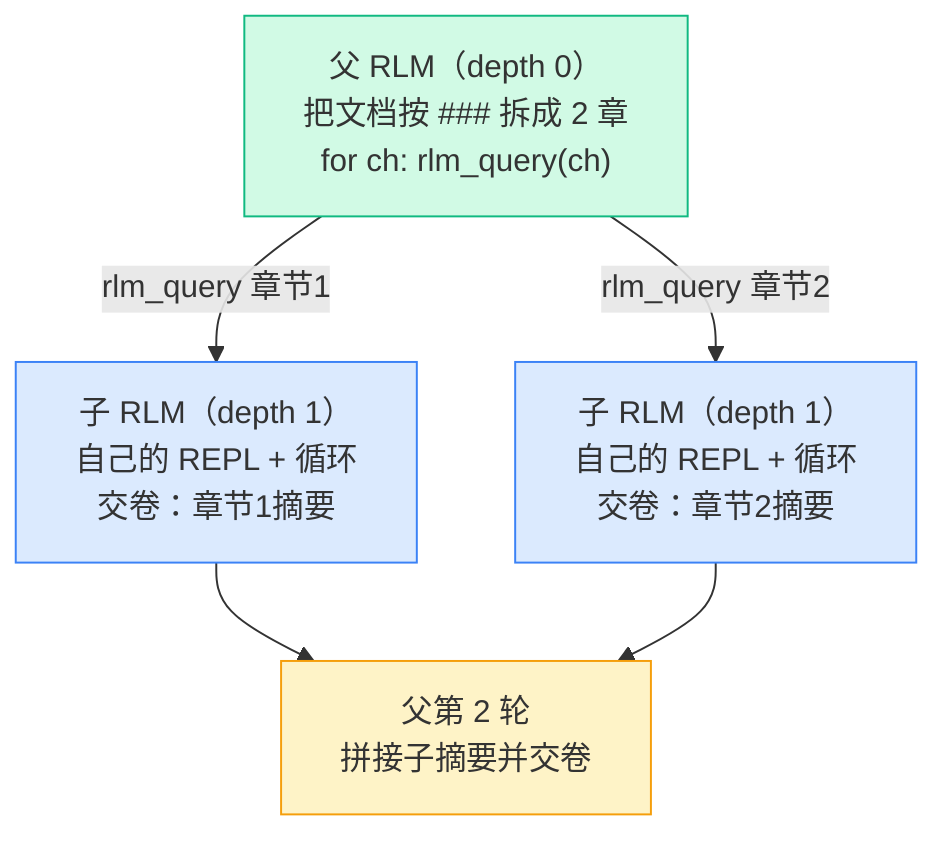
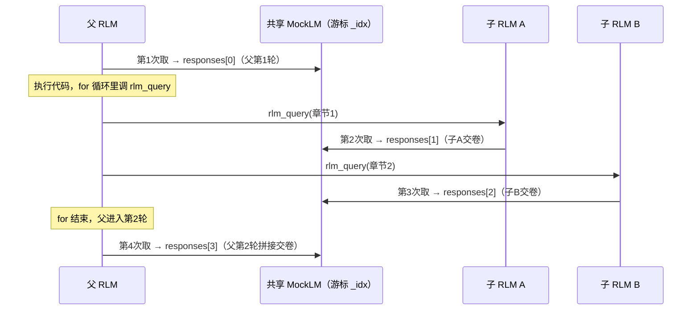

# Demo 5 · 符号递归（rlm_query + depth）

> 源码：`final-project/backend/demos/demo5_recursion.py` · 依赖 `mini_rlm/rlm.py`（`_make_repl` / `_spawn_subcall`）、`mini_rlm/repl.py`（`_rlm_query`）

[Demo 3](/40-demos/demo3-llm-query) 的 `llm_query` 开的子模型没有 REPL、没有记忆，只能处理"一小段、一步到位"的任务。但如果某个子任务**本身又长又复杂**呢（比如"总结一整章"）？答案优雅得近乎自然：**让子调用本身也是一个完整的 RLM**。这就是 `rlm_query`，论文标题里那个"Recursive"的来历。

## 本 demo 要握住的机制

`rlm_query(prompt)`：当递归深度还没到 `max_depth` 时，它会新建一个 `depth+1` 的 `MiniRLM`（有自己的 REPL、自己的循环、还能再 `rlm_query`）。`depth` 的语义是这套递归的总开关：

| `max_depth` | `rlm_query` 的行为 |
| --- | --- |
| `1` | 退化成普通 `llm_query`（叶子，无子 REPL） |
| `2` | 能起一层子 RLM（本 demo） |
| `N` | 能递归 `N-1` 层 |

本 demo 用 MockLM 编排一个**两层递归**：父 RLM 把一篇"长文档"按章节拆开，对每个章节用 `rlm_query` 起一个子 RLM 去总结，最后拼成全文摘要。



## 运行命令与预期输出

````bash
cd final-project/backend
python demos/demo5_recursion.py
````

输出（已实测）：

```text
============================================================
最终摘要: 章节1讲了 RLM 把 prompt 当环境 | 章节2讲了符号递归突破上下文窗口
============================================================

递归轨迹结构：
  └─ depth=1 [子 RLM] 自身迭代数=1 -> 章节1讲了 RLM 把 prompt 当环境
  └─ depth=1 [子 RLM] 自身迭代数=1 -> 章节2讲了符号递归突破上下文窗口

小结：父 RLM 在一段代码里 for 循环起了多个子 RLM，每个子 RLM 是独立的完整循环。
把 max_depth 调成 1 再跑一次，你会看到 rlm_query 退化成叶子 LLM（无子迭代）。
```

注意那个"递归轨迹结构"：父迭代里嵌着子调用，子调用 `[子 RLM]`、`depth=1`、有自己的迭代数。**整棵递归树就装在父 `result` 里**——这正是数据结构层面的递归。

## 关键代码逐段讲解

### 1. 父子共享一个 MockLM 脚本——以及致命的排序陷阱

这是本 demo 最容易踩坑、也最有教学价值的地方。父 RLM 和所有子 RLM **共用同一个** MockLM 实例（`_spawn_subcall` 把 `client=self._client` 传给了子 RLM）。MockLM 脚本模式有个内部游标 `self._idx`，按**实际调用发生的顺序**逐条吐 `responses`。所以脚本的顺序必须和真实调用时序**严丝合缝**：

````python
return MockLM(responses=[
    # 1. 父第 1 轮：对每个章节起子 RLM
    "我把文档按章节拆开，每节交给一个子 RLM 去总结。\n"
    "```repl\n"
    "chapters = context.split('###')\n"
    "chapters = [c.strip() for c in chapters if c.strip()]\n"
    "summaries = []\n"
    "for ch in chapters:\n"
    "    s = rlm_query(f'用一句话总结这段：{ch}')\n"
    "    summaries.append(s)\n"
    "    print('得到子摘要:', s)\n"
    "```",
    # 2. 子 RLM A：直接交卷
    "```repl\nanswer['content'] = '章节1讲了 RLM 把 prompt 当环境'\nanswer['ready'] = True\n```",
    # 3. 子 RLM B：直接交卷
    "```repl\nanswer['content'] = '章节2讲了符号递归突破上下文窗口'\nanswer['ready'] = True\n```",
    # 4. 父第 2 轮：拼接并交卷
    "```repl\nanswer['content'] = ' | '.join(summaries)\nanswer['ready'] = True\n```",
])
````

调用时序（**关键**）：



**陷阱在于**：父第 1 轮的代码在 `for` 循环里**同步地**调 `rlm_query`，每次调用都会从同一个游标取走一条 `responses`。所以脚本必须按"父1 → 子A → 子B → 父2"排，而不是"父1 → 父2 → 子A → 子B"。如果你按"父说完话再处理子"的直觉排序，游标顺序就全错了，子 RLM 会拿到本该给父第 2 轮的脚本，整个 demo 乱套。**这是共享脚本 Mock 编排递归时唯一需要格外小心的点。**

### 2. `_make_repl`：按深度决定"给不给递归能力"

父 RLM 凭什么能 `rlm_query`、而子 RLM（到了最大深度）不能？秘密在 `rlm.py:159`：

````python
def _make_repl(self) -> MiniREPL:
    subcall_fn = None
    if self.depth + 1 < self.config.max_depth:
        subcall_fn = self._spawn_subcall
    return MiniREPL(client=self._client, subcall_fn=subcall_fn, ...)
````

只有当 `depth + 1 < max_depth` 时，才给 REPL 装上 `subcall_fn`。`max_depth=2` 时：
- 父 `depth=0`：`0 + 1 < 2` 成立 → 有 `subcall_fn` → `rlm_query` 能起子 RLM；
- 子 `depth=1`：`1 + 1 < 2` 不成立 → `subcall_fn=None` → 子的 `rlm_query` 会退化成 `llm_query`。

### 3. `_rlm_query`：有 `subcall_fn` 就递归，没有就退化

REPL 里 `rlm_query` 注入的是 `_rlm_query`（`repl.py:120`）：

````python
def _rlm_query(self, prompt: str) -> str:
    if self._subcall_fn is None:
        # 没有递归能力（已到最大深度），退化为普通子 LLM 调用
        return self._llm_query(prompt)
    result = self._subcall_fn(prompt)
    self.usage.merge(result.usage)
    self._pending_calls.append(result)
    return result.response
````

这就是"叶子 vs 子 RLM"的分叉点：

- 有 `subcall_fn` → 调 `_spawn_subcall`，记一条**完整子 RLM** 的 `RLMResult`（`stopped_reason="final_answer"`）；
- 没有 → 回退到 `_llm_query`，记一条**叶子**（`stopped_reason="leaf_llm"`，见 [Demo 3](/40-demos/demo3-llm-query)）。

### 4. `_spawn_subcall`：子调用怎么"完整地"跑起来

````python
def _spawn_subcall(self, prompt: str) -> RLMResult:
    child = MiniRLM(
        config=self.config, client=self._client, custom_tools=self.custom_tools,
        trajectory_logger=None,   # 子调用轨迹已嵌在父结果里，不单独落盘
        depth=self.depth + 1, **self._client_kwargs,
    )
    # 子调用把 prompt 同时当作 context 和 task
    return child.completion(context=prompt, task=prompt)
````

两个要点：
- `depth=self.depth + 1`：深度逐层加一，配合 `_make_repl` 的判断逐层收缩递归能力，直到触底退化成叶子。这就是递归的"终止条件"。
- `child.completion(context=prompt, task=prompt)`：子 RLM 把传进来的章节文本**既当 context 又当 task**——它要对这段内容跑一整套完整 RLM 流程。所以输出里子 RLM 的"自身迭代数=1"，它真的走了一遍自己的循环。

而 `trajectory_logger=None` + 父 RLM 只在 `depth==0` 落盘（[Demo 4](/40-demos/demo4-full-loop) 埋的伏笔），保证整棵树只写一份文件、不重复。

## 动手改改看：max_depth=1 的对照实验

源码末尾就提示了这个实验。把 `max_depth` 改成 `1`：

````python
rlm = MiniRLM(
    config=RLMConfig(max_iterations=6, max_depth=1),  # 不再允许递归
    client=build_shared_mock(),
    trajectory_logger=logger,
)
````

再跑，递归轨迹结构变成（已实测）：

```text
  depth=1 [叶子 LLM] iters=0 -> "```repl\nanswer['content'] = '章节1讲了 RLM 把..."
  depth=1 [叶子 LLM] iters=0 -> "```repl\nanswer['content'] = '章节2讲了符号递归突破..."
```

对比 `max_depth=2`，三个变化一目了然：

1. **`[子 RLM]` 变成 `[叶子 LLM]`**：`max_depth=1` 时父 `depth=0`，`0+1 < 1` 不成立，父就没有 `subcall_fn`，`rlm_query` 退化成 `llm_query`。
2. **`iters=0`**：叶子 LLM 不跑循环，没有"自身迭代"。
3. **返回值变成了原始 ` ```repl ` 文本**：这是个特别有教学意义的"翻车"。子 A/B 的脚本本来是写给"会执行代码的子 RLM"的——交卷动作藏在 ` ```repl ` 块里。可叶子 `llm_query` 只是**把脚本文本原样返回**，根本不会去 `exec` 它。于是父拿到的不是干净摘要，而是一坨没被执行的代码文本。

这个对照实验把"`rlm_query` 退化"讲得淋漓尽致：**同一份脚本，深度一变，子调用的"理解协议的能力"就没了**——因为叶子 LLM 压根没有 REPL 去执行那段 ` ```repl `。它精准印证了 [核心洞察](/10-concepts/rlm-insight) 里 `llm_query` 和 `rlm_query` 的本质区别。

## 常见错误

::: warning 把脚本按"父说完再处理子"的直觉排序
共享 MockLM 的游标按**实际调用顺序**前进，而父第 1 轮的代码是在 `for` 循环里**同步**调 `rlm_query` 的。正确顺序是"父1 → 子A → 子B → 父2"。按直觉排成"父1 → 父2 → 子…"会让子 RLM 取到错误的脚本，结果全乱。给递归编排 Mock 脚本时，**先把调用时序图画出来再排 `responses`**。
:::

::: warning 以为 `max_depth=2` 能递归两层
`max_depth=N` 能递归 `N-1` 层。`max_depth=2` 只能起**一层**子 RLM（子 RLM 自己已经到底、不能再 `rlm_query`）。想让子 RLM 还能再起孙 RLM，得 `max_depth=3`。别把 `max_depth` 的数值和"能递归几层"画等号——记住要减一。
:::

## 小练习

1. `max_depth=2` 时，父 `depth=0` 有递归能力、子 `depth=1` 没有。如果改成 `max_depth=3` 再跑这个 demo（脚本不变），会发生什么？（提示：脚本里子 RLM 第一轮就交卷，并没有再调 `rlm_query`，所以子的递归能力用没用得上？）
2. `_spawn_subcall` 里子 RLM 拿 `prompt` **同时当 context 和 task**。回想 [Demo 4](/40-demos/demo4-full-loop) 里根 RLM 是 `completion(context=超长日志, task=问题)`——context 和 task 是分开的。为什么子调用这里把它俩设成同一个 prompt 是合理的？

::: details 参考思路
1. 行为和 `max_depth=2` 几乎一样、输出不变。因为脚本里的子 RLM 第一轮就直接交卷，**根本没调 `rlm_query`**，所以"子也具备递归能力"这件事没被用上——多出来的那层深度是空头支票。要真正看到三层递归，得改脚本让子 RLM 也去 `rlm_query` 起孙 RLM。这说明 `max_depth` 只是"允许的上限"，实际递归几层取决于模型（脚本）真的调了几层。
2. 因为子调用收到的 `prompt`（如"用一句话总结这段：第一章内容…"）本身**既是要处理的内容、又是要做的事**——它是一个自包含的小任务。把它同时当 context（待处理的素材）和 task（任务描述）符合 [核心洞察](/10-concepts/rlm-insight) 里"RLM 对外就是一个吃字符串吐字符串的语言模型"：你给它一段话，它就对这段话跑一遍完整 RLM。根 RLM 之所以分开，是因为它的 context（超长日志）和 task（具体问题）天然是两样东西。
:::

至此，5 个 demo 拼出的 mini RLM 就完整了：环境、解析执行、`llm_query`、完整循环、递归一应俱全。接下来 [Part 5](/50-build-backend/structure) 会带你从零把这套后端工程化地实现一遍，[Part 6](/60-build-frontend/visualizer) 则把这些 `./logs` 轨迹画成可交互的递归树。
