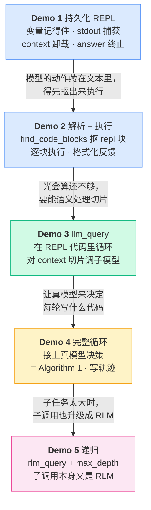

# Part 4 · 渐进式 Demo 总览与运行方式

前面三个 Part 我们把 RLM 的"为什么"（[核心洞察](/10-concepts/rlm-insight)、[三个设计决策](/10-concepts/three-design-choices)）和官方实现的骨架讲透了。现在到了最爽的环节：**亲手把一个 RLM 一块砖一块砖地搭出来**。

我们准备了 5 个可以零成本运行的 demo，放在 `final-project/backend/demos/` 下。它们不是孤立的玩具，而是**严格递进**的——每个 demo 只新增一个机制，5 个跑完，一个能跑、能递归、能落盘轨迹的 mini RLM 就完整地出现在你面前。

## 5 个 demo 怎么拼出一个完整 RLM

先看全局。下面这张图是这一 Part 的"地图"，每一步加一块，最后拼成 [Demo 4](/40-demos/demo4-full-loop) 的完整 [Algorithm 1](/20-paper/algorithm) 循环，再由 [Demo 5](/40-demos/demo5-recursion) 加上递归：



一句话概括这条递进线：

> **环境（Demo 1）→ 让模型驱动环境（Demo 2）→ 让环境能调模型（Demo 3）→ 闭环（Demo 4）→ 递归（Demo 5）。**

## 每个 demo 一句话定位

| Demo | 文件 | 新增的那块砖 | 一句话定位 |
| --- | --- | --- | --- |
| [Demo 1](/40-demos/demo1-persistent-repl) | `demo1_persistent_repl.py` | `MiniREPL` | 一个会记住变量、能捕获 stdout、能"交卷"的持久化 REPL。**不含任何 LLM。** |
| [Demo 2](/40-demos/demo2-parse-and-run) | `demo2_parse_and_run.py` | `find_code_blocks` + 反馈 | 从一坨"模型输出"里把 ` ```repl ` 块抠出来、逐块执行、格式化回喂。 |
| [Demo 3](/40-demos/demo3-llm-query) | `demo3_llm_query.py` | `llm_query` | 在 REPL 代码里 `for` 循环对 context 切片逐条调用子模型。 |
| [Demo 4](/40-demos/demo4-full-loop) | `demo4_full_loop.py` | `MiniRLM.completion` | 把前三块接上真模型决策，跑通完整 Algorithm 1 循环，并把轨迹写进 `./logs`。 |
| [Demo 5](/40-demos/demo5-recursion) | `demo5_recursion.py` | `rlm_query` + `max_depth` | 父 RLM 在代码里起子 RLM，子调用本身又是一个完整循环。 |

## demo 在仓库里的位置

5 个 demo 和它们依赖的 `mini_rlm` 包同住在 `final-project/backend/` 下：

```text
final-project/backend/
├── demos/
│   ├── demo1_persistent_repl.py   # Demo 1：持久化 REPL
│   ├── demo2_parse_and_run.py     # Demo 2：解析 + 执行
│   ├── demo3_llm_query.py         # Demo 3：llm_query
│   ├── demo4_full_loop.py         # Demo 4：完整循环（写 ./logs）
│   └── demo5_recursion.py         # Demo 5：rlm_query 递归
├── mini_rlm/                      # demo 依赖的教学版 RLM 实现
│   ├── repl.py        # MiniREPL：环境（Demo 1/2/3 的地基）
│   ├── parsing.py     # find_code_blocks / 反馈格式化（Demo 2）
│   ├── clients.py     # MockLM / OpenAICompatClient（贯穿全程）
│   ├── rlm.py         # MiniRLM：主循环 + 递归（Demo 4/5）
│   └── logger.py      # TrajectoryLogger：轨迹落盘（Demo 4）
└── logs/                          # Demo 4/5 写出的轨迹（喂给 Part 6）
```

每个 demo 都只调用 `mini_rlm` 里**已经实现好**的零件——demo 文件本身很短，重点是"怎么把零件用起来"。零件的逐文件实现细节留给 [Part 5](/50-build-backend/implementation)，这里我们先把它们当黑盒跑通、看清行为。

## 统一的运行前提

5 个 demo 共用同一套约定，先一次说清，后面各章不再重复。

### 1. 在 `backend/` 目录下运行

所有命令都假设你的当前目录是 `final-project/backend/`：

```bash
cd final-project/backend
```

::: tip 为什么脚本能直接 `import mini_rlm`？
每个 demo 文件开头都有这两行：

```python
import os, sys
sys.path.insert(0, os.path.dirname(os.path.dirname(os.path.abspath(__file__))))
```

它把 `backend/` 目录塞进 `sys.path`，于是无需 `pip install` 就能 `from mini_rlm import ...`。这是为了让你 `git clone` 完直接就能跑，不必先打包安装。
:::

### 2. 零成本：默认全用 MockLM

这是这套 demo 最重要的特性——**默认一行 API key 都不用配，一分钱都不花**。

秘密在于 [`MockLM`](/50-build-backend/implementation)（`mini_rlm/clients.py`）：它是一个假模型，按预设脚本或一个函数吐出"模型回复"。整套 RLM 循环、解析、递归、轨迹落盘的逻辑，对"底下是真模型还是假模型"完全无感知——因为它们都实现同一个 `BaseLM.completion(messages) -> (text, in_tok, out_tok)` 接口。

所以你可以放心地反复跑、单步调、改脚本，**行为完全确定、可复现**，特别适合学习。

### 3. 可选 `--real`：接真模型

Demo 3 和 Demo 4 支持 `--real` 开关，切换到真实的 OpenAI 兼容模型：

```bash
export OPENAI_API_KEY="sk-..."
# 可选：指向任意 OpenAI 兼容服务（国内代理 / 本地 vLLM 都行）
export OPENAI_BASE_URL="https://your-endpoint/v1"

python demos/demo4_full_loop.py --real
```

`--real` 走的是 [`OpenAICompatClient`](/50-build-backend/implementation)，底层就是 `openai` SDK 的 `chat.completions.create`。**不加 `--real` 就是 MockLM，零成本。** 建议先用 MockLM 把每一轮看清楚，再上真模型感受"真的会写代码"的震撼。

::: warning 常见错误：在仓库根目录跑
如果你在 `rlm-tutorial/` 根目录直接 `python demos/demo1_persistent_repl.py`，会报 `No such file or directory`。demo 在 `final-project/backend/demos/` 下，务必先 `cd final-project/backend`。
:::

::: warning 常见错误：`python` 不存在
不少 Linux 发行版只装了 `python3`。如果 `python` 命令找不到，把命令里的 `python` 换成 `python3` 即可（本教程示例统一写 `python`）。
:::

## 学习路径建议

1. **按顺序读、按顺序跑**。每个 demo 都建立在前一个的机制上，跳着看会缺基础。
2. 每章末尾都有一个"动手改改看"的小实验，**强烈建议真的去改、去跑**——RLM 这套东西看十遍不如改一遍。
3. 跑完 Demo 4 后，`./logs` 里会出现轨迹文件，[Part 6 的可视化前端](/60-build-frontend/visualizer) 能把它画成一棵漂亮的递归树。你会想回头再跑几次 demo 喂给它看。

准备好了就翻到 [Demo 1](/40-demos/demo1-persistent-repl)，我们从那个"会记住变量的 REPL"开始。

## 小练习

1. 不看下文，凭这张递进图说出来：为什么必须先有 Demo 2 的"解析执行"，才轮得到 Demo 3 的 `llm_query`？换句话说，`llm_query` 是被谁、在什么时候调用的？
2. MockLM 有三种用法（脚本 / 函数 / 默认回显）。如果你想写一个 demo 让"假模型"根据**当前 context 的内容**动态决定回复（而不是固定脚本），该用哪一种？

::: details 参考思路
1. 因为模型不会"直接调用函数"，它只会输出文本。`llm_query` 是模型**写在 ` ```repl ` 代码块里**的一行 Python 代码。必须先有 Demo 2 那套"从文本里抠出 ` ```repl ` 块并 `exec` 执行"的机制，模型写的 `llm_query(...)` 才会真正被运行。所以 `llm_query` 是在"执行模型生成的代码"这一步、由 REPL 的 `exec` 触发的。
2. 用 **函数模式** `MockLM(response_fn=...)`。`response_fn` 收到完整的 `messages` 列表，可以读最后一条消息里的 REPL 反馈（含 context 切片的 stdout）来动态决定返回什么。Demo 3 的情感分类器正是这种用法。脚本模式是固定顺序、与输入无关的。
:::
