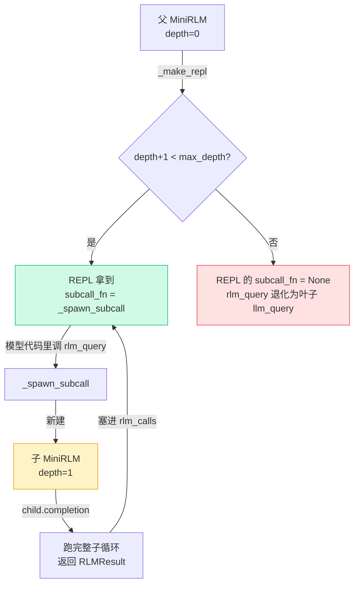

# 核心包逐文件实现

上一章我们搭好了心智地图：七个文件、依赖关系、保留与砍掉。这一章动真格——按 `types → parsing → prompts → clients → repl → rlm` 的顺序，把每个文件的关键代码贴出来逐段讲。

顺序不是随便排的：它**从地基往上盖**。先定数据形状（types），再定怎么从模型输出里抠动作（parsing）、怎么教模型干活（prompts）、怎么调模型（clients），最后才是两个主角——环境 `repl.py` 和编排 `rlm.py`。读完这一章，你应该能合上教程自己把 `mini_rlm` 默写个七七八八。

## 1. `types.py`：先把数据形状钉死

RLM 的一次运行是个**多层嵌套**的过程：一次 completion 有很多轮迭代，每轮可能有几个代码块，每个代码块执行后有 stdout、有子调用……而子调用本身又是一次完整的运行。`types.py` 干的就是把这套嵌套结构用 dataclass 钉死。

先看注释里画的那棵树（这是整个后端最重要的一张图）：

```text
RLMResult                 # 一次 completion 的最终结果
└── iterations: list[RLMIteration]
        └── code_blocks: list[CodeBlock]
                └── result: REPLResult
                        └── rlm_calls: list[RLMResult]   # 递归子调用（嵌套！）
```

`REPLResult.rlm_calls` 里装的又是 `RLMResult`——**递归在数据结构上的体现**。一段代码触发的每个 `rlm_query` 子调用，都会产出一个完整的 `RLMResult` 塞进 `rlm_calls`。前端 `SubCallTree` 之所以能"自己渲染自己"，根就在这里。

配置类用了 `frozen=True`：

```python
@dataclass(frozen=True)
class RLMConfig:
    model_name: str = "mock-model"
    max_iterations: int = 12      # 主循环最多跑几轮（兜底护栏）
    max_depth: int = 2            # 递归最深几层（depth 语义见下章）
    stdout_truncate_chars: int = 4000   # 回喂给模型的 stdout 截断长度
    backend: str = "mock"
```

`frozen=True` 让配置在一次运行里**改不动**——这是[复现实验](https://en.wikipedia.org/wiki/Reproducibility)的好习惯，免得跑到一半某处偷偷把 `max_depth` 改了，结果对不上还查不出来。

每个数据类都带一个 `to_dict()`——这是**前后端数据契约的实现**。后端吐什么字段，前端 `types.ts` 就定什么 interface（Part 6 逐字段对照）。一个容易踩的坑在 `REPLResult.to_dict()` 里：`"locals": {k: _safe_preview(v) for ...}`。REPL 命名空间可能塞了任意对象（甚至不可 JSON 序列化的），直接 `json.dumps` 会把日志写挂。`_safe_preview` 把每个值 `repr()` 成短字符串、超长截断、连 `repr` 都报错就退化成 `<类型名>`。**永远不要假设要序列化的数据是"干净"的**，尤其当它来自模型生成的代码时。

## 2. `parsing.py`：从模型输出里抠出"动作"

RLM 的动作全藏在模型输出的 ` ```repl ... ``` ` 代码块里。`find_code_blocks` 用一条正则把它们全抠出来：

````python
_CODE_BLOCK_PATTERN = re.compile(r"```repl\s*\n(.*?)```", re.DOTALL)

def find_code_blocks(text: str) -> list[str]:
    blocks: list[str] = []
    for match in _CODE_BLOCK_PATTERN.finditer(text):
        code = match.group(1).strip()
        if code:
            blocks.append(code)
    return blocks
````

逐段看这条正则：

- `` ```repl `` ——只匹配 `repl` 围栏。普通的 ` ```python ` 块**不会**被当成动作（测试 `test_ignores_non_repl_fences` 专门验了这点）。这很关键：模型有时会在解释里贴个 python 示例，你不能把它也拿去执行。
- `\s*\n` ——`repl` 后面允许有空白，然后必须换行。
- `(.*?)` ——非贪婪捕获代码体。
- `re.DOTALL` ——让 `.` 也能匹配换行，否则多行代码就废了。

`finditer` 让模型**一轮能写多个代码块**，按出现顺序返回。没有代码块就返回空列表——这代表"模型这一轮只是在思考"，主循环会提醒它"要交互必须写 ```repl 块"。

另一半工作是**把执行结果截断后回喂**。`_truncate` 是整个 RLM "不撑爆窗口"的物理保障：

```python
def _truncate(text: str, max_chars: int) -> str:
    if len(text) <= max_chars:
        return text
    omitted = len(text) - max_chars
    return text[:max_chars] + f"\n... [已省略 {omitted} 个字符]"
```

为什么必须截断？因为模型很可能写 `print(context[:100000])`，stdout 一下子几十万字符。如果原样塞回对话历史，**当场把窗口撑爆**——这恰恰是 RLM 要避免的。所以只回喂"够用"的一段，并明确告诉模型省略了多少（让它知道还有内容没看到）。

`format_iteration_feedback` 把一轮里所有代码块的结果拼成一条 user 消息；如果模型这轮一个代码块都没写，它会返回一句提醒："要和 context 交互、或提交答案，都必须写 ```repl 代码块"。这是一条软护栏，把跑偏的模型拽回正轨。

## 3. `prompts.py`：把普通 LLM "调教"成 RLM

RLM 不改模型权重，**全靠 prompt**。`SYSTEM_PROMPT` 就是把三大设计决策翻译给模型听的那段话。挑关键几句（英文原文，便于和官方对齐）：

```text
Your task's long context does NOT sit in your chat window. Instead it lives
as a variable `context` inside a persistent Python REPL...

- `context`: the (possibly huge) input ... Peek at it with slicing/len/regex
  BEFORE doing anything else.
- `llm_query(prompt) -> str`: ask a fresh sub-LLM ... process a *slice*.
- `rlm_query(prompt) -> str`: like llm_query, but the sub-call is itself a
  full RLM ... when recursion depth allows.
- `answer`: set answer["content"] = ... and answer["ready"] = True to submit.
```

对照[三个设计决策](/10-concepts/three-design-choices)，一一对应：

- "context lives as a variable" + "Peek at it BEFORE doing anything else" → **决策①**：给句柄不给全文，逼模型用代码按需取用。
- "set answer['ready'] = True to submit" → **决策②**：答案从环境变量取，不靠模型一口气说完。
- "llm_query / rlm_query over slices" → **决策③**：在代码里程序化调用模型。

注意 prompt 里反复强调 **"Keep YOUR window small. Never print the whole context."**——这是在主动教模型别干蠢事。官方 prompt 更长（含编排策略、in-context 示例），教学版留最小骨架。

还有个小心思在 `build_turn_prompt`：

````python
def build_turn_prompt(iteration: int, max_iterations: int) -> Message:
    head = f"第 {iteration + 1}/{max_iterations} 轮："
    if iteration == 0:
        head = (
            "你还没有查看过 context。请先写一个 ```repl 代码块查看它的长度和开头，"
            "不要急着给最终答案。\n\n" + head
        )
    return Message(role="user", content=head)
````

第 0 轮额外塞一句 safeguard：**先 peek，别急着答**。模型最常见的失败模式就是"还没看就瞎答"，这句提醒能显著提高成功率。这是 prompt 工程里典型的"在最容易出错的地方多说一句"。

## 4. `clients.py`：让上层不关心模型真假

`clients.py` 定义一个统一接口 `BaseLM`，所有客户端都实现同一个方法：

```python
class BaseLM(ABC):
    @abstractmethod
    def completion(self, messages: list[Message]) -> tuple[str, int, int]:
        """返回 (生成文本, 输入 token 数, 输出 token 数)"""
```

签名定成 `(text, in_tok, out_tok)`——文本是模型说了什么，两个 token 数用来算 usage。**上层 `MiniRLM` 完全不知道底下是真模型还是假模型**，这是整个测试体系能零成本的前提。

`OpenAICompatClient` 是真模型，亮点是**延迟导入**：

```python
def __init__(self, ...):
    try:
        from openai import OpenAI
    except ImportError as exc:
        raise ImportError("使用真实模型需要先安装 openai：pip install openai") from exc
```

把 `import openai` 放进 `__init__` 而不是文件顶部，意味着**没装 openai 也能 `import mini_rlm`、也能用 MockLM**。读者第一次跑教程时不需要任何 API key、不需要装 openai，照样能跑通全流程。

`MockLM` 是教学版的灵魂，三种用法：

```python
class MockLM(BaseLM):
    def completion(self, messages):
        if self._responses is not None:        # 1. 脚本模式：按顺序吐预设回复
            text = self._responses[self._idx]; self._idx += 1
        elif self._response_fn is not None:     # 2. 函数模式：按输入动态生成
            text = self._response_fn(messages)
        else:                                   # 3. 默认模式：回显最后一条消息
            text = f"Mock 回复（回显）：{messages[-1].content[:80]}"
        ...
```

- **脚本模式**最常用：你把模型"应该"逐轮说什么写成一个 list，行为完全确定，测试可重放。
- **函数模式**用来模拟"模型从不交卷"这种行为（下章测 `max_iterations` 兜底时用）。
- 脚本用尽了还被调用，会**兜底交一个空答案**，避免测试死循环——一个小而周到的护栏。

## 5. `repl.py`：环境 E 的最小实现（重点）

`MiniREPL` 是整个项目的心脏。它把三大决策**物理地**实现出来。逐个看。

### 持久化：同一个命名空间反复 exec

```python
self.ns: dict[str, Any] = {}        # 唯一的命名空间字典
...
exec(code, self.ns, self.ns)        # 所有代码都在 self.ns 里执行
```

关键就一行：**所有代码都在同一个 `self.ns` 字典里 `exec`**。这一轮 `x = 1`，下一轮 `print(x)` 还能拿到 1——因为它俩共用一个命名空间。这就是 REPL（Read-Eval-Print-Loop）和一次性 `eval` 的本质区别：**状态在轮之间持续**。测试 `test_variable_persists_across_calls` 验的就是这个。

::: warning ⚠️ exec 不是安全沙箱
`exec(code, self.ns, self.ns)` 直接在**当前 Python 进程**里执行模型生成的代码。模型写 `import os; os.system("rm -rf /")` 它就真的会跑。教学版这么做是为了**让你看清机制**，绝不能用于生产或执行不可信输入。官方项目用 Docker / E2B / Modal 等隔离环境跑不可信代码——上一章讲的"砍掉沙箱"指的就是这个。源码里特意标了 `# noqa: S102 教学用途，非安全沙箱`。**记住这个红线。**
:::

### context 卸载 + stdout 捕获

```python
def load_context(self, context):
    self.ns["context"] = context     # 决策①：超长输入只作为变量存在

def execute_code(self, code):
    stdout_buf, stderr_buf = io.StringIO(), io.StringIO()
    try:
        with redirect_stdout(stdout_buf), redirect_stderr(stderr_buf):
            exec(code, self.ns, self.ns)
        stderr = stderr_buf.getvalue()
    except Exception:
        import traceback
        stderr = stderr_buf.getvalue() + traceback.format_exc()
        # 不 re-raise：RLM 的精髓之一是模型能从执行报错中恢复
```

两个要点：

1. `load_context` 把超长输入存成 `context` 变量，模型只能写代码去看它——**决策①**的落地。
2. `redirect_stdout/stderr` 把打印**捕获到字符串**而非真打到终端，这样才能截断后回喂。
3. **报错不 re-raise**：模型代码报错（除零、KeyError……）时把 traceback 接进 stderr 喂回去，让模型**自我修正**——这是 RLM 的精髓之一。`test_error_is_captured_not_raised` 验证报错后 REPL 仍可用。

### 答案捕获：`_AnswerDict` 的回调魔法

决策②"答案从变量取"怎么实现？用一个特制的 dict：

```python
class _AnswerDict(dict):
    def __init__(self, on_ready):
        super().__init__()
        super().__setitem__("content", "")
        super().__setitem__("ready", False)
        self._on_ready = on_ready

    def __setitem__(self, key, value):
        super().__setitem__(key, value)
        if key == "ready" and value:          # 监听 answer["ready"] = True
            self._on_ready(str(self.get("content", "")))
```

`_AnswerDict` 重写了 `__setitem__`。模型代码执行 `answer["ready"] = True` 时**立刻触发 `on_ready` 回调**，把当前 `answer["content"]` 捕获下来。主循环不必轮询"交卷没"——一交卷就被通知。这是用魔术方法做的一个优雅"事件钩子"。

为什么要这么绕？因为决策②的关键是"答案可以在循环里一点点攒、长度不受窗口限制"。模型可以写 `answer["content"] = "\n".join(几十万行)`，攒够再 `ready = True`。答案多长都行，因为它在变量里、不在模型的输出里。

### 工具注入：llm_query / rlm_query

```python
def _setup_namespace(self):
    self.ns["llm_query"] = self._llm_query
    self.ns["rlm_query"] = self._rlm_query
    self.ns["answer"] = _AnswerDict(on_ready=self._capture_answer)
    for name, value in self._custom_tools.items():
        self.ns[name] = value
```

把这几个**方法引用**塞进命名空间，模型在代码里就能像调内置函数一样 `llm_query("...")`——这就是"符号化地调用语言模型"。`llm_query` 和 `rlm_query` 的区别是核心：

```python
def _llm_query(self, prompt):
    text, in_tok, out_tok = self._client.completion([Message("user", prompt)])
    self._pending_calls.append(RLMResult(
        response=text, depth=self._depth + 1, stopped_reason="leaf_llm", ...))
    return text                       # 叶子：开个新模型答一句，无 REPL 无记忆

def _rlm_query(self, prompt):
    if self._subcall_fn is None:      # 到了最大深度，退化成叶子
        return self._llm_query(prompt)
    result = self._subcall_fn(prompt)  # 否则：递归起一个完整子 RLM
    self.usage.merge(result.usage)
    self._pending_calls.append(result)
    return result.response
```

- `_llm_query` 是**叶子**：开一个全新的、无 REPL、无记忆的模型答一句，记成 `stopped_reason="leaf_llm"` 的 `RLMResult`。
- `_rlm_query` 是**递归**：`subcall_fn` 存在（深度还够）就调它起一个**完整子 RLM**（有自己的 REPL 和循环）；到了最大深度 `subcall_fn` 是 `None`，**退化成 `_llm_query`**。

谁来设 `subcall_fn`？`rlm.py`，这就接到了最后一块。

## 6. `rlm.py`：把一切组装成"像个普通 LLM 的东西"

`MiniRLM` 对外只有一个方法 `completion(context, task) -> RLMResult`，内部是 Algorithm 1 的最小实现。先看主循环骨架：

```python
def completion(self, context, task=None):
    repl = self._make_repl()
    repl.load_context(context)                       # context 卸载进环境
    history = build_system_messages(...)             # 系统提示 + context 元数据
    result = RLMResult(response="", root_model=..., depth=self.depth)

    for i in range(self.config.max_iterations):      # ← 主循环（护栏：最多这么多轮）
        history.append(build_turn_prompt(i, ...))
        iteration = self._run_one_turn(i, history, repl)
        result.iterations.append(iteration)

        if iteration.final_answer is not None:       # 模型交卷了
            result.response = iteration.final_answer
            result.stopped_reason = "final_answer"
            break

        # 没交卷：把"模型说了什么 + REPL 反馈"接回历史，进入下一轮
        history.append(Message("assistant", iteration.response))
        history.append(Message("user", format_iteration_feedback(...)))
    else:
        # for...else：循环正常跑完（没 break）才进这里 = 轮次耗尽
        result.response = self._fallback_answer(result)
        result.stopped_reason = "max_iterations"
    ...
    return result
```

逐段看：

- **`for i in range(max_iterations)`** 就是 RLM 的主循环。`max_iterations` 是护栏——模型万一陷入死循环（一直 peek 不交卷），到点强制停。
- 每轮先 `build_turn_prompt` 追加一条轮次提示，再 `_run_one_turn`（调模型、解析、执行）。
- **`if final_answer is not None: break`**——模型把答案写进了 `answer` 变量，结束。
- 没交卷就把模型的响应 + REPL 反馈接回 `history`，喂下一轮。注意接回去的反馈是**截断过的**（`stdout_truncate_chars`），窗口不会爆。
- **`for...else`**：Python 的冷门语法，`else` 只在循环**没被 break**时执行。这里恰好表达"跑满了所有轮次都没交卷"，走 `_fallback_answer` 兜底取最后一次非空响应。

`_run_one_turn` 是单轮的细节——调模型、抠代码块、逐块执行：

```python
def _run_one_turn(self, i, history, repl):
    response, in_tok, out_tok = self._client.completion(history)
    repl.usage.add(in_tok, out_tok)

    code_blocks, final_answer = [], None
    for code in find_code_blocks(response):
        repl_result = repl.execute_code(code)
        code_blocks.append(CodeBlock(code=code, result=repl_result))
        if repl_result.final_answer is not None:
            final_answer = repl_result.final_answer
            break                       # 交卷了，本轮剩余代码块不再执行
    return RLMIteration(iteration=i, prompt=list(history), response=response,
                        code_blocks=code_blocks, final_answer=final_answer, ...)
```

注意 `prompt=list(history)` 存了一份**快照**——这样前端能回看"当时模型看到的完整上下文长什么样"。一旦某个代码块交卷，立刻 `break`，本轮后面的代码块不再执行。

### 递归：`_make_repl` + `_spawn_subcall`

这是整个 `mini_rlm` 最精彩的两个方法，决策③的落地：

```python
def _make_repl(self):
    subcall_fn = None
    if self.depth + 1 < self.config.max_depth:     # 深度还够，才给递归能力
        subcall_fn = self._spawn_subcall
    return MiniREPL(client=self._client, subcall_fn=subcall_fn,
                    custom_tools=self.custom_tools, depth=self.depth)

def _spawn_subcall(self, prompt):
    child = MiniRLM(                                # 新建一个 depth+1 的子 RLM
        config=self.config, client=self._client,
        trajectory_logger=None,                     # 子轨迹嵌在父结果里，不单独落盘
        depth=self.depth + 1, **self._client_kwargs)
    # 子调用把 prompt 同时当 context 和 task——要对这段内容做完整 RLM 处理
    return child.completion(context=prompt, task=prompt)
```

把这两段连起来读，递归的完整链条就清楚了：



- `_make_repl` 按**深度**决定 REPL 有没有递归能力：只有 `depth + 1 < max_depth` 时，才把 `_spawn_subcall` 交给 REPL。这就是 [depth 语义](/10-concepts/three-design-choices)的代码实现——到了最深一层，`subcall_fn` 是 `None`，REPL 里的 `rlm_query` 自动退化成叶子 `llm_query`。
- `_spawn_subcall` 是递归的发动机：它**新建一个 `depth+1` 的 `MiniRLM`**，用同一个 client，调它的 `completion`，把返回的 `RLMResult` 塞进父调用的 `rlm_calls`。

子调用 `child.completion(context=prompt, task=prompt)` 这一句把 `prompt` **同时当 context 和 task**——子 RLM 要对这段内容做一次完整的 RLM 处理（有自己的 REPL、自己的循环、甚至自己的子调用）。这就是论文说的 "symbolic recursion"，也是教学版**保留下来最有价值的机制**。

::: tip 递归为什么不会失控
两道闸：① `max_depth` 限制递归层数（默认 2，即父可以调子 RLM，子只能调叶子 LLM）；② 每层都有自己的 `max_iterations` 主循环上限。两道闸叠起来，递归的总调用量有明确上界。下章讲护栏会再细说。
:::

## 小结：三大决策落在哪几行

| 决策 | 落地代码 | 文件:位置 |
|---|---|---|
| ① prompt 即环境（给句柄） | `self.ns["context"] = context` | `repl.py` `load_context` |
| ② 答案从变量取 | `_AnswerDict.__setitem__` 监听 `ready=True` | `repl.py` |
| ③ 程序化递归 | `_spawn_subcall` 新建 `depth+1` 的 MiniRLM | `rlm.py` |
| 主循环闭环 | `for i in range(max_iterations)` + 反馈接回 | `rlm.py` `completion` |

下一章 [日志、护栏与测试](/50-build-backend/logging-and-tests)：把这套东西的轨迹写成 JSONL、护栏怎么兜底、以及怎么用 MockLM 把整个 RLM 循环测得明明白白。

## 小练习

1. `_AnswerDict` 重写了 `__setitem__` 来监听 `answer["ready"] = True`。如果模型写的是 `answer.update({"ready": True})` 而不是 `answer["ready"] = True`，回调还会触发吗？为什么？（提示：想想 `dict.update` 内部走不走 `__setitem__`）

::: details 参考思路
**不一定会触发**。CPython 的 `dict.update` 是用 C 实现的，它**不一定**逐个调用 Python 层的 `__setitem__`——对内置 dict 子类，`update` 通常绕过重写的 `__setitem__` 直接操作底层存储。所以 `answer.update({"ready": True})` 很可能**不会**触发 `on_ready` 回调，模型就"交了卷但没人收"。这也是为什么系统提示里明确教模型用 `answer["ready"] = True` 这种**下标赋值**写法。生产级实现会更稳妥（比如改成轮询 `answer` 的状态，或在 execute 后主动检查），教学版选了最能讲清"魔术方法做钩子"的写法。
:::

2. `_spawn_subcall` 里给子 RLM 传了 `trajectory_logger=None`，注释说"子调用轨迹已嵌在父结果里，不单独落盘"。如果这里不传 None、让每个子调用也各写一个 JSONL 文件，会发生什么问题？

::: details 参考思路
会**重复记录**且**结构错乱**。子调用的 `RLMResult` 已经被 `_rlm_query` 塞进了父调用某个 `REPLResult.rlm_calls` 里，最终会随父调用的轨迹一起被 `logger.write` 落盘（嵌在 `iterations → code_blocks → result → rlm_calls` 这棵树里）。如果子调用再自己落一个盘，同一段轨迹就存了两份，而且前端是按"一个 JSONL = 一次顶层运行"来读的，多出来的子轨迹文件会让人困惑。所以约定：**只有 `depth == 0` 的顶层调用落盘**（看 `completion` 末尾的 `if ... and self.depth == 0`），子调用一律嵌进父结果。
:::
