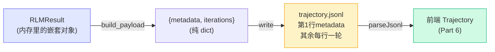

# 日志、护栏与测试

前两章把 `mini_rlm` 的核心闭环和递归都实现了。但一个"能跑"的 RLM 还差三样东西，才能算"能交付"：

1. **轨迹日志**——把一次运行的全过程落成结构化数据，否则你既没法可视化（Part 6 要用），也没法 debug；
2. **护栏**——模型生成的代码不可信、循环可能不收敛，得有兜底机制防止失控；
3. **测试**——而且是**零成本、可重放**的测试，否则每改一行都要烧 API key 验一遍。

这一章把这三样补齐。最后跑一遍 `pytest -q`，确认 21 个测试全过。

## 一、轨迹日志：JSONL 的两段式结构

`logger.py` 的 `TrajectoryLogger` 把一次运行的 `RLMResult` 转成前端要的格式。核心是 `build_payload`：

```python
def build_payload(self, result, config):
    return {
        "metadata": {
            "type": "metadata",
            "root_model": config.model_name,
            "max_depth": config.max_depth,
            "max_iterations": config.max_iterations,
            "stopped_reason": result.stopped_reason,
            "final_answer": result.response,
            "total_iterations": len(result.iterations),
            "total_code_blocks": sum(len(it.code_blocks) for it in result.iterations),
            "total_sub_calls": sum(
                len(b.result.rlm_calls)
                for it in result.iterations for b in it.code_blocks),
            "total_execution_time": result.execution_time,
            "usage": result.usage.to_dict(),
        },
        "iterations": [it.to_dict() for it in result.iterations],
    }
```

payload 分两层：

- **`metadata`**：整次运行的概览——用了哪个模型、为什么停下、最终答案、总共几轮几块几个子调用、总耗时、token 统计。这些**汇总数字**正是前端顶部那四张统计卡片（`StatCards`）的数据源。注意 `total_sub_calls` 用了一个嵌套推导式：遍历每轮的每个代码块，数它们的 `rlm_calls`。
- **`iterations`**：每一轮的完整明细，由各 `RLMIteration.to_dict()` 递归展开（一直展到子调用）。

落盘时是 **JSONL（每行一个 JSON 对象）**，不是一整个大 JSON：

```python
with open(path, "w", encoding="utf-8") as f:
    f.write(json.dumps(payload["metadata"], ensure_ascii=False) + "\n")   # 第一行
    for it in payload["iterations"]:
        f.write(json.dumps(it, ensure_ascii=False) + "\n")                 # 之后每行一轮
```

::: tip 为什么用 JSONL 而不是一个大 JSON
JSONL 是**流式友好**的：第一行就是 metadata，可以先读出概览立刻渲染；后面每行一个 iteration，可以边读边画时间线，不用等整个文件加载完。这对"运行很多轮、轨迹很大"的场景很重要。官方可视化器也用这个格式——我们刻意对齐，这样前端代码能直接复用。`ensure_ascii=False` 保证中文不被转义成 `\uXXXX`，日志直接可读。
:::

数据流向一目了然：



`TrajectoryLogger` 还有个贴心设计：`log_dir=None` 时**只在内存里存** `last_payload`，不落盘。本地开发服务器（`server.py`）就用这个——跑完一个场景直接把 `logger.last_payload` 当 HTTP 响应返回，不用碰文件系统。

## 二、护栏：让不可信的东西可控

RLM 有两个天然的"不可控源"：模型生成的代码、和可能不收敛的循环。`mini_rlm` 用四道护栏兜底。

### 护栏 1：`max_iterations` —— 循环不收敛就强制停

主循环是 `for i in range(self.config.max_iterations)`。模型万一一直 peek 不交卷，到点强制结束，走兜底取答案：

```python
else:   # for...else：跑满所有轮次都没 break（没交卷）
    result.response = self._fallback_answer(result)
    result.stopped_reason = "max_iterations"
```

`stopped_reason` 会标成 `"max_iterations"`，前端能据此把这次运行标红——你一眼就知道"这次没正常交卷，是被兜底掐停的"。

### 护栏 2：`max_depth` —— 递归不会无限深

`_make_repl` 里 `if self.depth + 1 < self.config.max_depth` 才给递归能力。到了最深一层，`rlm_query` 退化成叶子 `llm_query`。配合每层各自的 `max_iterations`，递归的总调用量有明确上界，不会爆炸。

### 护栏 3：执行报错不崩溃，喂回去自愈

上一章讲过——`execute_code` 捕获模型代码的任何异常，把 traceback 接进 stderr 喂回模型，**不 re-raise**。这既是护栏（一段烂代码不会搞垮整个进程），也是 RLM 的能力（模型从报错中恢复）。

### 护栏 4：输出截断，窗口不爆

`format_repl_output` 把回喂的 stdout/stderr 各截到 `stdout_truncate_chars`（默认 4000）。模型 `print` 出几十万字符也不会撑爆下一轮的上下文。

| 护栏 | 防的是什么 | 代码位置 |
|---|---|---|
| `max_iterations` | 循环不收敛 | `rlm.py` `for...else` |
| `max_depth` | 递归无限深 | `rlm.py` `_make_repl` |
| 报错不 re-raise | 烂代码搞垮进程 | `repl.py` `execute_code` |
| 输出截断 | 回喂撑爆窗口 | `parsing.py` `_truncate` |

::: warning 护栏 ≠ 沙箱
这四道护栏管的是**可控性**（别死循环、别爆窗口、别崩溃），**不是安全性**。模型若写 `os.system(...)` 照样能跑——上一章红框警告过，`exec` 不是安全沙箱。生产环境的"安全护栏"是 Docker/E2B 隔离，那是另一码事，教学版没做。
:::

## 三、用 MockLM 写零成本测试

这是本章的重头戏。**RLM 是个带循环、带递归、要调模型的复杂系统，怎么测才不烧钱、还能复现？** 答案：把"模型"换成可编排的 `MockLM`。

### 为什么 MockLM 能让 RLM 循环可测

回想 RLM 主循环的形状：`调模型 → 解析代码 → 执行 → 把反馈接回 → 再调模型`。这里唯一**不确定、要花钱**的环节就是"调模型"。其余全是确定性的本地逻辑（正则解析、`exec`、截断）。

`MockLM` 的脚本模式正好把这唯一的不确定源**钉死**：你预先写好"模型第 1 轮说什么、第 2 轮说什么……"，它就按这个剧本逐轮吐。于是整个 RLM 循环变成**完全确定、可重放**的——同样的脚本永远走同样的路径，断言永远稳定。

两个测试辅助函数把脚本写得很顺手（在 `tests/test_rlm.py` 顶部）：

````python
def repl_block(code: str) -> str:
    return f"```repl\n{code}\n```"

def submit(content: str) -> str:
    return repl_block(f"answer['content'] = {content!r}\nanswer['ready'] = True")
````

`repl_block` 把一段代码包成模型该输出的 ` ```repl ` 块；`submit` 进一步生成"交卷"的那段代码。有了它俩，写一段"模型剧本"就像写伪代码。

### 代表性用例 1：完整循环 + 终止

```python
def test_full_loop_terminates_on_answer():
    mock = MockLM(responses=[
        repl_block("print(len(context))"),     # 第 1 轮：peek
        submit("done"),                         # 第 2 轮：交卷
    ])
    rlm = MiniRLM(config=RLMConfig(max_iterations=5), client=mock)
    result = rlm.completion(context="x" * 100, task="测一下")
    assert result.response == "done"
    assert result.stopped_reason == "final_answer"
    assert len(result.iterations) == 2
```

剧本只有两条：先 peek、再交卷。断言三件事——最终答案对、停止原因是正常交卷、恰好跑了两轮（交卷后立刻停，没多跑）。这一个测试就覆盖了"模型写代码 → 执行 → 反馈 → 再写代码 → 交卷 → 终止"的完整闭环。

### 代表性用例 2：模型真能读到 context

```python
def test_peek_context_in_loop():
    mock = MockLM(responses=[
        repl_block("first = context[:5]\nprint(first)"),
        repl_block("answer['content'] = first\nanswer['ready'] = True"),
    ])
    result = MiniRLM(config=RLMConfig(max_iterations=5), client=mock).completion(
        context="HELLO world", task="取前 5 字符")
    assert result.response == "HELLO"
```

这个用例验证**变量持久化 + context 卸载**：第 1 轮把 `context[:5]` 存进 `first`，第 2 轮还能读到 `first`（跨轮持久化），且 `context` 确实是传进去的 `"HELLO world"`（卸载正确）。最终答案是 `"HELLO"`——证明这条链全通。

### 代表性用例 3：循环不收敛走兜底

这里用**函数模式**模拟"模型永远不交卷"：

```python
def test_max_iterations_fallback():
    mock = MockLM(response_fn=lambda msgs: repl_block("print('thinking...')"))
    rlm = MiniRLM(config=RLMConfig(max_iterations=3), client=mock)
    result = rlm.completion(context="abc")
    assert result.stopped_reason == "max_iterations"
    assert len(result.iterations) == 3
```

`response_fn` 让模型每轮都只 print、从不 `answer["ready"]=True`。跑满 3 轮后走 `for...else` 兜底，`stopped_reason` 标成 `"max_iterations"`。这就把**护栏 1** 测到了。

### 代表性用例 4：递归真的发生了

最精彩的一个——验证 `rlm_query` 起了一个**完整子 RLM**：

```python
def test_recursion_spawns_child_rlm():
    shared = MockLM(responses=[
        repl_block("sub = rlm_query('子任务')\nprint(sub)"),  # 父第1轮：调 rlm_query
        submit("child-answer"),                                # 子RLM第1轮：交卷
        submit("parent-done"),                                 # 父第2轮：交卷
    ])
    rlm = MiniRLM(config=RLMConfig(max_iterations=5, max_depth=2), client=shared)
    result = rlm.completion(context="data", task="递归测试")

    assert result.response == "parent-done"
    sub_calls = [c for it in result.iterations
                 for b in it.code_blocks for c in b.result.rlm_calls]
    assert len(sub_calls) == 1
    assert sub_calls[0].response == "child-answer"
    assert sub_calls[0].depth == 1
    assert len(sub_calls[0].iterations) >= 1     # 子调用是完整 RLM，有自己的迭代
```

::: tip 父子共享一个 MockLM，剧本要按"调用顺序"排
这是写递归测试最容易绕晕的地方。父和子用**同一个** `MockLM` 实例（`shared`），所以脚本里的 responses 必须严格按**真实发生的时间顺序**排：父第 1 轮调 `rlm_query` → **在这次代码执行期间**子 RLM 启动并消费第 2 条脚本交卷 → 控制权回到父，父第 2 轮消费第 3 条脚本交卷。顺序排错，整个测试就崩。`scenarios.py` 里的递归在线场景也是同样的排法。
:::

关键断言是最后两条：子调用的 `depth == 1`（确实下沉了一层），且 `len(iterations) >= 1`（它是**完整 RLM**，有自己的迭代轨迹，而不是叶子）。

### 代表性用例 5：到了最深处退化成叶子

对照组——`max_depth=1` 时 `rlm_query` 应退化成叶子 `llm_query`：

```python
def test_depth_limit_falls_back_to_leaf():
    shared = MockLM(responses=[
        repl_block("sub = rlm_query('子任务')\nprint(sub)"),
        "叶子回答",        # rlm_query 退化成 llm_query，消费这条原始文本
        submit("parent-done"),
    ])
    result = MiniRLM(config=RLMConfig(max_iterations=5, max_depth=1),
                     client=shared).completion(context="data")
    sub_calls = [c for it in result.iterations
                 for b in it.code_blocks for c in b.result.rlm_calls]
    assert sub_calls[0].stopped_reason == "leaf_llm"
    assert len(sub_calls[0].iterations) == 0      # 叶子没有自己的迭代
```

注意第 2 条脚本是**纯文本** `"叶子回答"`（不是 ` ```repl ` 块）——因为叶子 `llm_query` 只是"问一句答一句"，返回的就是原始文本，不会被当成代码执行。断言 `stopped_reason == "leaf_llm"` 且 `iterations == 0`，精确区分了"叶子"和"完整子 RLM"。把用例 4 和 5 放一起看，[depth 语义](/10-concepts/three-design-choices)就被测得明明白白。

### 其它三个文件的测试

`tests/` 下还有三个文件，思路相同——把不确定源换成 Mock 或纯本地：

- **`test_repl.py`**（7 个）：直接测 `MiniREPL`，连模型都基本不用（REPL 是纯本地的）。覆盖变量持久化、stdout 捕获、报错不崩、context 可读、`_AnswerDict` 答案捕获、`llm_query` 注入、自定义工具。
- **`test_parsing.py`**（6 个）：纯函数测试，无需任何模型。验证单块/多块解析、忽略非 repl 围栏、截断逻辑。
- **`test_logger.py`**（2 个）：用 MockLM 跑一次，验证 payload 结构和 JSONL 落盘（第一行是 metadata、第二行 `iteration == 0`）。

### 跑起来：21 passed

```bash
cd final-project/backend
pytest -q
```

```text
.....................                    [100%]
21 passed in 0.04s
```

**0.04 秒、零 API 调用、零成本**。这就是 MockLM 的威力：把一个要调大模型的递归系统，变成了能在 CI 里秒级跑完的确定性测试。每次改 `mini_rlm` 的代码，跑一遍就知道有没有破坏闭环、递归、护栏中的任何一条。

| 测试文件 | 个数 | 测什么 | 用到模型吗 |
|---|---|---|---|
| `test_rlm.py` | 6 | 完整循环/终止/兜底/递归/退化 | MockLM 脚本 |
| `test_repl.py` | 7 | 持久化/捕获/报错/注入 | 几乎不用 |
| `test_parsing.py` | 6 | 解析/截断 | 不用 |
| `test_logger.py` | 2 | payload/JSONL | MockLM 脚本 |
| **合计** | **21** | | **全程零成本** |

到这里，`mini_rlm` 后端就完整了：核心闭环、递归、护栏、轨迹日志、测试一应俱全。下一 Part [轨迹数据结构与接口](/60-build-frontend/data-and-api) 我们转到前端，把这些 JSONL 轨迹画成能交互的可视化器。

## 小练习

1. `test_recursion_spawns_child_rlm` 里父子共享同一个 `MockLM`，脚本顺序是 `[父调rlm_query, 子交卷, 父交卷]`。如果你不小心把后两条写反成 `[父调rlm_query, 父交卷, 子交卷]`，测试会怎么失败？

::: details 参考思路
会失败在子调用上。父第 1 轮执行 `rlm_query('子任务')` 时，子 RLM 立刻启动并去消费**下一条**脚本——此时下一条是 `submit("parent-done")`，于是**子 RLM** 拿这条交了卷，`sub_calls[0].response` 会变成 `"parent-done"` 而不是预期的 `"child-answer"`，`assert sub_calls[0].response == "child-answer"` 直接挂掉。而父第 2 轮再去取脚本时拿到的是 `submit("child-answer")`，父的最终答案也错了。这说明：**共享 MockLM 的递归测试，脚本顺序必须精确等于真实调用的时间顺序**，子调用是"在父代码执行中途插进来"消费脚本的。
:::

2. `UsageSummary` 有 `add` 和 `merge` 两个方法。在递归场景里，子调用的 token 用量是怎么一层层汇总到顶层 metadata 的？请顺着 `_rlm_query` → `_spawn_subcall` → `completion` 把链路理一遍。

::: details 参考思路
链路是：子 RLM `completion` 跑完后，它自己的 `result.usage` 已经 `merge` 了它那层 REPL 的 usage（`result.usage.merge(repl.usage)`）。回到父层，`_rlm_query` 里 `self.usage.merge(result.usage)` 把子调用的总用量并进**父 REPL 的 usage**。父 `completion` 结束时再 `result.usage.merge(repl.usage)` 把父 REPL 的 usage（已含子调用）并进父结果。最后 `build_payload` 里 `result.usage.to_dict()` 进 metadata。所以是**自底向上逐层 merge**：叶子 `add` 单次调用 → 每层 REPL 累积 → 子结果 merge 进父 REPL → 父结果 merge 父 REPL。前端顶部看到的 token 总数，就是整棵递归树所有调用的合计。
:::
