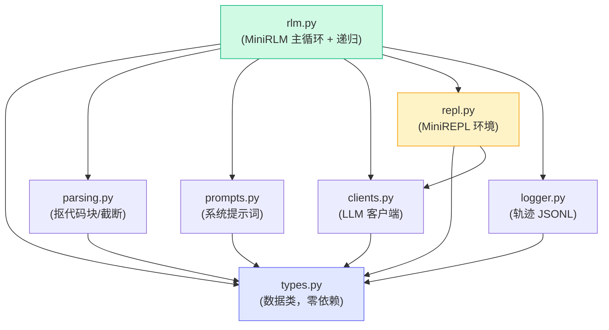
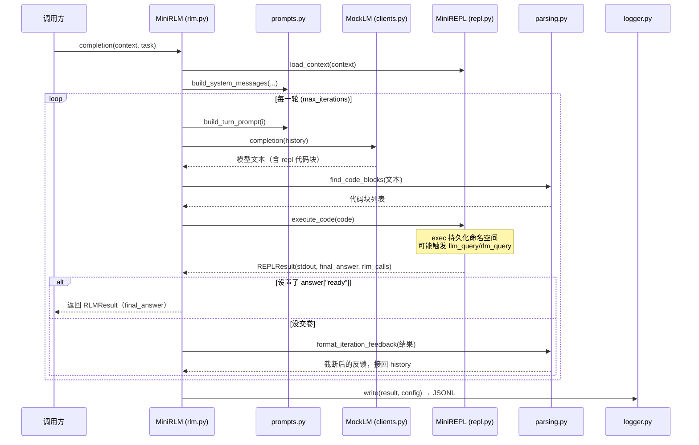

# 项目结构与设计取舍

前面四个 Part 我们把 RLM 的"为什么"讲透了：prompt 即环境、答案从变量取、程序化递归。从这一章起，我们要把这些想法**亲手敲成代码**。

目标很明确：写一个能跑通完整 RLM 闭环、能递归、零成本可测、还能把轨迹喂给前端可视化的 `mini_rlm`。但"能跑"和"看得懂"是两回事——官方实现为了支持远程沙箱、多 provider、上下文压缩，绕了很多工程弯路。教学版的第一要务是**让你一眼看清三大设计决策落在哪几行代码上**。所以这一章先不写代码，先讲清楚两件事：

1. 这个包**拆成哪几个文件**，每个文件管什么，它们怎么互相依赖；
2. 相比官方实现，我们**保留了什么、砍掉了什么**，以及每个简化为什么对教学无损。

## 七个文件，各管一摊

`mini_rlm` 包一共七个源文件（外加一个 `__init__.py` 导出公共 API）。先看目录：

```text
final-project/backend/
├── mini_rlm/
│   ├── __init__.py      # 公共 API 导出（MiniRLM / MockLM / RLMConfig ...）
│   ├── types.py         # 所有数据类：配置 + 嵌套的轨迹结构
│   ├── parsing.py       # 从模型输出抠 repl 代码块 + 截断回喂
│   ├── prompts.py       # 系统提示词：把普通 LLM "调教"成 RLM
│   ├── clients.py       # LLM 客户端：统一接口 + OpenAI 兼容 + MockLM
│   ├── repl.py          # MiniREPL：持久化环境、工具注入、答案捕获
│   ├── rlm.py           # MiniRLM：主循环 + 递归编排
│   └── logger.py        # TrajectoryLogger：把轨迹写成 JSONL 给前端
├── tests/               # 21 个测试，全用 MockLM，零成本
├── demos/               # demo1~demo5，逐步演示
├── scenarios.py         # 预设在线场景（供 server / serverless 共用）
└── server.py            # 本地 FastAPI 开发服务器
```

每个文件的职责，一张表说清：

| 文件 | 职责 | 对应的 RLM 概念 |
|---|---|---|
| `types.py` | 定义 `RLMConfig` 和一套**嵌套的轨迹数据类**（`RLMResult` → `RLMIteration` → `CodeBlock` → `REPLResult` → `rlm_calls`） | 数据契约；递归在数据结构上的体现 |
| `parsing.py` | `find_code_blocks` 用正则抠代码块；`format_iteration_feedback` 把执行结果截断后拼成下一轮反馈 | "动作藏在 ```repl 块里"；只回喂 stdout 的元数据 |
| `prompts.py` | `SYSTEM_PROMPT` 告诉模型 context 在 REPL 里、怎么用 `llm_query`/`rlm_query`/`answer` | 决策①②③的提示词落地 |
| `clients.py` | `BaseLM` 抽象接口；`OpenAICompatClient` 真模型；`MockLM` 假模型 | 让上层不关心底下真假，测试零成本 |
| `repl.py` | `MiniREPL`：持久化命名空间 `exec`、工具注入、`_AnswerDict` 答案捕获 | **决策①②③的核心载体**——环境 E |
| `rlm.py` | `MiniRLM`：组装"环境 + 提示 + 循环 + 递归"，对外像个普通 LLM | Algorithm 1 主循环 |
| `logger.py` | `TrajectoryLogger`：把 `RLMResult` 落成 `{metadata, iterations}` 的 JSONL | 给前端的数据出口 |

::: tip 为什么要拆这么细
每个文件都控制在 80~200 行，[小文件原则](https://zh.wikipedia.org/wiki/单一职责原则)让你能单独读、单独测一个模块。更重要的是：**职责边界恰好对齐 RLM 的概念边界**。你想搞懂"答案怎么从环境里取"，只需要读 `repl.py` 的 `_AnswerDict`；想搞懂"递归怎么发生"，只需要读 `rlm.py` 的 `_spawn_subcall`。代码结构本身就是教材的目录。
:::

## 模块依赖关系

七个文件不是平铺的，它们有清晰的分层。`types.py` 在最底层（谁都依赖它，它不依赖任何人），`rlm.py` 在最顶层（把所有人组装起来）。



读这张图有两个要点：

- **`types.py` 是地基**。所有模块都 `from .types import ...`，但 `types.py` 自己不 import 任何兄弟模块。这是典型的"数据与逻辑分离"——数据形状先定死，逻辑再围着它转。
- **`rlm.py` 是装配车间**，它依赖其余全部五个模块。`repl.py` 是唯一一个除了 `types` 还依赖 `clients` 的中间层（因为 REPL 里注入的 `llm_query` 需要一个真客户端去调）。

这条依赖链没有环。`rlm.py` 唯一"特殊"的地方是它**自己 import 自己**——`_spawn_subcall` 里 `MiniRLM(...)` 新建子实例。这不是循环依赖，而是**递归**，下一章会细看。

## 一次运行的数据如何流动

把上面的依赖图换个角度看——不看"谁 import 谁"，而看"一次 `completion()` 调用里数据怎么走"：



这张图就是 RLM 的[那个核心闭环](/10-concepts/rlm-insight)：**模型写代码 → 环境执行 → 截断后的结果回喂 → 再写代码**，直到模型把答案写进 `answer` 变量。整个 Part 5 就是把这张图逐格实现出来。

## 我们保留了什么

教学版不是"残废版"。RLM 之所以是 RLM 的**核心机制，一个不少**：

| 保留项 | 在哪个文件 | 为什么不能砍 |
|---|---|---|
| 持久化 REPL 环境 | `repl.py` `exec(code, self.ns, self.ns)` | 这是"prompt 即环境"的物理载体，砍了就不是 RLM 了 |
| context 卸载到变量 | `repl.py` `load_context` | 决策①：超长输入不进窗口，只给句柄 |
| 答案从变量取 | `repl.py` `_AnswerDict` | 决策②：输出能突破窗口 |
| 程序化递归 | `rlm.py` `_spawn_subcall` + `repl.py` `_rlm_query` | 决策③：能在 `for` 循环里调模型，最关键的一条 |
| 完整轨迹日志 | `logger.py` + `types.py` 嵌套结构 | 没有轨迹就没法可视化，也没法 debug |

## 我们砍掉了什么，以及为什么无损

官方实现（`github.com/alexzhang13/rlm`）为了上生产，背着不少包袱。教学版逐一卸下——但**每一项都只是"换了个更简单的等价物"，没有动核心闭环**：

| 砍掉/简化 | 官方怎么做 | 我们怎么做 | 为什么对教学无损 |
|---|---|---|---|
| **Socket 通信** | `LMHandler` 是个多线程 TCP socket 服务器，让沙箱里的代码能回调主进程发 LM 请求 | 直接用**本地闭包** `subcall_fn` / 注入 `llm_query` | socket 是为了"沙箱在别的进程/机器上也能调主进程的模型"。教学版不隔离，REPL 和主循环在同一进程，一个 Python 函数调用就够了。**递归语义完全一致**，只是少了进程边界 |
| **IPython 内核** | 支持 `ipython` 环境，富显示、魔术命令 | 只用内置 `exec` | IPython 是体验增强，不是 RLM 必需。`exec` 已经能持久化命名空间，足以演示全部机制 |
| **沙箱隔离** | Docker / E2B / Modal / Daytona 等隔离环境跑不可信代码 | `exec` 直接在本进程跑 | 隔离是**安全**需求，不是**机制**需求。教学聚焦"RLM 怎么工作"，安全性单独用警告标注（见下章） |
| **多 provider** | LiteLLM 接各家模型 | 只做 OpenAI 兼容 + MockLM | 一个 `OpenAICompatClient` 靠 `base_url` 就能接 OpenAI/vLLM/国内代理；MockLM 让你**没有 API key 也能跑通全流程** |
| **上下文压缩 (compaction)** | 历史过长时压缩对话 | 完全不做 | 这恰恰是 RLM **要避免**的有损操作！RLM 的卖点就是"不靠压缩也能处理超长输入"。教学版坚决不引入压缩，反而更纯粹 |

::: warning 最大的差异：socket vs 闭包
官方和我们 `mini_rlm` 最大的工程差异，就是**子调用怎么发起**。官方用 socket 是因为代码可能跑在 Docker 容器、远程 E2B 沙箱里，物理上够不着主进程的 LM 客户端，只能通过网络回调。我们的代码就在同一个 Python 进程里，`MiniREPL` 里注入的 `llm_query` 就是主进程的一个方法引用，**直接调用即可**。

记住这个对应：官方的「socket 回调主进程」 ≡ 我们的「闭包直接调用」。**两者的递归语义一模一样**，只是网络 vs 函数调用的区别。如果你以后要把教学版升级成"能跑不可信代码的隔离版"，那一步就是把闭包换成 socket——而 RLM 的核心逻辑一行都不用改。
:::

想看官方那套三层架构（环境层 / LM Handler 层 / RLM 编排层）长什么样，可以回顾 [官方架构总览](/30-source/architecture-overview)。对照着看，你会更清楚教学版到底"压扁"了哪几层。

## 这一 Part 的路线图


- **本章**：搭好心智地图——七个文件、依赖关系、保留与砍掉。
- **下一章** [核心包逐文件实现](/50-build-backend/implementation)：按 `types → parsing → prompts → clients → repl → rlm` 的顺序贴关键代码，讲三大决策怎么落地，重点啃 `repl.py` 的 `exec` 持久化和 `rlm.py` 的递归。
- **第三章** [日志、护栏与测试](/50-build-backend/logging-and-tests)：JSONL 轨迹格式、`max_iterations` 兜底、用 MockLM 写零成本测试。

## 小练习

1. 看模块依赖图，假设你想给 `mini_rlm` 加一个"把所有子调用并发执行"的功能（官方用 `ThreadPoolExecutor`）。这个改动主要落在哪个文件？会不会影响 `types.py` 的数据结构？

::: details 参考思路
主要落在 `repl.py`——具体是 `_llm_query_batched`（目前是串行 `[self._llm_query(p) for p in prompts]`）。把它换成 `ThreadPoolExecutor.map` 即可，对外接口不变。`types.py` **完全不用动**：每个子调用仍然产出一个 `RLMResult` 追加进 `rlm_calls`，数据形状不变。这正体现了"数据与逻辑分离"的好处——优化执行方式不影响数据契约，前端也不用改。
:::

2. 我们砍掉了"上下文压缩"，并说这"对教学无损、反而更纯粹"。请用[三个设计决策](/10-concepts/three-design-choices)里的话，解释为什么对 RLM 来说，引入压缩几乎是"自废武功"。

::: details 参考思路
RLM 的决策①是"prompt 放进环境、给模型一个符号句柄，**永远不让全文进窗口**"。既然全文从不进窗口，模型的对话历史就只有"代码 + 截断后的 stdout 元数据"，天然就长不起来，**根本不需要压缩**。普通 agent（Algorithm 2）才需要压缩，因为它一上来就把 P 全文塞进了历史（破绽①），撑爆了只能有损压缩。所以给 RLM 加压缩，等于承认你把全文塞进了窗口——那就退化成普通 agent 了。
:::
