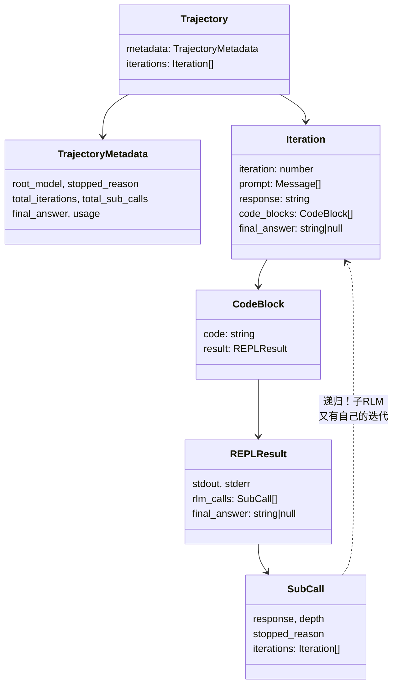
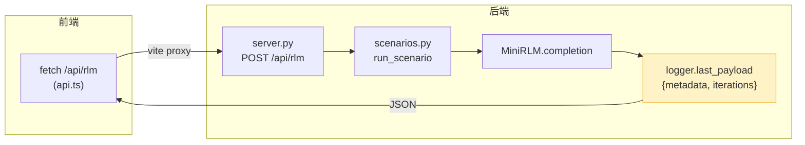

# 轨迹数据结构与接口

后端 `mini_rlm` 已经能把一次运行落成 JSONL 轨迹。现在转到前端——我们要写一个 React 可视化器，把那堆 JSONL 画成"迭代时间线 + 对话 + 代码执行 + 递归子调用"的交互界面。

但在画任何 UI 之前，得先解决一个最根本的问题：**前端怎么理解后端吐出来的数据？** 这就是本章的主题——**数据契约**。后端 Python 的 dataclass 和前端 TypeScript 的 interface 必须**严格对齐**，差一个字段、错一个类型，整个可视化就崩。

::: tip 技术栈说明
教学版前端用 **Vite + React + 手写 CSS**，刻意简化。官方可视化器用 Next.js + Tailwind + shadcn/ui。我们不用那套是因为：Vite 启动快、配置少，手写 CSS 让你看清每个样式从哪来，没有任何"魔法"挡在你和 RLM 概念之间。等你搞懂了机制，换成官方那套只是工程包装的事。
:::

## 数据契约：types.ts 逐字段对齐 types.py

前端所有类型定义在 `src/lib/types.ts`，开头第一句注释就立了规矩：

```typescript
// 这些类型刻意和后端 mini_rlm/types.py 的 to_dict() 输出一一对应。
// 后端吐 JSONL，前端读进来就是这套结构 —— 数据契约必须严格一致。
```

我们把后端的 dataclass 和前端的 interface **并排对照**，你会发现它们是镜像关系。

### REPLResult：一段代码的执行结果

::: code-group

```python [后端 types.py]
@dataclass
class REPLResult:
    stdout: str = ""
    stderr: str = ""
    locals: dict[str, Any] = field(default_factory=dict)
    execution_time: float = 0.0
    rlm_calls: list["RLMResult"] = field(default_factory=list)
    final_answer: str | None = None
```

```typescript [前端 types.ts]
export interface REPLResult {
  stdout: string
  stderr: string
  locals: Record<string, string>
  execution_time: number
  rlm_calls: SubCall[]
  final_answer: string | null
}
```

:::

逐字段对：`str → string`、`float → number`、`str | None → string | null`、`list[X] → X[]`、`dict[str, Any] → Record<string, string>`。注意 `locals` 后端是 `dict[str, Any]`，前端却是 `Record<string, string>`——因为后端 `to_dict()` 里用 `_safe_preview` 把每个值都 `repr()` 成了字符串（上一 Part 讲过），到了前端就全是 string 了。**契约对齐的是 `to_dict()` 的输出，不是内存里的原始类型**，这个细节很重要。

### Iteration 和 CodeBlock：一轮迭代

::: code-group

```python [后端]
@dataclass
class RLMIteration:
    iteration: int
    prompt: list[Message]
    response: str
    code_blocks: list[CodeBlock] = ...
    final_answer: str | None = None
    iteration_time: float = 0.0

@dataclass
class CodeBlock:
    code: str
    result: REPLResult
```

```typescript [前端]
export interface Iteration {
  iteration: number
  prompt: Message[]
  response: string
  code_blocks: CodeBlock[]
  final_answer: string | null
  iteration_time: number
}

export interface CodeBlock {
  code: string
  result: REPLResult
}
```

:::

`RLMIteration` 在前端叫 `Iteration`（名字简化了，字段一模一样）。一轮迭代包含：当时的完整对话快照 `prompt`、模型的响应 `response`、解析出的代码块 `code_blocks`、以及这轮有没有交卷 `final_answer`。

### SubCall：递归在数据上的体现

这是整个数据契约里**最关键**的一个类型。后端的 `RLMResult` 在前端叫 `SubCall`：

::: code-group

```python [后端 RLMResult]
@dataclass
class RLMResult:
    response: str
    root_model: str
    depth: int = 0
    iterations: list[RLMIteration] = ...
    usage: UsageSummary = ...
    execution_time: float = 0.0
    stopped_reason: str = "final_answer"
```

```typescript [前端 SubCall]
export interface SubCall {
  response: string
  root_model: string
  depth: number
  iterations: Iteration[]        // ← 子调用自己又是一棵迭代树！
  usage: Usage
  execution_time: number
  stopped_reason: string         // "leaf_llm" | "final_answer"
}
```

:::

注意看 `SubCall.iterations: Iteration[]` 这一行。而 `Iteration` 里有 `code_blocks: CodeBlock[]`，`CodeBlock` 里有 `result: REPLResult`，`REPLResult` 里又有 `rlm_calls: SubCall[]`……

**这条链绕回来了。** `SubCall → Iteration → CodeBlock → REPLResult → SubCall`。这不是 bug，这正是**递归在数据结构上的体现**：一个子调用如果是完整子 RLM，它自己又有迭代、有代码块、有更深一层的子调用，可以无限套下去。后端 `types.py` 注释里那句"`REPLResult.rlm_calls` 里装的又是 `RLMResult`"，到了前端就成了这条自引用的类型链。

::: tip leaf_llm vs final_answer：两种 SubCall
`stopped_reason` 区分两种子调用：
- **`"leaf_llm"`**：叶子。`llm_query` 或到达 `max_depth` 退化的 `rlm_query`，开个新模型答一句，**`iterations` 是空的**（没有自己的循环）。
- **`"final_answer"`**：完整子 RLM。`rlm_query` 在深度允许时起的子调用，**`iterations` 非空**，有自己完整的迭代轨迹。

下一章 `SubCallTree` 组件就靠这个字段决定"画成简单卡片"还是"展开成一棵子树"。
:::

整个数据契约的嵌套关系，一张图收尾：



那条虚线 `SubCall ..> Iteration` 就是递归的环。看懂这张图，你就看懂了整个前端数据模型。

## parseJsonl：把 JSONL 读成一个对象

后端落的是 JSONL（第一行 metadata、其余每行一个 iteration），前端得把它读回成一个 `Trajectory` 对象。这就是 `parseJsonl`：

```typescript
export function parseJsonl(text: string): Trajectory {
  const lines = text.trim().split('\n').filter((l) => l.trim())
  let metadata: TrajectoryMetadata | null = null
  const iterations: Iteration[] = []
  for (const line of lines) {
    const obj = JSON.parse(line)
    if (obj.type === 'metadata') metadata = obj   // 靠 type 字段认出 metadata 行
    else iterations.push(obj)
  }
  if (!metadata) throw new Error('轨迹缺少 metadata 行')
  return { metadata, iterations }
}
```

逐段看：

- `text.trim().split('\n')` 按行切，`filter` 掉空行——这就是"JSONL 流式友好"的好处，一行一行处理。
- 每行 `JSON.parse`，靠 **`obj.type === 'metadata'`** 区分两种行。还记得后端 `build_payload` 里 metadata 多塞了一个 `"type": "metadata"` 字段吗？就是为了让前端这里能一眼认出它。这是个朴素但有效的"行类型标记"。
- 没有 metadata 行就抛错——`App.tsx` 上传文件时会 catch 这个错并提示"解析失败"。

## api.ts：可选的"在线运行"

前端有两种数据来源：**内置样例**（默认，零网络）和**在线运行**（加分项，调后端实时跑）。`lib/api.ts` 负责后者：

```typescript
export interface RunRequest {
  scenario: string        // 预设场景 id，如 "find-secret"
  use_real?: boolean
}

export async function runRlm(req: RunRequest): Promise<Trajectory> {
  const resp = await fetch('/api/rlm', {
    method: 'POST',
    headers: { 'Content-Type': 'application/json' },
    body: JSON.stringify(req),
  })
  if (!resp.ok) {
    const detail = await resp.text().catch(() => '')
    throw new Error(`后端返回 ${resp.status}：${detail || '在线运行失败'}`)
  }
  return (await resp.json()) as Trajectory
}
```

一个标准的 `POST /api/rlm`，body 里带 `scenario`（要跑哪个预设场景）和可选的 `use_real`（用真模型还是 MockLM）。注意它返回的直接 `as Trajectory`——因为后端 `server.py` 的 `/api/rlm` 返回的就是 `logger.last_payload`，那正是 `{metadata, iterations}` 结构，**和 `parseJsonl` 的输出完全同构**。无论数据从样例、上传、还是在线来，进到 UI 时都是同一个 `Trajectory` 类型，下游组件不用关心来源。

后端那头（`server.py`）极简：

```python
@app.post("/api/rlm")
def run(req: RunRequest) -> dict[str, Any]:
    return run_scenario(req.scenario, req.use_real)   # 跑场景，返回 last_payload
```

`run_scenario`（在 `scenarios.py`）按 id 取出预设的 MockLM 剧本，跑一次 `MiniRLM.completion`，把内存里的 `logger.last_payload` 直接当 JSON 返回。Vite 开发时通过 `vite.config.ts` 里的 proxy 把 `/api` 转发到本地 `:8000` 的 FastAPI 服务。



::: warning 在线运行是"加分项"，不是"必需项"
这套 `/api` 链路即使**完全不可用**，前端也能完整工作——因为有内置样例兜底（下一节）。`App.tsx` 里 `onRunLive` 的 catch 写得很明白：`'在线运行失败（不影响样例查看）：' + ...`。这是个好的前端设计原则：**核心功能不依赖网络**，在线只是锦上添花。
:::

## 内置样例：零网络也能完整演示

可视化器要让人**打开就能看**，不能要求先装后端、起服务。所以前端把两条由后端 demo 生成的轨迹**直接打包进产物**：

```typescript
// samples/index.ts
import findSecret from './find-secret.json'
import recursiveSummary from './recursive-summary.json'

export const SAMPLES: Sample[] = [
  {
    id: 'find-secret',
    title: '在长日志里找 SECRET',
    desc: '完整 RLM 循环：peek → 正则定位 → 交卷。展示"代码 peek 而非整段喂入"。',
    trajectory: findSecret as unknown as Trajectory,
  },
  {
    id: 'recursive-summary',
    title: '递归摘要（含子调用）',
    desc: '父 RLM 把文档按章节拆开，对每章 rlm_query 起子 RLM，再汇总。展示符号递归。',
    trajectory: recursiveSummary as unknown as Trajectory,
  },
]
```

两个样例是精心挑的，对应 RLM 的两个核心看点：

- **find-secret**：展示决策①——在 240 行日志里用正则 peek 定位 SECRET，而不是把整段日志喂给模型。
- **recursive-summary**：展示决策③——父 RLM 把文档按 `###` 章节拆开，对每章 `rlm_query` 起一个子 RLM，再汇总。子调用的 `iterations` 非空，前端能展开成子树。

这两个 JSON 是后端 `scenarios.py` 跑出来、再存进 `frontend/src/samples/` 的。`vite.config.ts` 里 `assetsInlineLimit: 0` 保证 JSON 能被正常 import。`App.tsx` 初始就加载 `SAMPLES[0]`，所以**打开页面立刻能看到一条完整轨迹**，一个字节的网络都不用走。

```typescript
// App.tsx
const [trajectory, setTrajectory] = useState<Trajectory>(SAMPLES[0].trajectory)
```

三种数据来源，殊途同归到一个 `Trajectory`：

| 来源 | 入口 | 是否需要网络 |
|---|---|---|
| 内置样例 | `SAMPLES[i].trajectory` | 否（打包在产物里） |
| 用户上传 | `parseJsonl(文件内容)` | 否（本地读文件） |
| 在线运行 | `runRlm({scenario})` → `/api/rlm` | 是（调后端） |

下一章 [三面板可视化器实现](/60-build-frontend/visualizer) 我们就用这个 `Trajectory` 类型，把它画成时间线 + 对话 + 执行三个面板，重点看 `SubCallTree` 怎么"自己渲染自己"来呼应 RLM 的递归。

## 小练习

1. `types.ts` 里 `SubCall.iterations` 的类型是 `Iteration[]`，而 `Iteration → code_blocks → result → rlm_calls` 又回到 `SubCall[]`。TypeScript 允许这种"互相引用"的 interface 吗？这种自引用的类型对应到运行时数据，会不会无限递归下去？

::: details 参考思路
**TS 完全允许**互相引用的 interface（编译期只是类型形状的声明，不是求值）。运行时**不会**无限递归，因为真实数据的递归深度被后端 `max_depth` 卡死了：到了最深一层，`rlm_query` 退化成叶子 `llm_query`，叶子的 `iterations` 是**空数组**，递归就终止了。所以类型上是"可无限嵌套"，数据上是"有限深度"——叶子节点（`stopped_reason === "leaf_llm"`、`iterations` 为空）就是递归的天然边界。下一章 `SubCallTree` 正是用 `isLeaf` 判断来停止往下展开的。
:::

2. 如果后端给某个字段改了名（比如把 `final_answer` 改成 `answer`），但前端 `types.ts` 没跟着改，会在什么时候、以什么形式暴露问题？为什么说"数据契约"是前后端协作里最容易出隐蔽 bug 的地方？

::: details 参考思路
TypeScript 是编译期类型检查，但 `JSON.parse` 返回的是 `any`，前端 `parseJsonl` 里 `iterations.push(obj)` 并不会在运行时校验字段名。所以后端改名后，前端**编译不报错**、`parseJsonl` 也**不报错**，只有当某个组件去读 `iteration.final_answer` 时拿到 `undefined`，UI 上才表现为"交卷标记不显示了"——一个静默的、难定位的 bug。这就是数据契约的陷阱：**两端各自类型安全，但跨越 JSON 边界时类型信息丢失**。务实的防御手段：在 `parseJsonl` 里加运行时校验（如 zod schema），或者前后端共享一份 schema 定义。教学版靠"注释强约定 + 后端 `to_dict` 集中管理字段名"来降低风险。
:::
