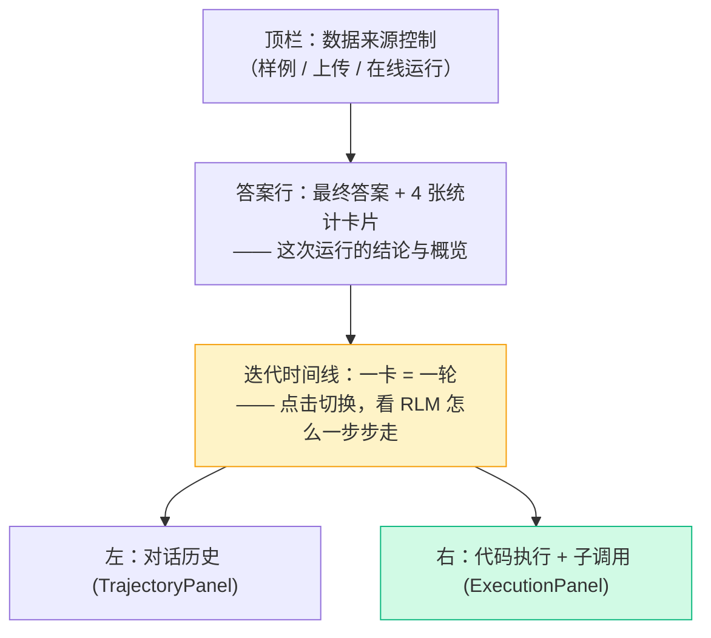
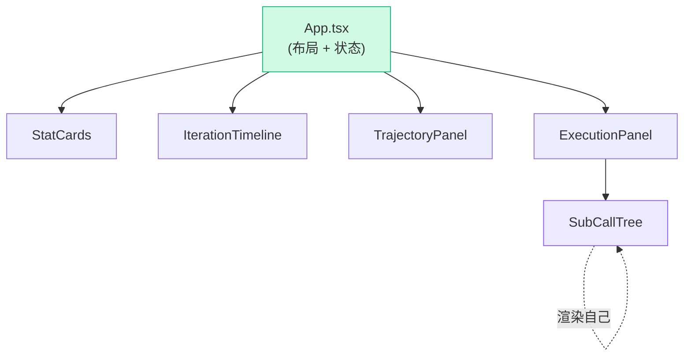

# 三面板可视化器实现

上一章把数据契约理清了：前端拿到的是一个 `Trajectory` 对象，里面是层层嵌套、最终会递归回自己的迭代树。这一章我们把它**画出来**——一个让你能"看见 RLM 怎么思考"的交互界面。

整个可视化器只有六个 React 组件，加起来不到 300 行。我们从最外层的 `App` 布局往里讲，最后重点啃 `SubCallTree`——那个**自己渲染自己**的组件，是整个前端的点睛之笔，因为它的递归结构恰好镜像了 RLM 的递归结构。

## App.tsx：整体布局

`App` 是顶层容器，决定页面分成几块。先看它的 JSX 骨架（去掉了控件细节）：

```tsx
return (
  <div className="app">
    <header className="topbar">...</header>      {/* 顶栏：选样例/上传/在线运行 */}

    <section className="answer-row">              {/* 第一行：最终答案 + 统计卡片 */}
      <div className="answer-card">
        <div className="answer-text">{trajectory.metadata.final_answer || '（无）'}</div>
        <span className={`pill ${trajectory.metadata.stopped_reason}`}>
          {trajectory.metadata.stopped_reason}
        </span>
      </div>
      <StatCards meta={trajectory.metadata} />
    </section>

    <IterationTimeline                            {/* 第二行：横向迭代时间线 */}
      iterations={trajectory.iterations}
      selected={selected}
      onSelect={setSelected}
    />

    <main className="split">                      {/* 第三行：左右分栏 */}
      <TrajectoryPanel iteration={current} ... />  {/* 左：对话历史 */}
      <ExecutionPanel iteration={current} />       {/* 右：代码执行 + 子调用 */}
    </main>
  </div>
)
```

布局自上而下三层，对应理解一次 RLM 运行的三个层次：



状态管理极简，全靠几个 `useState`：

```tsx
const [trajectory, setTrajectory] = useState<Trajectory>(SAMPLES[0].trajectory)
const [selected, setSelected] = useState(0)        // 当前选中第几轮
const current = trajectory.iterations[selected]    // 派生出当前轮
```

`selected` 是核心交互状态——你在时间线上点哪一轮，左右两个面板就显示哪一轮（`current`）。`trajectory` 可以被三种方式替换（加载样例 `loadSample`、上传 `onUpload`、在线运行 `onRunLive`），但下游组件只认 `Trajectory` 类型，不关心它从哪来。这种"单一数据源 + 派生视图"是 React 里最干净的模式。

## StatCards：四个汇总数字

最简单的组件，把 metadata 里的四个汇总字段画成卡片：

```tsx
export function StatCards({ meta }: { meta: TrajectoryMetadata }) {
  const cards = [
    { label: '迭代轮数', value: meta.total_iterations, icon: '◎', cls: 'c-green' },
    { label: '代码块', value: meta.total_code_blocks, icon: '⟨⟩', cls: 'c-blue' },
    { label: '子调用', value: meta.total_sub_calls, icon: '◇', cls: 'c-violet' },
    { label: '耗时(s)', value: meta.total_execution_time.toFixed(3), icon: '⏱', cls: 'c-amber' },
  ]
  return (
    <div className="stat-cards">
      {cards.map((c) => (
        <div key={c.label} className={`stat ${c.cls}`}>...</div>
      ))}
    </div>
  )
}
```

这四个数字（迭代/代码块/子调用/耗时）正是上一 Part 后端 `build_payload` 里那几个 `total_*` 字段。**前端不做任何计算**——所有汇总在后端就算好了，前端只负责显示。这是个好习惯：聚合逻辑放一处（后端），前端各处用同一份数字，不会出现"这里显示 3 个子调用、那里显示 4 个"的不一致。

## IterationTimeline：一卡 = 一轮

时间线是理解"RLM 是一个循环"最直观的视图。横向排开，**一张卡片就是主循环的一轮**：

````tsx
export function IterationTimeline({ iterations, selected, onSelect }) {
  return (
    <div className="timeline">
      <div className="timeline-track">
        {iterations.map((it, i) => {
          const subCalls = it.code_blocks.reduce((n, b) => n + b.result.rlm_calls.length, 0)
          const hasError = it.code_blocks.some((b) => b.result.stderr.trim())
          const isFinal = it.final_answer !== null
          return (
            <button
              className={`tl-card ${i === selected ? 'active' : ''} ${
                isFinal ? 'final' : hasError ? 'err' : ''}`}
              onClick={() => onSelect(i)}
            >
              <div className="tl-num">{i + 1}</div>
              <div className="tl-badges">
                {isFinal && <span className="b b-green">FINAL</span>}
                {hasError && <span className="b b-red">ERR</span>}
                <span className="b">⟨⟩ {it.code_blocks.length}</span>
                {subCalls > 0 && <span className="b b-violet">◇ {subCalls}</span>}
              </div>
              <div className="tl-preview">
                {it.response.split('```')[0].trim().slice(0, 48) || '(直接写代码)'}
              </div>
            </button>
          )
        })}
      </div>
    </div>
  )
}
````

每张卡片从迭代数据里**现算**三个状态徽章：

- `isFinal = it.final_answer !== null`——这轮交卷了吗？交了就标 `FINAL` 绿徽。
- `hasError`——这轮有代码报错吗？有就标 `ERR` 红徽。
- `subCalls`——这轮触发了几次子调用？用 `reduce` 把每个代码块的 `rlm_calls.length` 加起来，大于 0 就标 `◇` 紫徽。

还有个小细节 `it.response.split('```')[0]`——取模型响应在第一个代码块**之前**的文字（就是它的"思考"部分），截 48 字做预览。这样你扫一眼时间线，就能看出每轮模型在干嘛："先看看规模" → "用正则定位" → 交卷。点击任一卡片触发 `onSelect`，下面两个面板就切到那一轮。

## TrajectoryPanel：左面板，对话历史

左面板展示**这一轮模型看到的对话历史**——证明 RLM 不只是"跑代码"，而是模型在和环境多轮对话。它渲染 `iteration.prompt`（还记得吗，后端存了每轮的 prompt 快照）：

```tsx
const ROLE_META = {
  system: { icon: '⚙', label: 'System（系统提示）', cls: 'role-system' },
  user: { icon: '👤', label: 'User（环境/轮次）', cls: 'role-user' },
  assistant: { icon: '🤖', label: 'Assistant（模型）', cls: 'role-assistant' },
}

export function TrajectoryPanel({ iteration, index, total }) {
  return (
    <div className="panel">
      <div className="panel-body">
        {iteration.prompt.map((m, i) => {
          const isSystem = m.role === 'system'
          return (
            <div key={i} className={`msg ${ROLE_META[m.role].cls}`}>
              <pre className="msg-body">
                {isSystem ? '（系统提示词：教模型如何当 RLM，已折叠）' : truncate(m.content)}
              </pre>
            </div>
          )
        })}
        {/* 本轮模型的响应单独高亮 */}
        <div className="msg role-assistant current">
          <pre className="msg-body">{truncate(iteration.response)}</pre>
        </div>
        {iteration.final_answer !== null && (
          <div className="final-answer">✓ 本轮交卷：{iteration.final_answer}</div>
        )}
      </div>
    </div>
  )
}
```

两个设计考量：

- **system 提示折叠**：系统提示词很长（就是上一 Part 那段教模型当 RLM 的 prompt），每轮都原样显示会刷屏。这里检测 `m.role === 'system'` 就替换成一行说明。重点让你看到的是**本轮的 user 提示 + 模型响应**。
- **`truncate` 截断**：长消息截到 1800 字并标注省略数。前端截断纯粹是为了**显示**不刷屏，和后端为了"不撑爆窗口"的截断是两码事——别混淆。

## ExecutionPanel：右面板，代码执行闭环

右面板是 RLM 闭环"**模型写代码 → 环境执行 → 结果反馈**"的可视化。它遍历这一轮的每个代码块，画出代码、stdout、stderr、和触发的子调用：

```tsx
export function ExecutionPanel({ iteration }: { iteration: Iteration }) {
  return (
    <div className="panel">
      <div className="panel-body">
        {iteration.code_blocks.map((block, i) => {
          const r = block.result
          const hasError = r.stderr.trim().length > 0
          return (
            <div className={`exec-block ${hasError ? 'has-error' : ''}`}>
              <pre className="code">{block.code}</pre>           {/* 模型写的代码 */}

              {r.stdout.trim() && (
                <div className="out"><pre className="out-body">{r.stdout}</pre></div>
              )}
              {hasError && (
                <div className="out err"><pre className="out-body">{r.stderr}</pre></div>
              )}

              {r.rlm_calls.length > 0 && (                       {/* 触发的子调用 */}
                <div className="subcalls">
                  <div className="out-label">
                    本块触发了 {r.rlm_calls.length} 次子调用（llm_query / rlm_query）
                  </div>
                  {r.rlm_calls.map((c, k) => (
                    <SubCallTree key={k} call={c} depth={0} />    {/* ← 关键！ */}
                  ))}
                </div>
              )}

              {r.final_answer !== null && (
                <div className="final-answer">✓ 此块设置了 answer，循环将结束</div>
              )}
            </div>
          )
        })}
      </div>
    </div>
  )
}
```

一个代码块的完整生命周期都在这里：**代码本身 → stdout → （有的话）stderr → （有的话）子调用 → （有的话）交卷标记**。这正是后端 `REPLResult` 的所有字段，一一映射成 UI。

最关键的一行是 `<SubCallTree call={c} depth={0} />`——当一个代码块里调用了 `llm_query`/`rlm_query`，它的 `rlm_calls` 里就有子调用，这里把每个子调用交给 `SubCallTree` 去渲染。`depth={0}` 表示这是第一层子调用。下面就是全文的高潮。

## SubCallTree：自己渲染自己（亮点）

`SubCallTree` 是整个前端最精彩的组件——**它在自己内部调用自己**。这个递归的组件结构，恰好镜像了 RLM 的递归调用结构。全文如下：

```tsx
export function SubCallTree({ call, depth }: { call: SubCall; depth: number }) {
  const isLeaf = call.stopped_reason === 'leaf_llm'
  return (
    <div className="subcall" style={{ marginLeft: depth > 0 ? 12 : 0 }}>
      <div className="subcall-head">
        <span className={`b ${isLeaf ? 'b-amber' : 'b-violet'}`}>
          {isLeaf ? '叶子 LLM' : `子 RLM · depth ${call.depth}`}
        </span>
        <span className="muted">
          {call.usage.input_tokens}↓ {call.usage.output_tokens}↑ tok
        </span>
      </div>
      <div className="subcall-answer">→ {call.response}</div>

      {/* 完整子 RLM：展开它自己的迭代和更深一层的子调用（递归！） */}
      {!isLeaf &&
        call.iterations.map((it, i) => (
          <div key={i} className="subcall-iter">
            <div className="muted small">子轮 {i + 1}</div>
            {it.code_blocks.map((b, j) => (
              <div key={j}>
                <pre className="code small">{b.code}</pre>
                {b.result.rlm_calls.map((c, k) => (
                  <SubCallTree key={k} call={c} depth={depth + 1} />   {/* ← 调用自己！ */}
                ))}
              </div>
            ))}
          </div>
        ))}
    </div>
  )
}
```

逐段拆解这个递归：

**第一步，判断叶子还是完整子 RLM**。靠上一章讲的 `stopped_reason`：

```tsx
const isLeaf = call.stopped_reason === 'leaf_llm'
```

- **叶子**（`leaf_llm`）：`llm_query` 或到达 `max_depth` 退化的调用。它**没有自己的迭代**，所以只画一个简单卡片：黄色徽章"叶子 LLM" + 它的回答。**递归到此为止**。
- **完整子 RLM**（`final_answer`）：`rlm_query` 在深度允许时起的子调用。它有自己的 `iterations`，要继续往下展开。

**第二步，对完整子 RLM 展开它的迭代**。`!isLeaf && call.iterations.map(...)`——遍历子 RLM 自己的每一轮、每个代码块。

**第三步，也是递归的关键**——子 RLM 的代码块里可能**又有子调用**：

```tsx
{b.result.rlm_calls.map((c, k) => (
  <SubCallTree key={k} call={c} depth={depth + 1} />
))}
```

`SubCallTree` 在这里**调用了 `SubCallTree` 自己**，`depth + 1` 往里缩进。如果这一层的子调用又是完整子 RLM，它又会展开、又可能有更深的子调用……一直到遇见叶子（`isLeaf` 为真）才停。

把组件递归和数据递归并排看，你会发现它们是一一对应的：

```mermaid
flowchart TB
    subgraph 数据结构的递归
    direction TB
    D1["SubCall (子RLM)"] --> D2["iterations"]
    D2 --> D3["code_blocks"]
    D3 --> D4["rlm_calls: SubCall[]"]
    D4 -.->|又是 SubCall| D1
    end
    subgraph 组件的递归
    direction TB
    C1["SubCallTree(call, depth)"] --> C2["展开 call.iterations"]
    C2 --> C3["遍历 code_blocks"]
    C3 --> C4["map rlm_calls"]
    C4 -.->|SubCallTree(c, depth+1)| C1
    end
    style D4 fill:#ede9fe,stroke:#8b5cf6
    style C4 fill:#ede9fe,stroke:#8b5cf6
```

::: tip 为什么这个递归一定会终止
组件递归不会无限下去，因为**数据是有限深的**——后端 `max_depth` 保证了：到了最深一层，`rlm_query` 退化成叶子 `llm_query`，叶子的 `stopped_reason === "leaf_llm"`。`SubCallTree` 一旦判到 `isLeaf` 为真，就只画卡片、不再 `map` 子调用，递归终止。所以**叶子节点 = 递归出口**。这和写一个递归函数必须有 base case 是同一个道理，只不过这里的"函数"是个 React 组件，"base case"是 `isLeaf`。
:::

这就是为什么我们说这个组件是点睛之笔：RLM 在概念上是"模型能递归调用自己"，在数据上是"`SubCall` 嵌套 `SubCall`"，在 UI 上就是"`SubCallTree` 渲染 `SubCallTree`"。**三层递归，结构完全同构**。看懂了 `SubCallTree`，你就从代码层面真正吃透了 RLM 的递归。

## 全部组件，一张依赖图



六个组件，职责清晰：`App` 管布局和状态，`StatCards`/`IterationTimeline` 看全局，`TrajectoryPanel`/`ExecutionPanel` 看单轮细节，`SubCallTree` 看递归深处。那条 `ST -.-> ST` 的自环，就是整个可视化器的灵魂。

## 跑起来看看

```bash
cd final-project/frontend
npm install
npm run dev          # Vite 启动，打开提示的 localhost 地址
```

打开就能看到 `find-secret` 样例的完整轨迹——不需要后端、不需要 API key。想看递归，在顶栏切到"递归摘要（含子调用）"，点开有 `◇` 紫徽的那一轮，右面板里 `SubCallTree` 就展开成一棵子 RLM 的树。想试在线运行，另起后端：

```bash
cd final-project/backend
uv pip install -e ".[api]"
uvicorn server:app --reload --port 8000     # 另一个终端
```

然后前端点"▶ 在线运行"，Vite 的 proxy 会把 `/api` 转给后端实时跑一遍。

## 全教程收尾

到这里，《RLM 从零到一》的实现部分就走完了：

- **Part 5** 你亲手写了 `mini_rlm`——核心闭环、递归、护栏、轨迹日志、零成本测试；
- **Part 6** 你把轨迹画成了交互可视化器，还让一个 React 组件递归地呼应了 RLM 的递归。

从[一个洞察](/10-concepts/rlm-insight)（prompt 即环境 + 递归），到[三个设计决策](/10-concepts/three-design-choices)，到一行行可运行、可测试、可视化的代码——你现在不只是"知道 RLM 是什么"，而是"能从零把它造出来"。这正是这本教程的目标。

## 小练习

1. `SubCallTree` 用 `depth` 这个 prop 来做缩进（`marginLeft: depth > 0 ? 12 : 0`），但每个 `SubCall` 数据里其实也带了一个 `call.depth` 字段（后端给的递归深度）。这两个"depth"是一回事吗？如果用 `call.depth` 替换组件的 `depth` prop 来算缩进，会有什么区别？

::: details 参考思路
**不完全是一回事，但在当前数据下通常一致**。组件的 `depth` prop 是"`SubCallTree` 从 `ExecutionPanel` 算起递归了几层"（每 `SubCallTree(c, depth+1)` 加一）；`call.depth` 是后端记录的"这个子调用在 RLM 递归里的深度"。对从顶层 RLM（depth=0）发起的调用，两者会对齐。但它们**语义不同**：组件 `depth` 是"UI 嵌套层数"，`call.depth` 是"RLM 逻辑深度"。如果将来数据结构变化（比如从某个非零深度的子树开始渲染），用 `call.depth` 算缩进可能让顶层就缩进一大块。**算 UI 缩进就该用 UI 自己的 `depth` prop**——让显示逻辑和数据语义解耦，是更稳妥的选择。
:::

2. 当前 `ExecutionPanel` 一次只显示**选中那一轮**的代码执行。假设你想加一个"全局子调用树"视图——把整次运行里所有的子调用按递归层级画成一棵大树。你能复用现有的哪个组件？需要从 `Trajectory` 里怎么把所有顶层子调用收集出来？

::: details 参考思路
**直接复用 `SubCallTree`**——它本来就是递归的，喂给它一个 `SubCall` 就能画出整棵子树。需要做的只是把所有"顶层"子调用收集出来：遍历 `trajectory.iterations → code_blocks → result.rlm_calls`，把每个 `rlm_calls` 数组拼起来（和后端 `total_sub_calls` 用的嵌套推导式同一个思路）：
```tsx
const allTopCalls = trajectory.iterations.flatMap(
  it => it.code_blocks.flatMap(b => b.result.rlm_calls))
```
然后 `{allTopCalls.map((c, i) => <SubCallTree key={i} call={c} depth={0} />)}`。更深层的子调用 `SubCallTree` 会自己递归展开，完全不用额外代码。这再次说明：**好的递归组件让"局部视图"和"全局视图"复用同一套渲染逻辑**——这正是 `SubCallTree` 这种自相似设计的回报。
:::
