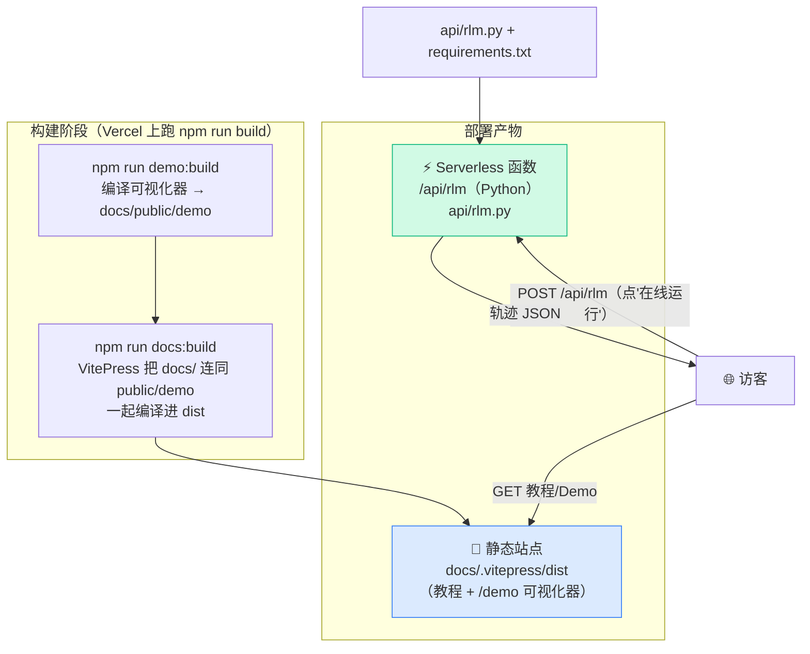

# 部署到 Vercel

本地全链路跑通了，最后一步：把它**部署到公网**，让任何人打开一个链接，就能读教程、玩可视化器、点"在线运行"。

我们选 Vercel，因为它能用**一次部署**同时托管三样东西：静态教程站点、静态可视化器、以及一个 Python Serverless 函数。这一章讲清楚这三者怎么拼在一起、`vercel.json` 该怎么写、以及部署时最容易踩的几个坑。

## 部署模型：一个仓库、三类产物

先看清楚部署后的形态。我们不开三个独立服务，而是**把三类产物塞进同一个 Vercel 项目**：



两类东西，两种托管方式：

| 产物 | 怎么来的 | Vercel 怎么托管 | 访问路径 |
| --- | --- | --- | --- |
| 教程站点 | `vitepress build docs` | 静态文件（CDN） | `/`、`/10-concepts/...` |
| 可视化器 | `demo:build` 拷进 `docs/public/demo` | 跟着站点一起当静态文件 | `/demo/index.html` |
| `/api/rlm` 函数 | `api/rlm.py` | Python Serverless Function | `/api/rlm` |

关键洞察：**前端不是单独部署的**，它在构建期被 `demo:build` 拷进 `docs/public/demo`，于是变成教程站点的一部分静态资源。访问者不知道、也不需要知道它原本是个独立的 Vite 项目。

## 构建命令：根 `build` 脚本一条龙

Vercel 部署时跑的构建命令，就是根 `package.json` 里的 `build`：

```json
"scripts": {
  "demo:build": "cd final-project/frontend && npm install && npm run build && rm -rf ../../docs/public/demo && cp -r dist ../../docs/public/demo",
  "build": "npm run demo:build && npm run docs:build"
}
```

`build` 干两件事，**顺序很重要**：

1. `demo:build` 先把可视化器编译好、拷进 `docs/public/demo`；
2. `docs:build` 再让 VitePress 编译 `docs/`，此时 `public/demo` 已经在位，会被一并打进 `dist`。

如果顺序反了，VitePress 构建时 `public/demo` 还不存在，线上的 iframe 就会 404。

## `vercel.json` 怎么写

仓库里目前还没有 `vercel.json`——这一节给出该怎么写。它要告诉 Vercel 四件事：用什么命令构建、产物在哪、Python 函数需要打包哪些额外文件、以及环境变量。

```json
{
  "buildCommand": "npm run build",
  "outputDirectory": "docs/.vitepress/dist",
  "functions": {
    "api/rlm.py": {
      "includeFiles": "final-project/backend/**"
    }
  }
}
```

逐项解释——这四行每一行都对应一个真实的坑：

### `buildCommand` 与 `outputDirectory`

- `buildCommand: "npm run build"`：跑上面那条一条龙脚本。
- `outputDirectory: "docs/.vitepress/dist"`：VitePress 的产物目录。Vercel 把这个目录当静态站点根。教程页、`/demo/` 可视化器都在这里面。

### `functions.includeFiles`：把 mini_rlm 打进函数

这是**最容易翻车的一项**。`api/rlm.py` 自己只有几十行，它真正干活靠的是 `final-project/backend/` 下的 `scenarios.py` 和整个 `mini_rlm` 包。看 `api/rlm.py` 怎么找它们：

```python
# api/rlm.py：运行时把 backend 目录加进 import 路径
_BACKEND = os.path.abspath(
    os.path.join(os.path.dirname(__file__), "..", "final-project", "backend")
)
sys.path.insert(0, _BACKEND)
from scenarios import run_scenario   # noqa: E402
```

文件头注释也点明了："Vercel 部署时整个仓库都在，靠 vercel.json 的 **includeFiles** 保证这些文件被打进函数。" Serverless 函数默认**只打包函数文件自己附近**的东西，`final-project/backend/` 在仓库另一头，不会自动进去。`includeFiles: "final-project/backend/**"` 就是显式把整个后端目录塞进函数包，这样运行时 `sys.path.insert` + `from scenarios import ...` 才找得到。

::: warning 最常见的部署错误：函数报 `No module named 'mini_rlm'` / `scenarios`
线上 `/api/rlm` 返回 500，日志里是 `ModuleNotFoundError: No module named 'mini_rlm'`（或 `scenarios`）。原因几乎一定是 **`includeFiles` 没配或路径写错**，导致后端代码没被打进函数包。检查 `vercel.json` 里 `functions["api/rlm.py"].includeFiles` 是否覆盖了 `final-project/backend/`。
:::

### `requirements.txt` 的作用

Vercel 的 Python 运行时会自动找仓库根的 `requirements.txt` 给函数装依赖。我们的：

```text
openai>=1.40.0
```

注释说得明白："mini_rlm 核心是纯标准库，mock 模式零依赖。下面这些仅在请求 `use_real=true` 时才会真正用到。" 也就是说，**默认的 mock 在线 Demo 根本不需要装任何东西**——`api/rlm.py` 只用了标准库 `http.server`、`json`、`os`、`sys`。`openai` 只是为了让有 key 的人能开 `use_real`。

## 环境变量：可选的 `OPENAI_API_KEY`

在线 Demo 默认 mock，所以**不配任何环境变量也能完整部署、完整玩**。只有当你想让线上支持 `use_real:true` 时，才去 Vercel 项目设置 → Environment Variables 配：

| 变量 | 必填 | 作用 |
| --- | --- | --- |
| `OPENAI_API_KEY` | 仅 `use_real` 时 | 真实模型的 key |
| `OPENAI_BASE_URL` | 选填 | 切兼容服务（vLLM / 第三方网关） |
| `RLM_MODEL` | 选填 | 模型名，默认 `gpt-4o-mini` |

这几个就是 `scenarios.py` 的 `use_real` 分支用 `os.getenv` 读的那些。

::: warning 别把 key 写进代码或 vercel.json
key 永远只放 Vercel 的环境变量（或本地 `.env`，且 `.env` 要在 `.gitignore` 里）。`vercel.json` 是会提交进 Git 的，把密钥写进去等于公开泄露。
:::

## Serverless 时限与"默认 mock"策略

再强调一次这条贯穿全项目的设计决策，因为它直接关系到线上能不能用：

- Vercel Hobby 计划的函数执行时限约 **10 秒**（`api/rlm.py` 注释里写的）。
- 真实 RLM 要多轮调用大模型，单轮就可能好几秒，多轮 + 递归很容易**超时**。
- 所以线上 `/api/rlm` **默认 `use_real=false`**：用 MockLM 按剧本走完一遍真实 RLM 循环，**毫秒级返回**。

这就是为什么"给全世界看的在线 Demo"必须默认 mock：它要在时限内稳定返回、零配置（不依赖 key）、零成本。想体验真实模型的人，要么在本地开 `use_real`，要么自己部署一份并配好 key、并接受可能超时。

::: warning 线上点"在线运行"转圈后报错 / 504
如果你给线上开了 `use_real:true`，又撞上慢模型，函数会在约 10s 后被 Vercel 杀掉，前端收到超时/错误。解决：要么改回默认 mock，要么升级到时限更长的计划，要么换更快的小模型。这也是 [调试清单](/80-extend/extend-and-debug) 里"超时"那一条。
:::

## 部署步骤

两条路，二选一。

### 路线 A：连 GitHub（推荐）

1. 把仓库推到 GitHub。
2. Vercel → New Project → Import 这个仓库。
3. Vercel 会读 `vercel.json`，自动用 `npm run build` 构建、`docs/.vitepress/dist` 作为输出。
4. （可选）在项目设置里配 `OPENAI_API_KEY` 等环境变量。
5. Deploy。之后每次 push 自动重新部署。

### 路线 B：Vercel CLI

```bash
npm i -g vercel
vercel            # 首次：登录 + 关联项目，按提示走
vercel --prod     # 部署到生产
```

CLI 同样读 `vercel.json`。本地装了 CLI 就能不经 GitHub 直接发。

## 部署后自检

部署完，打开线上域名，逐项确认：

```text
✅ 打开 /                       → 教程首页正常
✅ 打开 /70-run-deploy/online-demo → iframe 里可视化器出现（不是空白）
✅ 在 iframe 里选样例、点时间线   → 能看每一轮
✅ 点"在线运行"                  → 几秒内画出新轨迹（走 mock）
```

```bash
# 也可以直接打函数
curl -s -X POST https://<你的域名>/api/rlm \
  -H 'Content-Type: application/json' \
  -d '{"scenario":"find-secret"}' | head -c 200
```

返回 `{"metadata":...,"iterations":[...]}` 就说明函数 + includeFiles 都对了。

## 常见错误速查

| 现象 | 根因 | 解决 |
| --- | --- | --- |
| `/api/rlm` 500，日志 `No module named 'mini_rlm'/'scenarios'` | 后端没被打进函数 | `vercel.json` 配 `functions["api/rlm.py"].includeFiles: "final-project/backend/**"` |
| 在线运行超时 / 504 | 开了 `use_real` 撞上时限 | 改回默认 mock，或换快模型/升级计划 |
| iframe 空白 | `docs/public/demo` 没生成 | 构建命令含 `demo:build`（根 `build` 已串好）；本地先 `npm run demo:build` |
| 可视化器里资源 404、样式错乱 | 前端 `base` 不是相对路径 | 保持 `vite.config.ts` 的 `base: './'` |
| 构建时 iframe 资源不在 dist | `demo:build` 在 `docs:build` 之后跑了 | 保持顺序：先 `demo:build` 再 `docs:build` |

部署成功后，整套教程就真正"从零到一、并且在线可玩"了。最后一个 Part，我们聊聊在此基础上还能往哪些方向扩展，以及把全教程的坑汇总成一份 [调试清单](/80-extend/extend-and-debug)。

## 小练习

1. 你部署后发现教程页都正常，唯独 `/api/rlm` 返回 500，日志写 `ModuleNotFoundError: No module named 'scenarios'`。在不看上文答案的情况下，你的第一反应该检查哪个配置？为什么静态页正常但函数挂了？

::: details 参考思路
第一反应检查 `vercel.json` 的 `functions["api/rlm.py"].includeFiles`——它负责把 `final-project/backend/`（含 `scenarios.py` 和 `mini_rlm`）打进函数包。静态页正常是因为它们走的是 VitePress 构建产物，和 Python 函数的打包完全是两条独立链路；函数挂不影响静态资源，反之亦然。
:::

2. 老板说："在线 Demo 我希望线上就用真实模型，不要 mock。" 你会列出哪几条风险/前提，劝他三思或做相应准备？

::: details 参考思路
风险：① Serverless 时限约 10s，真实多轮 + 递归极易超时（504）；② 需要 `OPENAI_API_KEY`，每次点击都产生真实 API 成本，公开 Demo 可能被刷量烧钱；③ 真实模型不确定，可能写出失败/不优雅的轨迹，展示效果不稳定；④ exec 不是沙箱，让真模型在函数里执行代码有安全面。准备：升级到时限更长的计划、用更快的小模型、加调用频率限制/鉴权、考虑真正的隔离沙箱。综合看，"默认 mock + 本地开 use_real"通常仍是更稳的方案。
:::
