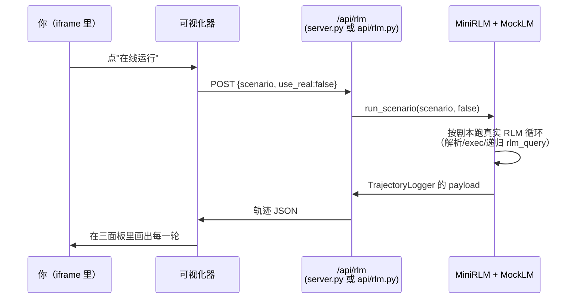

# 在线 Demo

读了这么多关于"prompt 即环境 + 递归"的文字，是时候**亲眼看 RLM 一轮一轮地动起来**了。这一页直接把可视化器嵌在下面——你不用装任何东西，往下滚就能玩。

## 先玩，再读

下面这个面板就是你在 [Part 6](/60-build-frontend/data-and-api) 亲手实现的那个三面板可视化器：

<iframe src="/demo/index.html" style="width:100%;height:760px;border:1px solid var(--vp-c-divider);border-radius:12px;" title="mini-RLM 可视化器"></iframe>

**怎么玩**（按顺序点一遍，每一步都对应教程里讲过的一个概念）：

1. **选样例轨迹**：顶部切换 `find-secret`（从 240 行日志里用正则揪出 SECRET_TOKEN）和 `recursive-summary`（把文档按章节拆开，每章交给一个子 RLM 总结——这是递归）。
2. **点时间线**：左侧/顶部的时间线每一格是一轮（iteration）。点不同的轮，看模型**这一轮在想什么、写了什么代码**。这对应 [核心循环](/30-source/core-loop) 里 `for i in range(max_iterations)` 的每一次迭代。
3. **看执行面板**：中间面板显示这一轮模型写的 ` ```repl ` 代码和它的 stdout 输出。在 `recursive-summary` 里，你能看到 `rlm_query(...)` 触发的**递归子调用**被展开——子 RLM 有它自己的轮次，深度（depth）加一。
4. **点"在线运行"**：右上角的按钮会真的 `POST /api/rlm`，让后端**现场跑一遍** mini-RLM 再把新轨迹画出来，而不是放内置的样例。

::: tip 看不懂面板里的字段？
每一格轨迹的数据结构（`metadata` + `iterations`、每个 iteration 里的 `code` / `stdout` / `rlm_calls`）在 [轨迹数据结构与接口](/60-build-frontend/data-and-api) 里逐字段讲过。这里看到的，就是 `TrajectoryLogger.build_payload` 落下来的那个 JSON。
:::

## "在线运行"默认跑的是 Mock，为什么

点"在线运行"时，请求体默认是 `{"scenario": "...", "use_real": false}`。后端（线上是 `api/rlm.py`，本地是 `server.py`）收到后，走的是 **MockLM 脚本化场景**，而不是真去调大模型。这是刻意的设计，原因写在 `api/rlm.py` 的文件头注释里：

> 为什么默认用 MockLM？因为 Serverless 函数有执行时限（Hobby 计划约 10s），而真实 RLM 多轮调用大模型可能很慢、还要 API key。所以在线 Demo 默认跑"脚本化场景"——用 MockLM 按预设剧本走完一遍真实的 RLM 循环，毫秒级返回，零成本零配置。

关键点是：**mock 不等于假**。`scenarios.py` 里的剧本，是一串预先写好的"模型应该输出什么"，但**驱动它的 RLM 循环是百分百真实的**——一样的解析、一样的 `exec`、一样的递归 `rlm_query`、一样的 `TrajectoryLogger`。你看到的轨迹结构和真实模型跑出来的完全同构，只是模型的"台词"是固定的。

看一眼 `recursive-summary` 场景的剧本，体会"剧本驱动真实循环"：

````python
# scenarios.py（节选）：每个场景 = context + task + 一串 mock 响应
"recursive-summary": {
    "context": summary_ctx,            # 三章的小文档
    "task": "生成全文摘要（递归）",
    "max_depth": 2,                    # 允许递归
    "responses": [
        # 第 1 轮：父 RLM 决定按章节拆开，对每章 rlm_query
        "按章节拆开，每章交给子 RLM。\n```repl\n"
        "chs=[c.strip() for c in context.split('###') if c.strip()]\n"
        "...\nfor c in chs:\n    s=rlm_query(f'一句话总结：{c}')\n...```",
        # 接下来三条：是三个子 RLM（depth=1）各自的交卷
        "...背景：长上下文会退化...",
        "...思想：prompt 当环境用代码读...",
        "...递归：子调用也是完整 RLM...",
        # 最后一轮：父 RLM 汇总交卷
        "汇总并交卷。\n```repl\nanswer['content']=' / '.join(sums)\n...```",
    ],
},
````

::: warning 剧本顺序就是真实调用顺序
`scenarios.py` 文件头有句要命的提醒："**responses 的顺序必须严格等于真实调用顺序**（递归场景里父子共享一个 MockLM，要把子调用穿插进去）。" 上面 5 条响应里，中间 3 条是子 RLM 的回复——因为父子共用同一个 `MockLM`，它按调用先后从 `responses` 列表里依次取。如果你新增场景时把子调用的台词放错位置，整个递归就会演错。这也是 [调试清单](/80-extend/extend-and-debug) 里专门列出的一类坑。
:::

## 想看真实模型？开 `use_real`

如果你想让在线运行真的去调大模型（看真实模型怎么自己写 ` ```repl ` 代码、怎么决定何时交卷），把请求体改成 `use_real: true`：

```bash
curl -s -X POST http://localhost:8000/api/rlm \
  -H 'Content-Type: application/json' \
  -d '{"scenario":"find-secret","use_real":true}'
```

此时 `scenarios.py` 的 `run_scenario` 走另一条分支：换成 `OpenAICompatClient`，`backend="openai"`，并从环境变量读模型名。前提是你配好了 key（本地 export，线上在 Vercel 环境变量里设 `OPENAI_API_KEY`）。

```python
# scenarios.py：use_real 分支
model = os.getenv("RLM_MODEL", "gpt-4o-mini")
client = OpenAICompatClient(model_name=model)
config = RLMConfig(model_name=model, backend="openai",
                   max_iterations=8, max_depth=spec["max_depth"])
```

线上**默认不开** `use_real`，正是因为前面说的 Serverless 时限——真实多轮调用很可能在 10 秒内跑不完而超时。所以"在线 Demo 给所有人看"用 mock，"我想验证真实行为"在本地开 `use_real`，这是最稳的分工。

## 本地看这个 iframe：先 `demo:build`

如果你是在本地 `npm run docs:dev` 读这一页，上面的 iframe 可能是**空白**。原因在第一章 [本地全链路](/70-run-deploy/run-local#第-5-步-起教程站点-docs-dev) 提过：iframe 的 `src="/demo/index.html"` 指向的是**静态产物**，住在 `docs/public/demo/`，不是 VitePress dev server 实时编译出来的。

VitePress 的约定是：`docs/public/` 下的文件会原样映射到站点根路径。所以 `docs/public/demo/index.html` → 线上 `/demo/index.html`。这个 `demo/` 目录是构建时生成的，仓库里默认没有。生成它：

```bash
# 在仓库根目录
npm run demo:build
```

这条命令做的事（根 `package.json` 里写得很直白）：

```text
demo:build = 进 final-project/frontend
           → npm install && npm run build   # 编译可视化器，产物在 dist/
           → rm -rf docs/public/demo         # 清掉旧的
           → cp -r dist docs/public/demo     # 拷成 docs 的静态资源
```

跑完后刷新这一页，iframe 里的可视化器就出来了。**部署到线上时不用手动跑**——根 `build` 脚本（`npm run demo:build && npm run docs:build`）已经把它串进去了，详见 [部署到 Vercel](/70-run-deploy/deploy-vercel)。

::: warning iframe 空白 / 资源 404 的两种成因
1. **空白**：`docs/public/demo/` 不存在 → 跑 `npm run demo:build`。
2. **里面元素错位、控制台报资源 404**：八成是前端构建的 `base` 配错了。`vite.config.ts` 里特意设了 `base: './'`（相对路径），就是为了让产物被嵌进 `/demo/` 子路径时，CSS/JS 仍能正确加载。如果你改成了绝对路径 `/`，嵌进子目录就会 404。
:::

## 两个样例分别在演示什么

可视化器里那两个样例不是随便选的——它们刚好对应教程最核心的两件事：**符号化读长文本** 和 **递归**。看懂它们，等于把前面所有概念在一条具体轨迹上验证一遍。

| 样例 | context | 它在演示 | `max_depth` | 看点 |
| --- | --- | --- | --- | --- |
| `find-secret` | 240 行日志，token 藏在第 121 行 | "prompt 即环境"：模型不读全文，写正则去 context 里捞 | 1 | 第 1 轮 peek 规模，第 2 轮 `re.search` 命中，第 3 轮交卷 |
| `recursive-summary` | 三章小文档 | "递归"：按章节拆开，每章 `rlm_query` 交给子 RLM | 2 | 父 RLM 的循环里嵌着三个子 RLM，深度加一 |

`find-secret` 的剧本（`scenarios.py`）很能说明"模型隔着玻璃操作 context"——它从头到尾**没把 240 行日志读进对话**，只 `print` 了规模和开头 60 字符，然后用一句正则把 token 揪出来：

````python
# find-secret 第 2 轮：不读全文，直接正则定位
"import re\n"
"m = re.search(r'SECRET_TOKEN=(\\S+)', context)\n"
"token = m.group(1)\nprint('命中', token)"
````

这正是 [RLM 核心洞察](/10-concepts/rlm-insight) 那句"隔着玻璃操作"的最小可视化案例。而 `recursive-summary` 则是 [Demo 5 符号递归](/40-demos/demo5-recursion) 的在线版——你能在执行面板里**点开**每个 `rlm_query` 触发的子 RLM，看它有自己独立的轮次。

## 后端挂了也不白屏：优雅降级

`src/lib/api.ts` 的 `runRlm` 在请求失败时会**抛出错误**而不是吞掉：

```ts
if (!resp.ok) {
  const detail = await resp.text().catch(() => '')
  throw new Error(`后端返回 ${resp.status}：${detail || '在线运行失败'}`)
}
```

前端接住这个错误后，**停留在内置样例上**，只提示"在线运行失败"，页面不崩。这就是为什么本页上方的 iframe，即便部署环境里 `/api/rlm` 临时不可用，你**仍然能选样例、点时间线、看递归**——因为那两条轨迹（`src/samples/*.json`）是打包进前端的静态数据，根本不依赖后端。"在线运行"是锦上添花，不是地基。这条设计在 [本地全链路](/70-run-deploy/run-local) 也强调过。

## 这一页背后的数据流

把"点一下在线运行"发生的事串成一张图，正好复习整条链路：



下一章，我们把这整套（教程站点 + 这个 iframe 里的静态前端 + `/api/rlm` 函数）**一次性部署到 Vercel**，让任何人打开链接都能玩到上面这个面板。

## 小练习

1. 在线运行默认 `use_real:false`，你看到的轨迹和"真模型跑出来的"在**结构**上有什么区别？在**内容**上呢？

::: details 参考思路
结构上**没有任何区别**：同样是 `metadata + iterations`，同样有递归子调用、stdout、交卷。因为驱动它的是真实 RLM 循环，只是模型的输出来自固定剧本。内容上有区别：mock 的代码和台词是人写死的、确定性的；真模型每次可能写不同的代码、走不同的轮数、甚至失败。所以 mock 适合"稳定展示一条理想轨迹"，真实适合"观察模型的真实决策"。
:::

2. 假设你要给在线 Demo 新增第三个场景 `count-words`（数 context 里某个词出现几次，单层、不递归）。你需要改哪个文件、补哪几样东西？要不要碰前端？

::: details 参考思路
只改 `final-project/backend/scenarios.py`：在 `get_scenarios()` 里加一个 `"count-words"` 条目，给它 `context`、`task`、`max_depth=1`，以及一串 `responses`（按真实调用顺序写好剧本：先 peek、再写计数代码、最后交卷）。前端不用改逻辑——它按返回的轨迹通用渲染；顶多在样例选择器里加个入口。记得剧本响应顺序要严格匹配 RLM 实际调用 MockLM 的顺序。
:::
