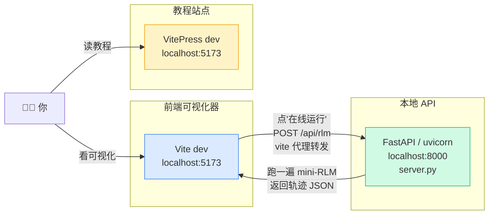

# 本地全链路跑起来

前面六个 Part，你已经把后端（mini_rlm 包）和前端（可视化器）都实现完了。这一章不引入任何新代码，只做一件事：**把所有东西在你自己的机器上从零跑通一遍**——后端测试、五个 Demo、前端 dev、本地 API 联调、教程站点，逐个点亮。

跑通一次，你对整个项目的"血管"就清楚了：哪个进程监听哪个端口、数据从哪流到哪、哪里是真实模型、哪里是 mock。

## 全景：本地一共有几个进程

先看清楚本地"全链路"长什么样。我们会同时跑起三组东西，它们各占端口、各管一摊：



注意一个坑：**前端可视化器和教程站点默认都想占 5173**。它们一般不会同时跑（你要么在调可视化器、要么在写文档），但如果真要一起开，Vite 会自动把后启动的那个挪到 5174。下文每一步会标清楚该开哪个、占哪个端口。

| 进程 | 启动命令 | 默认端口 | 作用 |
| --- | --- | --- | --- |
| 后端测试/Demo | `pytest` / `python demos/...` | 无（纯命令行） | 验证 mini_rlm 逻辑、看递归 |
| 本地 API | `uvicorn server:app --port 8000` | 8000 | 给前端"在线运行"提供 `/api/rlm` |
| 前端可视化器 | `npm run dev` | 5173 | 三面板看轨迹 |
| 教程站点 | `npm run docs:dev` | 5173 | 你正在读的这个站点 |

## 第 0 步：进后端目录、建虚拟环境

后端是一个独立的 Python 包，住在 `final-project/backend/`。它的核心**零依赖**（纯标准库），只有用真实模型或起 API 服务时才需要装东西。

```bash
cd final-project/backend

# 用 uv（推荐，快）或标准 venv 二选一
uv venv && source .venv/bin/activate
# 或：python -m venv .venv && source .venv/bin/activate
```

::: warning 常见错误：忘了激活 venv
后面所有 `pytest`、`python demos/...`、`uvicorn` 都假设你**已经激活了虚拟环境**。如果报 `ModuleNotFoundError: No module named 'mini_rlm'` 或 `command not found: pytest`，十有八九是 venv 没激活，或者你换了个终端窗口忘了重新 `source`。命令行提示符前应该有 `(.venv)` 字样。
:::

## 第 1 步：跑后端测试（验证逻辑没坏）

先装开发依赖，再跑测试。测试**全部用 MockLM，零成本、零网络、不需要任何 API key**。

```bash
uv pip install -e ".[dev]"   # 装 pytest + ruff
pytest -q
```

`tests/` 下有四个测试文件，覆盖解析、REPL、RLM 主循环、日志四块：

```text
tests/
├── test_parsing.py   # find_code_blocks 正则、stdout 截断
├── test_repl.py      # 持久化命名空间、llm_query/rlm_query
├── test_rlm.py       # 多轮循环、final_answer 检测、max_iterations 兜底
└── test_logger.py    # JSONL 落盘格式
```

全绿就说明你的 mini_rlm 逻辑是对的。这一步**应该几秒内跑完**——因为没有任何真实网络调用。

::: tip 顺手做个代码风格检查
`uv pip install -e ".[dev]"` 也装了 ruff。`ruff check .` 可以快速扫一遍代码风格，提交前跑一下是个好习惯。
:::

## 第 2 步：跑五个 Demo（看 RLM 一步步长出来）

[Part 4 的五个 Demo](/40-demos/overview) 是渐进式的：从"会记变量的 REPL"一路到"符号递归"。现在挨个跑一遍，建立直觉。默认全部 mock，零成本：

```bash
python demos/demo1_persistent_repl.py   # REPL 持久化命名空间
python demos/demo2_parse_and_run.py     # 从模型输出抠 ```repl 块并执行
python demos/demo3_llm_query.py         # REPL 里调用 llm_query
python demos/demo4_full_loop.py         # 完整 RLM 多轮循环
python demos/demo5_recursion.py         # max_depth=2，父 RLM 递归调子 RLM
```

其中 `demo3` 和 `demo4` 支持 `--real` 切到真实模型（其余默认 mock 足够说明问题）：

```bash
# 想看真实模型怎么写 ```repl 代码？（需要 API key，见下方"真实模式"）
python demos/demo3_llm_query.py --real
python demos/demo4_full_loop.py --real   # 还会把轨迹 JSONL 写进 ./logs
```

跑完 `demo4 --real` 后，去 `final-project/backend/logs/` 看一眼，里面是 `TrajectoryLogger` 落的 JSONL——**这正是前端可视化器要吃的数据格式**，第 4 步会用到。

## 第 3 步：起本地 API 服务（server.py）

可视化器的"在线运行"按钮，本地靠这个 FastAPI 服务接住。它和线上的 Vercel Serverless（`api/rlm.py`）**共用同一个 `scenarios.py`**，只是一个用 FastAPI、一个用标准库 `BaseHTTPRequestHandler`。

先装 API 依赖，再起服务：

```bash
# 仍在 final-project/backend/，venv 已激活
uv pip install -e ".[api]"          # 装 fastapi + uvicorn
uvicorn server:app --reload --port 8000
```

起来后验证一下健康检查：

```bash
curl http://localhost:8000/api/health
# {"status":"ok"}
```

`server.py` 只暴露两个路由（[`server.py:35`](#) `/api/rlm` 和 `:40` `/api/health`），请求体很简单——一个场景 id 加一个 `use_real` 开关：

```python
class RunRequest(BaseModel):
    scenario: str = "find-secret"   # 或 "recursive-summary"
    use_real: bool = False
```

直接 `curl` 打一发 `/api/rlm`，看它吐出完整轨迹 JSON：

```bash
curl -s -X POST http://localhost:8000/api/rlm \
  -H 'Content-Type: application/json' \
  -d '{"scenario":"find-secret","use_real":false}' | head -c 400
```

你会看到一坨 `{"metadata": ..., "iterations": [...]}`——和 `TrajectoryLogger` 落盘的格式一致。注意服务里加了宽松 CORS（`allow_origins=["*"]`），所以前端从 5173 跨到 8000 不会被浏览器拦。

## 第 4 步：起前端可视化器（npm run dev）

**新开一个终端**（保持第 3 步的 uvicorn 继续跑），进前端目录：

```bash
cd final-project/frontend
npm install
npm run dev     # Vite，默认 http://localhost:5173
```

打开 `http://localhost:5173`：

- 页面**一加载就能用**——它内置了两条样例轨迹（`src/samples/find-secret.json`、`recursive-summary.json`），不依赖后端。选择样例、点时间线、看执行面板，全程离线可用。
- 点"**在线运行**"按钮时，前端会 `POST /api/rlm`（见 `src/lib/api.ts` 的 `runRlm`）。这个请求被 Vite 代理转发到 `:8000`：

```ts
// vite.config.ts —— 把 /api 代理到本地 FastAPI
server: {
  proxy: { '/api': 'http://localhost:8000' },
},
```

所以**只要第 3 步的 uvicorn 还在跑**，点"在线运行"就会真的去后端跑一遍 mini-RLM，把刚生成的轨迹画出来。这就是本地"在线运行"联调的全貌：`5173（前端）` →`/api` 代理→ `8000（后端）`。

::: tip 前端"降级"设计
`src/lib/api.ts` 注释写得很清楚："在线运行是加分项：即使后端不可用，前端用内置样例也能完整工作。"所以你**不起 uvicorn 也能完整体验可视化器**，只是"在线运行"按钮会报错并回退到样例。这点在部署时也成立。
:::

## 第 5 步：起教程站点（docs:dev）

教程站点的命令在**仓库根目录**的 `package.json` 里，不在后端也不在前端：

```bash
# 回到仓库根目录
npm install          # 装 vitepress + mermaid 插件
npm run docs:dev     # VitePress dev server
```

VitePress 默认也想占 5173。如果你的前端可视化器还在跑，VitePress 会自动挪到 5174，终端里会打印实际地址，照着开就行。

::: warning 在线 Demo 页的 iframe 在 docs:dev 下是空白？
教程里的 [在线 Demo](/70-run-deploy/online-demo) 页面用 `<iframe src="/demo/index.html">` 嵌入了可视化器静态产物。这个产物**不是 dev server 实时编译的**，而是 `docs/public/demo/` 下的静态文件。本地第一次看这页前，要先生成它：

```bash
npm run demo:build
```

这条命令（见根 `package.json`）会进前端目录 `npm run build`，再把产物 `dist` 拷到 `docs/public/demo`。详见 [在线 Demo 章](/70-run-deploy/online-demo)。
:::

## 真实模式 vs Mock 模式

整个项目处处贯穿"双轨"：默认 mock（零成本、确定性、可测试），需要时切真实模型。把它们摊开对比一下：

| 维度 | Mock 模式（默认） | 真实模式 |
| --- | --- | --- |
| 用什么 | `MockLM`（脚本化剧本 / 回显） | `OpenAICompatClient`（openai SDK） |
| 要不要 key | 不要 | 要 `OPENAI_API_KEY` |
| 速度 | 毫秒级 | 取决于模型，可能很慢 |
| 确定性 | 完全确定（剧本固定） | 不确定 |
| 怎么开 | 默认 | Demo 加 `--real`；API 请求 `use_real:true` |
| 用在哪 | 测试、CI、在线 Demo、本地体验 | 想看真实模型行为时 |

真实模式要配的环境变量（`scenarios.py` 里 `use_real` 分支读这几个）：

```bash
export OPENAI_API_KEY=sk-...          # 必填
export OPENAI_BASE_URL=https://...    # 选填，切兼容服务（如本地 vLLM、第三方网关）
export RLM_MODEL=gpt-4o-mini          # 选填，默认 gpt-4o-mini
```

::: warning exec 不是安全沙箱
`mini_rlm` 的 REPL 用 `exec(code, ns, ns)` 直接在你的 Python 进程里跑模型生成的代码。**这不是隔离沙箱**。本地自己玩没问题，但切到真实模式让真模型写代码时要有这个意识——模型理论上能写出删文件、发网络请求的代码。生产环境怎么隔离，见 [扩展与调试清单](/80-extend/extend-and-debug)。
:::

## 一键自检脚本

把上面的"验证"步骤串起来，确认链路通：

```bash
# 1) 后端逻辑
cd final-project/backend && source .venv/bin/activate
pytest -q

# 2) 本地 API（另起终端）
uvicorn server:app --port 8000 &
curl -s http://localhost:8000/api/health        # {"status":"ok"}
curl -s -X POST http://localhost:8000/api/rlm \
  -H 'Content-Type: application/json' \
  -d '{"scenario":"recursive-summary"}' | head -c 200

# 3) 前端 + 教程站点照常 npm run dev / docs:dev
```

三步都有预期输出，就说明本地全链路通了。下一章我们聚焦那个最有意思的产物——[在线 Demo 可视化器](/70-run-deploy/online-demo)，并把它直接嵌进教程页面里。

## 常见错误速查

::: warning 端口被占用（Address already in use）
`uvicorn` 报 `[Errno 48] Address already in use`，说明 8000 被别的进程占了（多半是上次没关干净的 uvicorn）。换端口 `uvicorn server:app --port 8001`，但记得同步改 `vite.config.ts` 的代理目标，否则前端还往 8000 打。或者找出占用进程：`lsof -i :8000` 然后 `kill` 掉。
:::

::: warning ModuleNotFoundError: No module named 'openai'
你在跑 `--real` 或 `use_real:true`，但没装 openai。后端核心是零依赖的，openai 是可选依赖：`uv pip install -e ".[openai]"`（或 `".[api]"` 也会顺带需要时另装）。Mock 模式不需要它。
:::

::: warning 前端"在线运行"报跨域 / CORS 错误
正常情况下不会——`server.py` 已配 `allow_origins=["*"]`，且 Vite 把 `/api` 代理到 8000（同源）。如果你绕过代理、直接在前端代码里写死 `http://localhost:8000/api/rlm` 跨域请求，且改了 server 的 CORS 配置，才可能撞 CORS。坚持用相对路径 `/api/rlm` + Vite 代理，就不会有这问题。
:::

## 小练习

1. 不起 uvicorn，直接 `npm run dev` 打开可视化器，点"在线运行"。会发生什么？为什么页面不会整个崩掉？

::: details 参考思路
请求 `POST /api/rlm` 会失败（连接被拒），`runRlm` 抛出 `Error`。但前端把"在线运行"设计成加分项——`api.ts` 注释明说"即使后端不可用，前端用内置样例也能完整工作"。所以你会看到一个错误提示，但页面仍停留在内置样例上，可视化器照常可用。这正是健壮前端的"优雅降级"。
:::

2. 你想同时打开"前端可视化器"和"教程站点"对照着看，但两个都默认占 5173。会怎样？怎么确认各自实际跑在哪个端口？

::: details 参考思路
Vite 检测到 5173 被占，会自动顺延到 5174（再不行 5175），并在终端打印实际监听地址。所以两个能共存，只是其中一个挪了端口——以终端打印的 `Local: http://localhost:xxxx/` 为准，别想当然。如果想固定，可用 `npm run dev -- --port 5180` 显式指定。
:::
