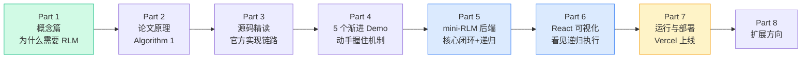

## 这套教程适合谁

你是一名**计算机本科毕业生**或有同等基础的开发者：会写 Python、了解基本的 Web 前后端、用过 LLM API，但**没读过 RLM 论文、也没接触过"把 prompt 当环境"这套思路**。

读完这套教程，你将能够：

- 用自己的话解释 **RLM 为什么能处理超过模型上下文窗口 10 倍以上的输入**；
- 说清 **REPL 卸载、符号递归、`answer` 终止信号** 这三件事各自解决了什么；
- 从零写出一个**能跑、能可视化、能递归**的 mini-RLM，并部署上线。

## 学习路线图

> 💡 **建议**：第一遍按顺序读 Part 1 → Part 4，把概念和机制握住；动手时直接对照 `final-project/` 里的可运行代码。赶时间的话，可以先看[你将做出什么](/00-intro/what-you-will-build)和[在线 Demo](/70-run-deploy/online-demo)建立直觉，再回头补原理。
